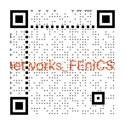

# Evolving FEniCS: The Extension Ecosystem at Simula Scientific Computing

FEniCS 2026 at University of Chicago in Paris
 
<b>Jørgen S. Dokken</b> 
 
<b>Henrik N.T. Finsberg</b>
 

 

  
  
  

---

# It all started over 21 years ago

<figcaption style="font-size: 50%; padding-top: 10px;">
FEniCS 05 (Chicago) - <i>Tools for Multi-Physics Simulation</i>   by Hans Petter Langtangen (Simula/UiO)
</figcaption>

Packages developed or maintained

- UFL/FFC(x)/DOLFIN(x)
- DOLFINx_MPC
- <b>scifem</b>
- <b>io4dolfinx</b> (<s>adios4dolfinx</s>)
- <b>fenicsx_ii</b>
- <b>DOLFIN(x)-adjoint</b>
- <b>networks_fenicsx</b>

---

<h1> Scifem - FEM prototyping playground </h1>

<!-- 
 -->

Not all ideas are good ideas  <b>in the beginning</b>

 

<b>Examples that are now in DOLFINx</b>

<!-- Real spaces -->

  <ul>
 <li>Real function spaces <code>scifem.create_real_functionspace</code>
  </ul>

  <pre is="marp-pre" data-auto-scaling="downscale-only">
  <code class="language-python"
>r_el = basix.ufl.real_element(mesh.basix_cell(), shape=(2, 3))
R = dolfinx.fem.functionspace(mesh, r_el)
</code></pre>

<!-- Blocked solvers -->

  <ul>
 <li>Blocked Newton solvers <code>scifem.BlockedNewtonSolver</code>
  </ul>

  <pre is="marp-pre" data-auto-scaling="downscale-only">
  <code class="language-python"
  >dolfinx.fem.petsc.NonlinearProblem
</code></pre>

<!-- Transfer tags -->

  <ul>
 <li>Transfer tags to submesh <code>scifem.transfer_meshtags_to_submesh</code>
  </ul>

  <pre is="marp-pre" data-auto-scaling="downscale-only">
  <code class="language-python"
  >dolfinx.mesh.transfer_meshtags_to_submesh
</code></pre>

---

# What is next?

<code>scifem.create_space_of_simple_functions</code>

<pre is="marp-pre" data-auto-scaling="downscale-only" style="margin-bottom: 0; padding-bottom: 0; border-bottom-left-radius: 0; border-bottom-right-radius: 0;">
<code class="language-python">mesh = dolfinx.mesh.create_unit_square(comm, 10, 10)
tdim = mesh.topology.dim
tol = 1e-14
</code></pre>

<pre is="marp-pre" data-auto-scaling="downscale-only" style="margin-top: 0; margin-bottom: 0; padding-top: 0; padding-bottom: 0; border-radius: 0;">
<code class="language-python"># Divide cell into three regions
tags = (4,5,8)
cell_map = mesh.topology.index_map(tdim)
num_cells_local = cell_map.size_local + cell_map.num_ghosts
markers = np.full(num_cells_local, tags[0],  dtype=np.int32)
markers[dolfinx.mesh.locate_entities(
    mesh, tdim, lambda x: x[0] <= 0.5+tol)] = tags[1]
markers[dolfinx.mesh.locate_entities(
    mesh, tdim, lambda x: x[1] <= 0.5+tol)] = tags[2]
cells = np.arange(num_cells_local, dtype=np.int32)
ct = dolfinx.mesh.meshtags(mesh, tdim, cells, markers)
</code></pre>

<pre is="marp-pre" data-auto-scaling="downscale-only" style="margin-top: 0; padding-top: 0; border-top-left-radius: 0; border-top-right-radius: 0;">
<code class="language-python"># Create a piecewise constant (per region) function space
V = create_space_of_simple_functions(mesh, ct, tags)
u = dolfinx.fem.Function(V)
u.x.array[0] = 3.2
u.x.array[1] = 5.5
u.x.array[2] = 4.2
assert len(u.x.array) == 3
</code></pre>

---

<h1> What is next?</h1>

 
<pre is="marp-pre" data-auto-scaling="downscale-only" style="margin-bottom: 0; padding-bottom: 0; border-bottom-left-radius: 0; border-bottom-right-radius: 0;">
<code class="language-python">from scifem import closest_point_projection
points, ref_points = closest_point_projection(
    mesh,
    closest_cells,
    points,
    tol_x=1e-7,
)
</code></pre>

Based on simplex projections2,3,4

<figcaption style="font-size: 50%; padding-top: 0px;">

Figure from the morning tutorial1

</figcaption>

<!--  footer: 1 Dokken, J.S <a href="https://a-latyshev.github.io/fenics26-tutorials/grid-mapping/">https://a-latyshev.github.io/fenics26-tutorials/grid-mapping/</a> 2Held, Wolfe, & Crowder (1974). DOI: <a href="https://doi.org/10.1007/BF01580223">10.1007/bf01580223</a> 3Bertsekas, (1976). DOI: <a href="https://doi.org/10.1109/tac.1976.1101194">10.1109/tac.1976.1101194</a>   4Condat, L. (2015). DOI: <a href="https://doi.org/10.1007/s10107-015-0946-6">10.1007/s10107-015-0946-6</a>   -->

---

<!--  footer: 5 Habera, Demarle, Hale, Richardson, Zilian , <i>XDMF and Paraview Checkpointing format</i>), FEniCS'18    -->

# IO4DOLFINx - a unified IO?

 

Visualization and checkpointing (write/read functions) has diverged due to N+1 different file formats and finite elements.

 

<figcaption style="font-size: 50%; padding-top: 10px;">
From M. Habera's presentation5 at FEniCS 2018 on the XDMF format
</figcaption>

 

---

<!--  footer: 6Dokken, J. S., (2024). <i>ADIOS4DOLFINx: A framework for checkpointing in FEniCS</i>. JOSS, DOI:<a href="https://doi.org/10.21105/joss.06451">10.21105/joss.06451</a>   7Dokken J.S (2023) <i>Checkpointing in FEniCSx</i>. FEniCS'23    -->

# IO4DOLFINx - a unified IO?

ADIOS4DOLFINx6 introduced a specific split between readable and visualizable functions.

<figure>

<figcaption style="font-size: 50%; padding-top: 0px;">
Snapshots from the FEniCS 2023 presentation on checkpointing7.
</figcaption>
</figure>

---

<!--  footer:    -->

# IO4DOLFINx - a unified IO?

Reality is that most users use iso-parameteric finite elements (often P1).

IO4DOLFINx is a <b>backend agnositic</b> interface to many mesh formats.

- `gmsh`, `PyVista`, `XDMF`, `VTKHDF`
  - `{read/write}_{point/mesh}_data`  
- `adios2`, `h5py`
  - `{read/write}_checkpoint`

---

# FEniCSx_ii

 

---

# DOLFINx-adjoint

 

---

# Networks_FEniCSx

 

---

# Whats next?

---

---

