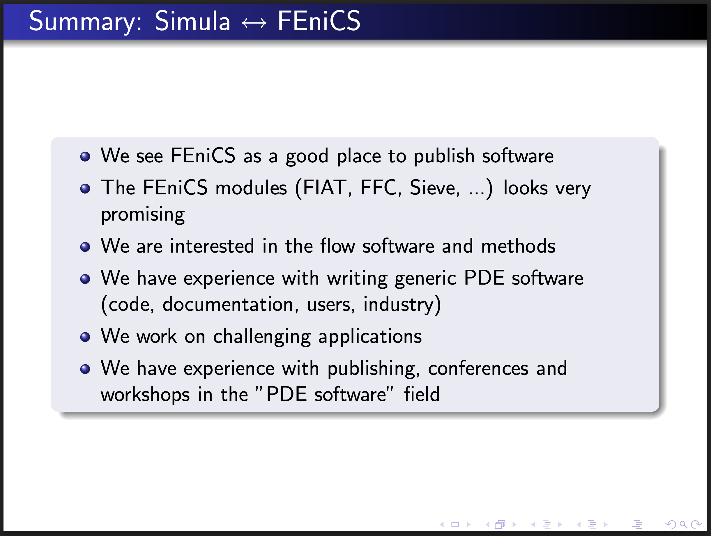

# Evolving FEniCS: The Extension Ecosystem at Simula Scientific Computing

FEniCS 2026 at University of Chicago in Paris
 
<b>Jørgen S. Dokken</b> 
 
<b>Henrik N.T. Finsberg</b>
 

 

---

# It all started over 21 years ago

<figcaption style="font-size: 50%; padding-top: 10px;">
FEniCS 05 (Chicago) - <i>Tools for a-Physics Simulation</i>   by Hans Petter Langtangen (Simula/UiO)
</figcaption>

Packages developed or maintained at SRL

- UFL
- DOLFINx_MPC
- adios4dolfinx
- scifem
- io4dolfinx
- fenicsx_ii
- DOLFIN(x)-adjoint 

---

