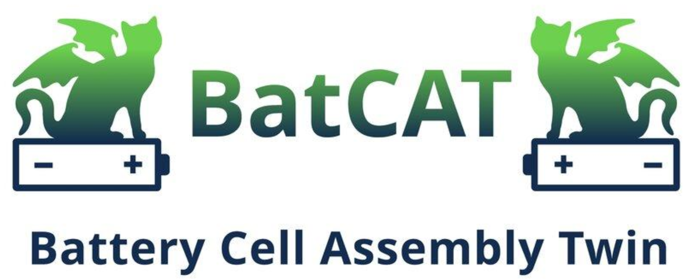
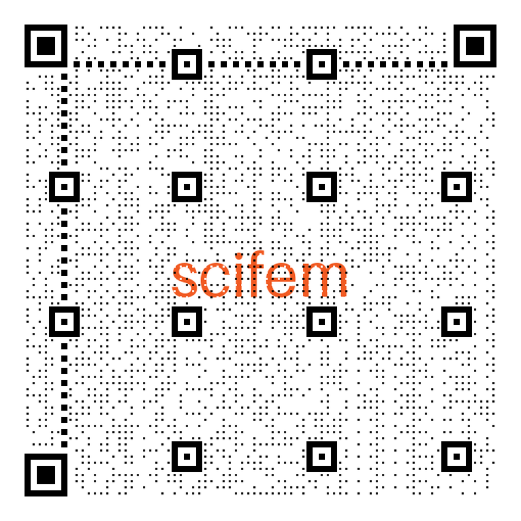
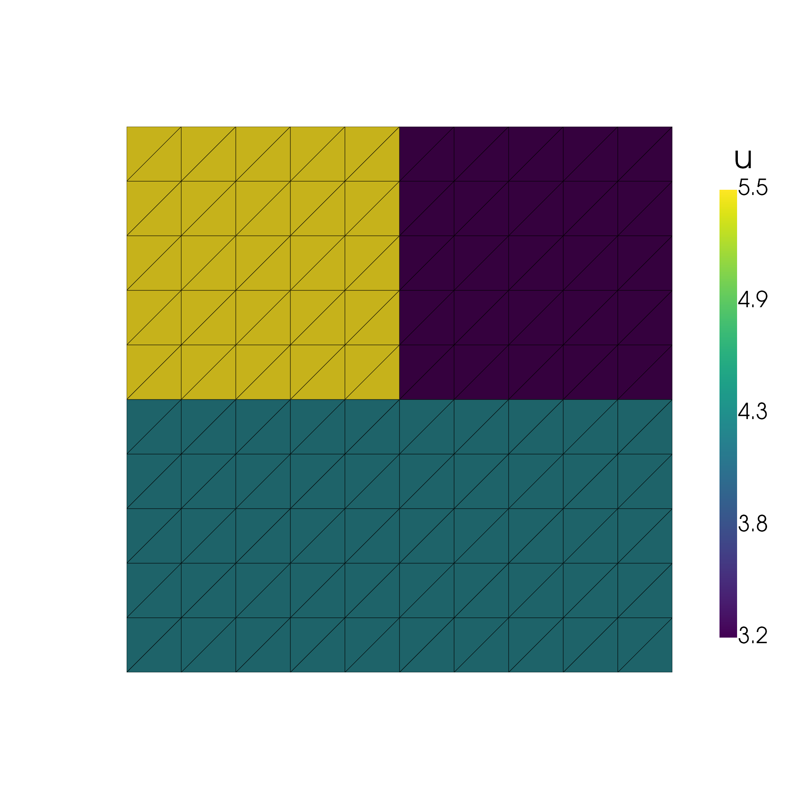
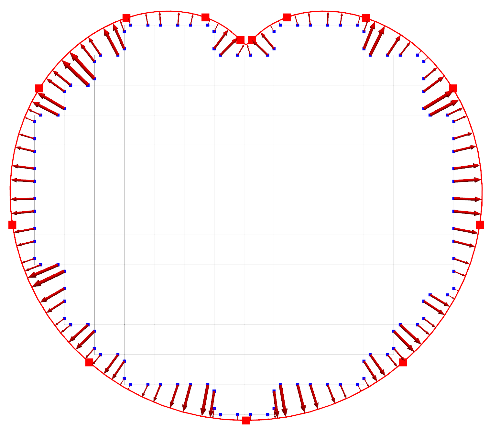
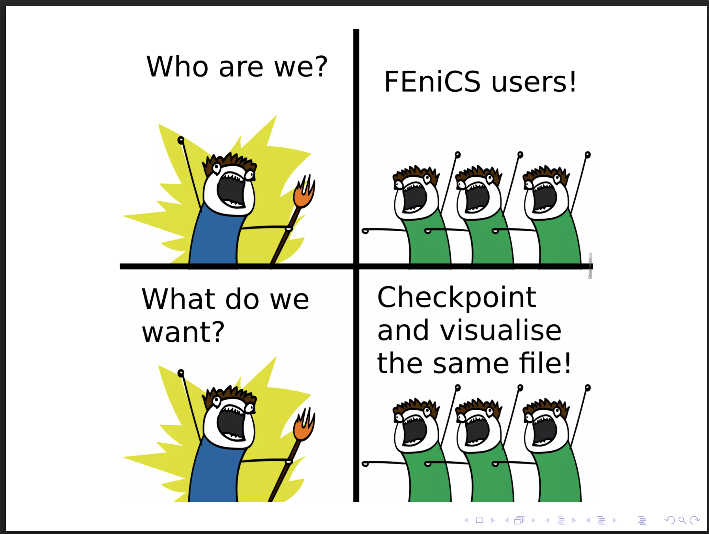
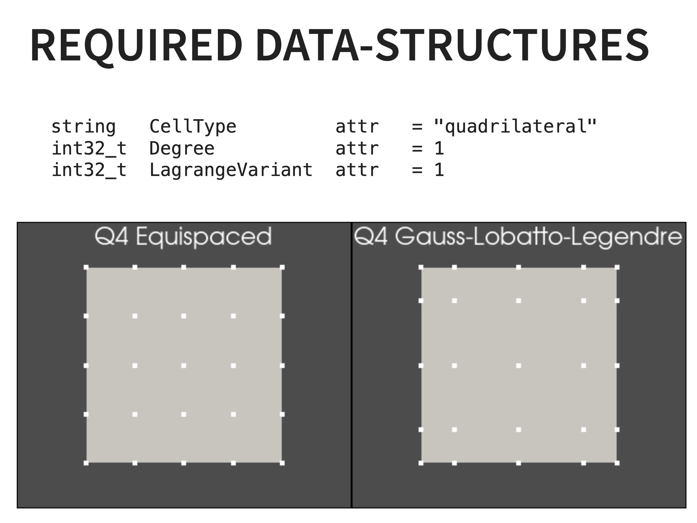
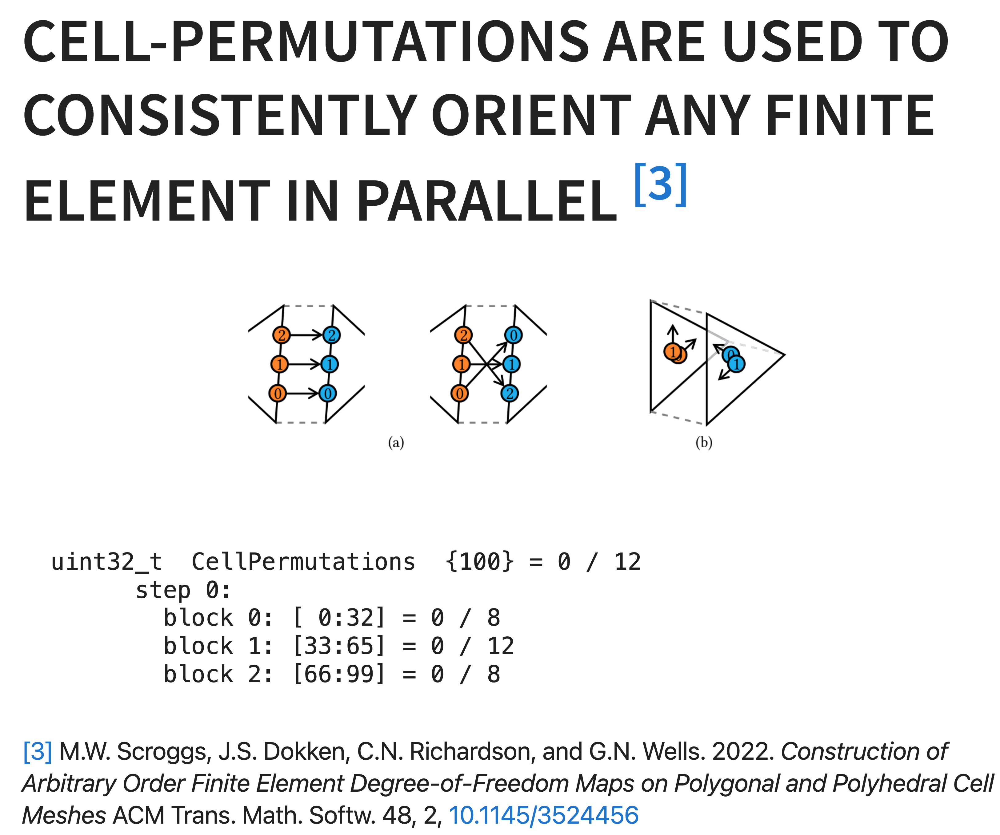
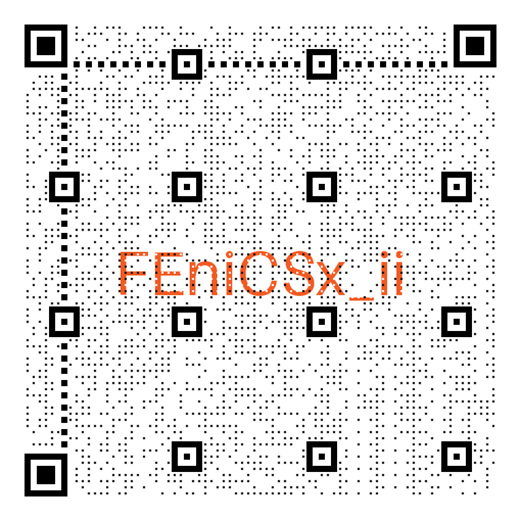
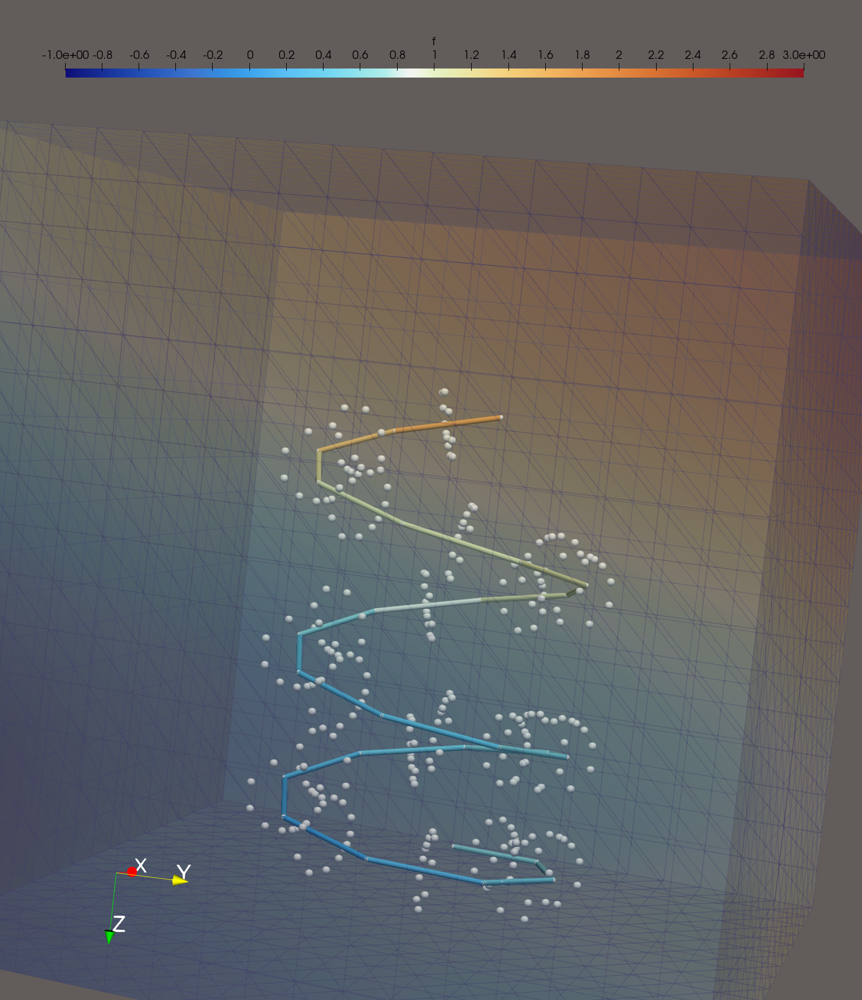
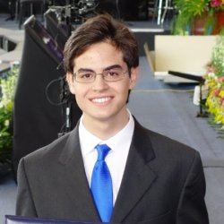

# Evolving FEniCS: The Extension Ecosystem at Simula Scientific Computing

<center>
FEniCS 2026 at University of Chicago in Paris
<br>
<b>Jørgen S. Dokken</b> 
<br/>
<b>Henrik N.T. Finsberg</b>
<br>


<br/>
<div style="display: grid; grid-template-columns: repeat(3, 1fr); align-items: center; justify-items: center; width: 100%;">
  
  
  
</div>

</center>

---

# It all started over 21 years ago


<div class="skewed-columns">
<div>

<figcaption style="font-size: 50%; padding-top: 10px;">
FEniCS 05 (Chicago) - <i>Tools for Multi-Physics Simulation</i><br>  by Hans Petter Langtangen (Simula/UiO)
</figcaption>
</div>
<div>
<div data-marpit-fragment>

Packages developed or maintained

- UFL/FFC(x)/DOLFIN(x)
- DOLFINx_MPC
- <b>scifem</b>
- <b>io4dolfinx</b> (<s>adios4dolfinx</s>)
- <b>fenicsx_ii</b>
- <b>DOLFIN(x)-adjoint</b>
- <b>networks_fenicsx</b>

</div>

</div>
</div>

---

<h1> Scifem - FEM prototyping playground </h1>

<!-- <div class="columns"> -->

<div>
<center>
Not all ideas are good ideas <span data-marpit-fragment> <b>in the beginning</b></span>


</div>
<br>
<div data-marpit-fragment>
<b>Examples that are now in DOLFINx</b>

</center>
<!-- Real spaces -->
<div class="columns">
<div data-marpit-fragment>
  <ul>
 <li>Real function spaces <code>scifem.create_real_functionspace</code>
  </ul>
</div>
<div data-marpit-fragment>
  <pre is="marp-pre" data-auto-scaling="downscale-only">
  <code class="language-python"
>r_el = basix.ufl.real_element(mesh.basix_cell(), shape=(2, 3))
R = dolfinx.fem.functionspace(mesh, r_el)
</code></pre>
</div>
</div>
<!-- Blocked solvers -->
<div class="skewed columns">
<div data-marpit-fragment>
  <ul>
 <li>Blocked Newton solvers <code>scifem.BlockedNewtonSolver</code>
  </ul>
</div>
<div data-marpit-fragment>
  <pre is="marp-pre" data-auto-scaling="downscale-only">
  <code class="language-python"
  >dolfinx.fem.petsc.NonlinearProblem
</code></pre>
</div>
</div>

<!-- Transfer tags -->
<div class="columns">
<div data-marpit-fragment>
  <ul>
 <li>Transfer tags to submesh <code>scifem.transfer_meshtags_to_submesh</code>
  </ul>
</div>
<div data-marpit-fragment>
  <pre is="marp-pre" data-auto-scaling="downscale-only">
  <code class="language-python"
  >dolfinx.mesh.transfer_meshtags_to_submesh
</code></pre>
</div>
</div>

---


# What is next?

<center>
<code>scifem.create_space_of_simple_functions</code>
</center>

<div class="skewed-columns">
<div>
<pre is="marp-pre" data-auto-scaling="downscale-only" style="margin-bottom: 0; padding-bottom: 0; border-bottom-left-radius: 0; border-bottom-right-radius: 0;">
<code class="language-python">mesh = dolfinx.mesh.create_unit_square(comm, 10, 10)
tdim = mesh.topology.dim
tol = 1e-14
</code></pre>
<div data-marpit-fragment style="margin: 0; padding: 0;">
<pre is="marp-pre" data-auto-scaling="downscale-only" style="margin-top: 0; margin-bottom: 0; padding-top: 0; padding-bottom: 0; border-radius: 0;">
<code class="language-python"><span style="color: #2e8b57;"># Divide cell into three regions</span>
tags = (4,5,8)
cell_map = mesh.topology.index_map(tdim)
num_cells_local = cell_map.size_local + cell_map.num_ghosts
markers = np.full(num_cells_local, tags[0],  dtype=np.int32)
markers[dolfinx.mesh.locate_entities(
    mesh, tdim, lambda x: x[0] <= 0.5+tol)] = tags[1]
markers[dolfinx.mesh.locate_entities(
    mesh, tdim, lambda x: x[1] <= 0.5+tol)] = tags[2]
cells = np.arange(num_cells_local, dtype=np.int32)
ct = dolfinx.mesh.meshtags(mesh, tdim, cells, markers)
</code></pre>
</div>
<div data-marpit-fragment style="margin: 0; padding: 0;">
<pre is="marp-pre" data-auto-scaling="downscale-only" style="margin-top: 0; padding-top: 0; border-top-left-radius: 0; border-top-right-radius: 0;">
<code class="language-python"><span style="color: #2e8b57;"># Create a piecewise constant (per region) function space</span>
<span style="background-color: rgba(255, 193, 7, 0.2); display: inline-block; width: 100%;">V = create_space_of_simple_functions(mesh, ct, tags)</span>
u = dolfinx.fem.Function(V)
u.x.array[0] = 3.2
u.x.array[1] = 5.5
u.x.array[2] = 4.2
assert len(u.x.array) == 3
</code></pre>
</div>
</div>
<div>

</div>
</div>
</div>

---


<h1> What is next?</h1>
<div class="skewed-columns">
<div>
<br>
<pre is="marp-pre" data-auto-scaling="downscale-only" style="margin-bottom: 0; padding-bottom: 0; border-bottom-left-radius: 0; border-bottom-right-radius: 0;">
<code class="language-python">from scifem import closest_point_projection
points, ref_points = closest_point_projection(
    mesh,
    closest_cells,
    points,
    tol_x=1e-7,
)
</code></pre>
<div font_size=10>
Based on simplex projections<sup>2,3,4</sup>
</div>
</div>
<div>

<figcaption style="font-size: 50%; padding-top: 0px;">
<center>
Figure from the morning tutorial<sup>1</sup>
</center>
</figcaption>
</div>
</div>
</div>


<!--  footer: <sup>1</sup> Dokken, J.S <a href="https://a-latyshev.github.io/fenics26-tutorials/grid-mapping/">https://a-latyshev.github.io/fenics26-tutorials/grid-mapping/</a><br><sup>2</sup>Held, Wolfe, & Crowder (1974). DOI: <a href="https://doi.org/10.1007/BF01580223">10.1007/bf01580223</a><br><sup>3</sup>Bertsekas, (1976). DOI: <a href="https://doi.org/10.1109/tac.1976.1101194">10.1109/tac.1976.1101194</a> <br> <sup>4</sup>Condat, L. (2015). DOI: <a href="https://doi.org/10.1007/s10107-015-0946-6">10.1007/s10107-015-0946-6</a><br><br> -->


---


<!--  footer: <sup>5</sup> Habera, Demarle, Hale, Richardson, Zilian , <i>XDMF and Paraview Checkpointing format</i>), FEniCS'18 <br><br> -->

# IO4DOLFINx - a unified IO?

<div class="skewed-columns">
<div>
<br>
<center>
Visualization and checkpointing (write/read functions) has diverged due to N+1 different file formats and finite elements.
</center>
</div>
<div>
<center>
<br>

<figcaption style="font-size: 50%; padding-top: 10px;">
From M. Habera's presentation<sup>5</sup> at FEniCS 2018 on the XDMF format
</figcaption>
</center>
</div>


<div class="columns">

<div>

<br>


</div>

<div>

</div>
</div>


---


<!--  footer: <sup>6</sup>Dokken, J. S., (2024). <i>ADIOS4DOLFINx: A framework for checkpointing in FEniCS</i>. JOSS, DOI:<a href="https://doi.org/10.21105/joss.06451">10.21105/joss.06451</a> <br> <sup>7</sup>Dokken J.S (2023) <i>Checkpointing in FEniCSx</i>. FEniCS'23 <br><br> -->

# IO4DOLFINx - a unified IO?


<div class="right-skewed-columns">
<div>
<center>
ADIOS4DOLFINx<sup>6</sup> introduced a specific split between readable and visualizable functions.
</center>
</div>
<div>
<center>
<figure>


<figcaption style="font-size: 50%; padding-top: 0px;">
Snapshots from the FEniCS 2023 presentation on checkpointing<sup>7</sup>.
</figcaption>
</figure>
</center>
</div>
</div>

---

<!--  footer: <br><br> -->

# IO4DOLFINx - a unified IO?


Reality is that most users use iso-parameteric finite elements (often P1).

IO4DOLFINx is a <b>backend agnositic</b> interface to many mesh formats.

- `gmsh`, `PyVista`, `XDMF`, `VTKHDF`
  - `{read/write}_{point/mesh}_data`  
- `adios2`, `h5py`
  - `{read/write}_checkpoint`


---

<!--  footer: <sup>8</sup>Laurino and Zunino. <i>Derivation and analysis of coupled PDEs on manifolds with high dimensionality gap arising from topological model reduction.</i> ESAIM: M2AN, 2019. DOI: <a href="https://doi.org/10.1051/m2an/2019042">10.1051/m2an/2019042</a>. <br><br> -->



# FEniCSx_ii


<div class="skewed-columns">
<div>
Example based on<sup>8</sup>
<br><br>

$$
\begin{align*}
  - \nabla \cdot (\alpha_1 \nabla u) + \xi (\Pi_R(u) - p))\delta_\Gamma &= f
  && \text{in } \Omega, \\
  - d_s(A d_s p) + P \xi (p - \Pi(u)) &= A \hat f  &&  \text{in } \Lambda, \\
  u&=g &&\text{on } \partial\Omega,\\
  A d_s p &=0 && \text{at } s\in\{0, 1\}.\\
  \int_\Omega \alpha_1 \nabla u \cdot \nabla v~\mathrm{d}x
  + \int_\Gamma P\xi (\Pi_R(u) - p)\Pi_R(v)~\mathrm{d}s
  &= \int_\Omega f\cdot v~\mathrm{d}x\\
  \int_\Gamma A d_s p \cdot d_s q~\mathrm{d}s
  + \int_\Gamma P\xi (p - \Pi_R(u))q~\mathrm{d}s
  &= \int_\Gamma A\hat f\cdot q~\mathrm{d}s
\end{align*}
$$

</div>
<div>

<figure>

<br>
</figure>

</div>
</div>


---


<!--  footer: <sup>9</sup>M, Kuchta. <i>Assembly of multiscale linear PDE operators</i>. ENUMATH 2019 (2021), DOI: <a href="https://doi.org/10.1007/978-3-030-55874-1_63">10.1007/978-3-030-55874-1_63</a>. <br><br> -->


# Re-implementation of FEniCS_ii<sup>9</sup>

<pre is="marp-pre" data-auto-scaling="downscale-only" style="margin-bottom: 0; padding-bottom: 0; border-bottom-left-radius: 0; border-bottom-right-radius: 0;">
<code class="language-python">from fenicsx_ii import Average, Circle, LinearProblem, assemble_scalar
V = dolfinx.fem.functionspace(omega, ("Lagrange", 1))
Q = dolfinx.fem.functionspace(lmbda, ("Lagrange", 1))
W = ufl.MixedFunctionSpace(*[V, Q])

R, q_degree = 0.05, 20
<span style="background-color: rgba(255, 193, 7, 0.2); display: inline-block; width: 100%;">restriction_trial = Circle(lmbda, R, degree=q_degree)
restriction_test = Circle(lmbda, R, degree=q_degree)
</span>
(u, p) = ufl.TrialFunctions(W)
(v, q) = ufl.TestFunctions(W)

q_el = basix.ufl.quadrature_element(lmbda.basix_cell(), value_shape=(), degree=q_degree)
Rs = dolfinx.fem.functionspace(lmbda, q_el)
<span style="background-color: rgba(255, 193, 7, 0.2); display: inline-block; width: 100%;">avg_u = Average(u, restriction_trial, Rs)
avg_v = Average(v, restriction_test, Rs)
</span></code></pre>

---


<h1 > Uses intermediate non-matching <br>interpolation matrices as<sup>9</sup></h1>

<pre is="marp-pre" data-auto-scaling="downscale-only" style="margin-bottom: 0; padding-bottom: 0; border-bottom-left-radius: 0; border-bottom-right-radius: 0;"><code class="language-python">dx_3D = ufl.Measure("dx", domain=omega)
dx_1D = ufl.Measure("dx", domain=lmbda)

A = ufl.pi * R**2
P = 2 * ufl.pi * R
xi = dolfinx.fem.Constant(omega, 1.0)
x = ufl.SpatialCoordinate(omega)
a = ufl.inner(ufl.grad(u), ufl.grad(v)) * dx_3D
<span style="background-color: rgba(255, 193, 7, 0.2); display: inline-block; width: 100%;">a += P * xi * ufl.inner(avg_u - p, avg_v) * dx_1D</span>
a += A * ufl.inner(ufl.grad(p), ufl.grad(q)) * dx_1D
<span style="background-color: rgba(255, 193, 7, 0.2); display: inline-block; width: 100%;">a += P * xi * ufl.inner(p - avg_u, q) * dx_1D</span>
L = f_vol * v * dx_3D
L += f_line * q * dx_1D
</code></pre>

<br>

---


<!-- footer: <sup>10</sup>I.G. Gjerde. <i>Graphnics: Combining FEniCS and NetworkX to simulate flow in complex networks</i>. 2022. <br>DOI: <a href="https://doi.org/10.48550/arXiv.2212.02916">10.48550/arXiv.2212.02916</a>.<br><sup>11</sup> Daversin-Catty, Dean, and Rognes. <i>Finite Element Software and Performance for Network Models with Multipliers</i>. 2024.<br>DOI: <a href="https://doi.org/10.1007/978-3-031-58519-7_4">10.1007/978-3-031-58519-7_4</a> <br><br> -->

# Networks_FEniCSx

<div class="skewed-columns">

<div>

MPI compatible FEniCSx+Networkx based on <sup>10,11</sup>

```python
from networks_fenicsx import HydraulicNetworkAssembler, NetworkMesh, Solver
from networks_fenicsx.network_generation import make_arterial_tree
from networks_fenicsx.post_processing import export_functions, extract_global_flux
n = 5
G = make_arterial_tree(N=n, direction=np.array([0.1, 1, 0]))
network_mesh = NetworkMesh(
    G, N=40, color_strategy=nx.coloring.strategy_largest_first)
assembler = HydraulicNetworkAssembler(
    network_mesh, flux_degree=1, pressure_degree=0)
assembler.compute_forms(p_bc_ex=p_bc_expr)
solver = Solver(assembler, kind="nest")
solver.assemble()
sol = solver.solve()
global_flux = extract_global_flux(network_mesh, sol)
```

</div>

<div>
<figure>
<center>

<figcaption style="font-size: 50%; padding-top: 0px;">
</figcaption>
</center>
</figure>
<br>
</div>
</div>


---

<!-- footer:  <br><br> -->


# DOLFINx-adjoint

<pre is="marp-pre" data-auto-scaling="downscale-only" style="margin-bottom: 0; padding-bottom: 0; border-bottom-left-radius: 0; border-bottom-right-radius: 0;"><code class="language-python">u = ufl.TrialFunction(V)
v = ufl.TestFunction(V)
F = ufl.inner(kappa * ufl.grad(u), ufl.grad(v)) * ufl.dx - f * v * ufl.dx
a, L = ufl.system(F)
<span style="background-color: rgba(255, 193, 7, 0.2); display: inline-block; width: 100%;">uh = dolfinx_adjoint.Function(V, name="State")</span>
petsc_options = {
    "ksp_type": "preonly",
    "pc_type": "lu",
    "pc_factor_mat_solver_type": "mumps",
    "ksp_error_if_not_converged": True,
}
<span style="background-color: rgba(255, 193, 7, 0.2); display: inline-block; width: 100%;">problem = dolfinx_adjoint.LinearProblem(
    a,
    L,
    u=uh,
    bcs=[bc],
    petsc_options=petsc_options,
    adjoint_petsc_options=petsc_options,
    tlm_petsc_options=petsc_options,  # type: ignore
)</span>
problem.solve()
</code></pre>

---

# DOLFINx-adjoint


<pre is="marp-pre" data-auto-scaling="downscale-only" style="margin-bottom: 0; padding-bottom: 0; border-bottom-left-radius: 0; border-bottom-right-radius: 0;"><code class="language-python">J_symbolic = 0.5 * ufl.inner(uh - d, uh - d) * ufl.dx
J_symbolic += 0.5 * alpha * ufl.inner(f, f) * ufl.dx
<span style="background-color: rgba(255, 193, 7, 0.2); display: inline-block; width: 100%;">J = dolfinx_adjoint.assemble_scalar(J_symbolic)</span>

<span style="background-color: rgba(255, 193, 7, 0.2); display: inline-block; width: 100%;">control = pyadjoint.Control(f)
Jhat = pyadjoint.ReducedFunctional(J, control)</span>
</code></pre>

<div data-marpit-fragment>

```python
optimization_problem = pyadjoint.MoolaOptimizationProblem(Jhat)
f_moola = DolfinxPrimalVector(f)
optimization_opts = {
  "jtol": 0, "gtol": 1e-9,
  "Hinit": "default", "maxiter": 100,
  "mem_lim": 10, "rjtol": 0}
solver = moola.BFGS(optimization_problem, f_moola, options=optimization_opts)
solution = solver.solve()
```

</div>

---

<!-- footer: <sup>11</sup>Farrell, Kirby, Marchena-Menéndez. ACM Trans. Math. Softw. 2021 DOI: <a href="https://doi.org/10.1145/3466168">10.1145/3466168</a>https://doi.org/10.1145/3466168 <br> <sup>12</sup> Kirby, MacLachlan. 2025. ACM Trans. Math. Softw. 51, 3 DOI: <a href="https://doi.org/10.1145/3759245">10.1145/3759245</a><br><sup>13</sup>Kirby, MacLachlan, Brubeck. 2025. arXiv:<a href="https://doi.org/10.48550/arXiv.2508.20255">2508.20255</a>-->


<h1> Irksome - time derivatives in UFL<sup>11,12,13</sup>  </h1>

```python
from irksome import Dt, MeshConstant
el_u = basix.ufl.element("Lagrange", ct, 3, shape=(gdim,))
el_p = basix.ufl.element("Lagrange", ct, 2)
W = dolfinx.fem.functionspace(msh, basix.ufl.mixed_element([el_u, el_p]))

MC = MeshConstant(msh, backend="dolfinx")
t, dt = MC.Constant(0.0), MC.Constant(1.0 / N)
z = dolfinx.fem.Function(W)
u, p = split(z)
(v, q) = TestFunctions(W)
F = inner(Dt(u), v) * dx + inner(grad(u), grad(v)) * dx \
  - inner(p, div(v)) * dx - inner(div(u), q) * dx \
  - inner(f, v) * dx
```
<br>

<style scoped>
section {
  background-image: url('logos/simula.png') !important;
  background-size: 150px !important;
  background-position: right 60px bottom 10px !important;
  background-repeat: no-repeat !important;
}
</style>

---


<!-- footer: <br> -->

# Dirichlet BCs with UFL-expressions


```python
from irksome.backends.dolfinx import dirichletbc
bc = dirichletbc(bc_u_as_ufl_expr, boundary_dofs, W.sub(0))
bc_p = dirichletbc(bc_p_as_ufl_expr, corner_dof, W.sub(1))
bcs = [bc, bc_p]
```

---


<h1>We can now choose the accuracy of the<br> time-derivative</h1>

```python
from irksome import GaussLegendre
from irksome.stage_derivative import StageDerivativeTimeStepper
from irksome.tools import AI

butcher_tableau = GaussLegendre(num_stages=num_stages)
linear_stepper = StageDerivativeTimeStepper(
        F, butcher_tableau, t, dt, z,
        bcs=bcs,
        Fp=None,
        bc_type="DAE",
        splitting=AI,
        solver_parameters=solver_parameters,
        backend="dolfinx",
    )
linear_stepper.advance()

```

---

# What's next?

* Combining external operator and JAX


* Extending Irksome support and moving DirichletBC to DOLFINx
* Extend DOLFINx-adjoint
* Extend and combine these frameworks

---


<!--  footer: <br>The work has been funded by the Wellcome Trust, grant number 313298/Z/24/Z and by Horizon Europe under the call Cross-sectoral solutions for the climate transition (HORIZON-CL5-2023-D2-01). <br>-->

<style scoped>
section {
  background-image: url('logos/simula.png') !important;
  background-size: 150px !important;
  background-position: right 60px bottom 10px !important;
  background-repeat: no-repeat !important;
}
</style>

# Thanks to all my collaborators
<div class="columns">
  <div>
    <center>
      <figure style="margin: 0 0 10px 0;">
        
        
        <figcaption style="font-size: 50%; padding-top: 0px;">
          H.N.T Finsberg & M.E. Rognes<br>FEniCSx_ii, scifem, dolfinx_adjoint
        </figcaption>
      </figure>
      <figure style="margin: 0;">
        
        
        
        <figcaption style="font-size: 50%; padding-top: 0px;">
          C. Catty-Daversin, P.T. Kühner & J.P. Dean<br>
          Networks_FEniCSx
        </figcaption>
      </figure>
    </center>
  </div>
  <div>
    <center>
      <figure style="margin: 0 0 10px 0;">
        
        
        
        <figcaption style="font-size: 50%; padding-top: 0px;">
          A. Ali, R. Kirby & P. Brubeck Martinez<br>
          Irksome
        </figcaption>
      </figure>
      <figure style="margin: 0;">
        
        <figcaption style="font-size: 50%; padding-top: 0px;">
          M. Croci <br> FEniCSx_JAX
        </figcaption>
      </figure>
    </center>
  </div>
</div>

---

<!-- footer: <br>-->


# Simula 25 years - FEniCS workshop

### Hybrid workshop September 8th - 9th

<div class="sskewed-columns">  
  <div>
    <b>Confirmed invited speakers</b> 
    <div class="columns" style="font-size: 50%; margin-top: 10px;">
      <div>
        Antonio B. Svizzero (Undabit)<br>
        Cécile Daversin-Catty (SRL)<br>
        Chris Richardson (Cantab)<br>
        David Ham (IC)<br>
        Francesco Ballarin (UNICATT)<br>
        Henrik N. T. Finsberg (SRL)<br>
        Hyunsun Alicia Kim (UCSD)<br>
        Jack S. Hale (UNI.LU.)<br>
        Jeremy Bleyer (ENPC)<br>
        Joakim Sundnes (SRL)<br>
      </div>
      <div>
        Johan Hoffman (KTH)<br>
        Kent Andre Mardal (SRL/UIO)<br>
        Martin Řehoř (Rafinex)<br>
        Neeraj Cherukunnath (Rolls Royce)<br>
        Padmini Rangamani (UCSD)<br>
        Remi Delaporte-Mathurin (MIT)<br>
        Robert Kirby (BU)<br>
        Simon W. Funke (formely SRL)<br>
        Susanne Claus (ONERA)<br>
        Thomas M. Surowiec (SRL)
      </div>
    </div>
  </div>

  <div style="text-align: center;">
    
    <br>
    <div style="font-size:30%">
    Organizers: Jørgen S. Dokken, Cécile Daversin-Catty, Ada Johanne Ellingsrud, Eirik Valseth
    </div>
  </div>
</div>
</div>