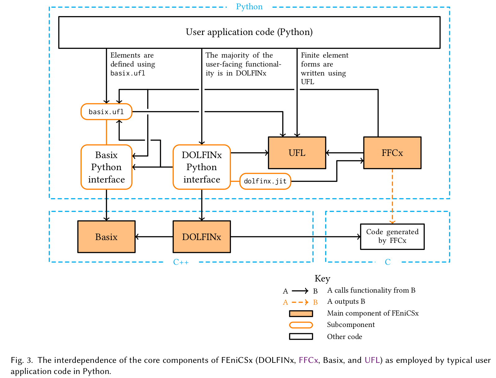
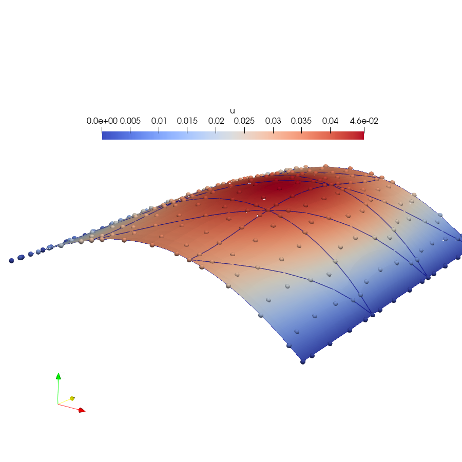
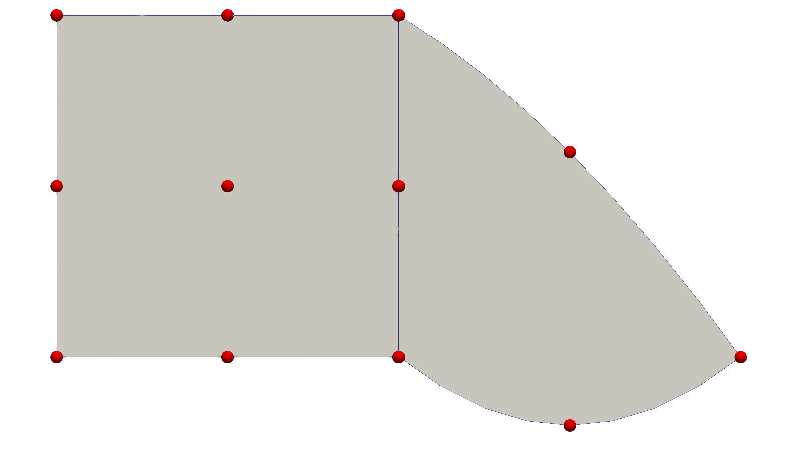

# The FEniCS Project: What’s new and what’s next

<center>
Jørgen S. Dokken
<center/>

<center>
<b> dokken@simula.no </b>
<center/>

<center>
<a href="https://jsdokken.com">https://jsdokken.com</a>
<center/>

<center>
<div>

</div>
<div>
&nbsp;&nbsp;&nbsp;&nbsp;&nbsp;&nbsp;&nbsp;&nbsp;&nbsp;&nbsp;


</div>
<center/>

---

# What is FEniCS(x)?

---

<!-- footer: Baratta, I. A. et al. (2023). DOLFINx: The next generation FEniCS problem solving environment. DOI: 10.5281/zenodo.10447666
 -->

<center>

<br>
<center/>

---

<!-- footer: <br> -->


# FEniCS Steering council

<font size="6">

Francesco Ballarin (Università Cattolica del Sacro Cuore)
Cécile Daversin-Catty (Simula Research Laboratory)
Jørgen S. Dokken (Simula Research Laboratory)
Michal Habera (University of Luxembourg)
Jack S. Hale (University of Luxembourg)
Chris Richardson (University of Cambridge)
Matthew W. Scroggs (University College London)
Nathan Sime (Carnegie Institution for Science)
Garth N. Wells (University of Cambridge)

</font>

<br>
<center>

<center/>

---

# The Poisson equation



```python
from mpi4py import MPI
import dolfinx.fem.petsc
import ufl
import numpy as np

mesh = dolfinx.mesh.create_unit_square(MPI.COMM_WORLD, 3, 3)
V = dolfinx.fem.functionspace(mesh, ("Lagrange", 5))


```

---

# The Poisson equation


```python
from mpi4py import MPI
import dolfinx.fem.petsc
import ufl
import numpy as np

mesh = dolfinx.mesh.create_unit_square(MPI.COMM_WORLD, 3, 3)
V = dolfinx.fem.functionspace(mesh, ("Lagrange", 5))

u, v = ufl.TrialFunction(V), ufl.TestFunction(V)
a = ufl.inner(ufl.grad(u), ufl.grad(v)) * ufl.dx
x, y = ufl.SpatialCoordinate(mesh)
f = x * ufl.sin(y * ufl.pi)
L = ufl.inner(f, v) * ufl.dx


```

---

# The Poisson equation

```python
from mpi4py import MPI
import dolfinx.fem.petsc
import ufl
import numpy as np

mesh = dolfinx.mesh.create_unit_square(MPI.COMM_WORLD, 3, 3)
V = dolfinx.fem.functionspace(mesh, ("Lagrange", 5))

u, v = ufl.TrialFunction(V), ufl.TestFunction(V)
a = ufl.inner(ufl.grad(u), ufl.grad(v)) * ufl.dx
x, y = ufl.SpatialCoordinate(mesh)
f = x * ufl.sin(y * ufl.pi)
L = ufl.inner(f, v) * ufl.dx

boundary_dofs = dolfinx.fem.locate_dofs_geometrical(
    V, lambda x: np.isclose(x[0], 0) | np.isclose(x[0], 1)
)
bcs = [dolfinx.fem.dirichletbc(0.0, boundary_dofs, V)]
options = {
    "ksp_type": "preonly",
    "pc_type": "lu",
    "pc_factor_mat_solver_type": "mumps",
    "ksp_error_if_not_converged": True,
}
problem = dolfinx.fem.petsc.LinearProblem(
  a, L, bcs=bcspetsc_options=options)
uh = problem.solve()
with dolfinx.io.VTXWriter(mesh.comm, "uh.bp", [uh]) as bp:
    bp.write(0.0)

```


---

# New features

---

# A wrapper for writing blocked problems

## `ufl.MixedFunctionSpace`

```python
msh = create_unit_square(MPI.COMM_WORLD, 96, 96, CellType.triangle)
k = 1
V = fem.functionspace(msh, ("RT", k))
W = fem.functionspace(msh, ("Discontinuous Lagrange", k - 1))

Q = ufl.MixedFunctionSpace(V, W)
sigma, u = ufl.TrialFunctions(Q)
tau, v = ufl.TestFunctions(Q)
```

---

# Example of potential API rewrite

```python
a = [
    [ufl.inner(sigma, tau) * dx, ufl.inner(u, ufl.div(tau)) * dx],
    [ufl.inner(ufl.div(sigma), v) * dx, None],
]
```

<div data-marpit-fragment>

`ufl.extract_blocks`

```python
a_mono = ufl.inner(sigma, tau) * dx + ufl.inner(u, ufl.div(tau)) * dx \
  + ufl.inner(ufl.div(sigma), v) * dx
a = ufl.extract_blocks(a_mono)
```

</div>

---

# Why do we need this?

```python
gamma, gamma_to_omega = dolfinx.mesh.create_submesh(omega, fdim, ft.find(tag))[
        0:2]
V = dolfinx.fem.functionspace(omega, ("Lagrange", 1, (omega.geometry.dim, )))
Q = dolfinx.fem.functionspace(gamma, ("Lagrange", 1))
W = ufl.MixedFunctionSpace(V, Q)
```

<div data-marpit-fragment>

For more information about mixed-dimensional assembly see: [https://fenicsproject.org/blog/v0.9.0/#mixed-assembly](https://fenicsproject.org/blog/v0.9.0/#mixed-assembly)

</div>

<!-- footer: An example where this is used can be found at: https://jsdokken.com/FEniCS-workshop/src/multiphysics/coupling.html <br><br>
 -->

---

# Why do we need this (part 2)?

```python
interior_spaces = [Vi.clone() for _ in range(num_ions+1)]
exterior_spaces = [Ve.clone() for _ in range(num_ions+1)]
spaces = (interior_spaces+exterior_spaces)
W = MixedFunctionSpace(*spaces)
```

<!-- footer: These lines of code is based on the KNP-EMI model in DOLFINx by Halvor Herlyng: https://github.com/scientificcomputing/fenics-in-the-wild/pull/8 <br><br>
 -->

---

<!-- footer: <br> -->

# Supported UFL operations

- `ufl.derivative(F, [sigma, u], [ds, du])`
- `ufl.lhs`, `ufl.rhs`, `ufl.system`: [UFL #350](https://github.com/FEniCS/ufl/pull/350)
- `ufl.action`: [UFL 351](https://github.com/FEniCS/ufl/pull/351)
- `ufl.adjoint`: [UFL #352](https://github.com/FEniCS/ufl/pull/352)

---

# Redesigning assembly

Overflow of PETSc operators

```python
dolfinx.fem.petsc.create_*
dolfinx.fem.petsc.create_*_block
dolfinx.fem.petsc.create_*_nest
dolfinx.fem.petsc.assemble_*
dolfinx.fem.petsc.assemble_*_block
dolfinx.fem.petsc.assemble_*_nest
```

---

# Simplified interface

```python
a_blocked = ufl.extract_blocks(a_mono)
a = dolfinx.fem.form(a_blocked)
```

<div data-marpit-fragment>

Blocked matrices

```python
A = dolfinx.fem.petsc.create_matrix(a, kind="mpi")
```

</div>

<div data-marpit-fragment>

Nest matrices

```python
A = dolfinx.fem.petsc.create_matrix(a, kind="nest")
```

</div>

<div data-marpit-fragment>

Unified assembly

```python
dolfinx.fem.petsc.assemble_matrix(A, a)
A.assemble()
```

</div>

---

# Blocked vectors needed a major redesign

Special handling of Dirichlet boundary conditions (lifting)

```python
b = assemble_vector_block(L_blocked, a_blocked, bcs=bcs)
```

<div data-marpit-fragment>

Unified logic for all assembly modes

```python
b = assemble_vector(L_blocked, kind=PETSc.Vec.Type.MPI)
bcs1 = fem.bcs_by_block(fem.extract_function_spaces(a_blocked, 1), bcs)
apply_lifting(b, a_blocked, bcs=bcs1)
b.ghostUpdate(addv=PETSc.InsertMode.ADD, mode=PETSc.ScatterMode.REVERSE)
bcs0 = fem.bcs_by_block(fem.extract_function_spaces(L_blocked), bcs)
set_bc(b, bcs0)
```

</div>

---

# Interacting with PETSc vectors

```python
x = dolfinx.fem.petsc.create_vector(L_block, kind="mpi")
assign((u, p), x) # Transfer data from DOLFINx functions to PETSc Vec
assign(x, (u, p)) # Transfer data from PETSc Vec to DOLFINx functions
```

---

# What caused all this redesign?

<div data-marpit-fragment>
<center>
Simpler solver interface
</center>
</div>

---

# Linear problems

```python
problem = fem.petsc.LinearProblem(
    a,
    L,
    u=[sigma, u],
    P=a_p,
    kind="nest",
    bcs=bcs,
    petsc_options={
        "ksp_type": "gmres",
        "pc_type": "fieldsplit",
        "pc_fieldsplit_type": "additive",
    },
)
```

<div data-marpit-fragment>

```python
nested_IS = problem.A.getNestISs()
ksp = problem.solver
ksp.getPC().setFieldSplitIS(("sigma", nested_IS[0][0]), ("u", nested_IS[0][1]))
ksp_sigma, ksp_u = ksp.getPC().getFieldSplitSubKSP()
```

</div>

---

# Non-linear problems

- `dolfinx.nls.petsc.NewtonSolver` is being deprecated
- `dolfinx.fem.petsc.NonlinearProblem` is being deprecated
  - renamed to `dolfinx.fem.petsc.NewtonSolverNonlinearProblem`

<div data-marpit-fragment>

- `dolfinx.fem.petsc.NonlinearProblem` encapsulates the `PETSc.SNES` solver

```python
options = {
    "snes_type": "newtonls",
    "snes_linesearch_type": "none",
    "ksp_type": "preonly",
    "pc_type": "lu",
    "snes_monitor": None,
}
problem = NonlinearProblem(F, u, petsc_options=options)
_, converged_reason, num_iterations = problem.solve()
```

</div>

---

# Input/output

---

# Input

- **GMSH**
  - Output `gmshio` is `MeshData`: `mesh`, `*_tags`, `physical_groups`
    ```python
      mesh_data = gmshio.model_to_mesh(model, comm, rank=0)
      ct = mesh_data.cell_tags
      ft = mesh_data.facet_tags
    ```

<div data-marpit-fragment>

- **VTKHDF**: New input format for meshes
  - Supports mixed topology
  - Vision: Replace XDMF
  ```python
      mesh = dolfinx.io.vtkhdf.read_mesh(comm, "grid.vtkhdf")
  ```

</div>
<div data-marpit-fragment>

- Support for branching meshes (e.g. T-joints)

</div>

---

# Output

- **VTKHDF**: Write to file
  - Vision replace VTKHDF and VTXwriter

```python
  dolfinx.io.vtkhdf.write_mesh("mixed_mesh_second_order.vtkhdf", mesh)
```

<div data-marpit-fragment>

- **Fides**: Removed support

## </div>

---

# Unified refinement interface

```python
refined_mesh, parent_cell, parent_facet = dolfinx.mesh.refine(
	domain, option=dolfinx.mesh.RefinementOption.parent_cell_and_facet
)
```

See [https://fenicsproject.org/blog/v0.9.0/#refine](https://fenicsproject.org/blog/v0.9.0/#refine)
for a complete example.

---

# Domain-independent form compilation

```python
real_type = np.float64
dtype = np.complex 128
c_el = basix.ufl.element("Lagrange", "triangle", 1, shape=(2,), dtype=real_type)
domain = ufl.Mesh(c_el)
el = basix.ufl.element("Lagrange", "triangle", 2, dtype=real_type)
V = ufl.FunctionSpace(domain, el)
u = ufl.Coefficient(V)
c = ufl.Constant(domain)
J = u* c * ufl.dx(domain=domain)
compiled_form = dolfinx.fem.compile_form(
   	MPI.COMM_WORLD, J, form_compiler_options={"scalar_type": dtype}
)
```

---

# Domain-independent form compilation

```python
for N in [2, 4, 8, 16]:
    mesh = dolfinx.mesh.create_unit_square(MPI.COMM_WORLD, N, N, dtype=real_type)
    Vh = dolfinx.fem.functionspace(mesh, u.ufl_element())
    uh = dolfinx.fem.Function(Vh, dtype=dtype)
    uh.interpolate(lambda x: x[0])
    wh = dolfinx.fem.Function(Vh, dtype=dtype)
    wh.interpolate(lambda x: x[1])
    eh = dolfinx.fem.Constant(mesh, dtype(3.0))
    ch = dolfinx.fem.Constant(mesh, dtype(2.0))
    form = dolfinx.fem.create_form(compiled_form, [], mesh, {u: uh}, {c: ch})
```

---

# What's next?

---

# Mixed topology meshes

<center>

<br>
Prototype available at:

<br>
<a href="https://github.com/FEniCS/dolfinx/blob/main/python/demo/demo_mixed-topology.py">https://github.com/FEniCS/dolfinx/blob/main/python/demo/demo_mixed-topology.py</a>
<br>
</center>

---

# Optimization/Inverse problems

- DOLFINx-adjoint based on pyadjoint?
- Jax-based?
- Other backend?

---
