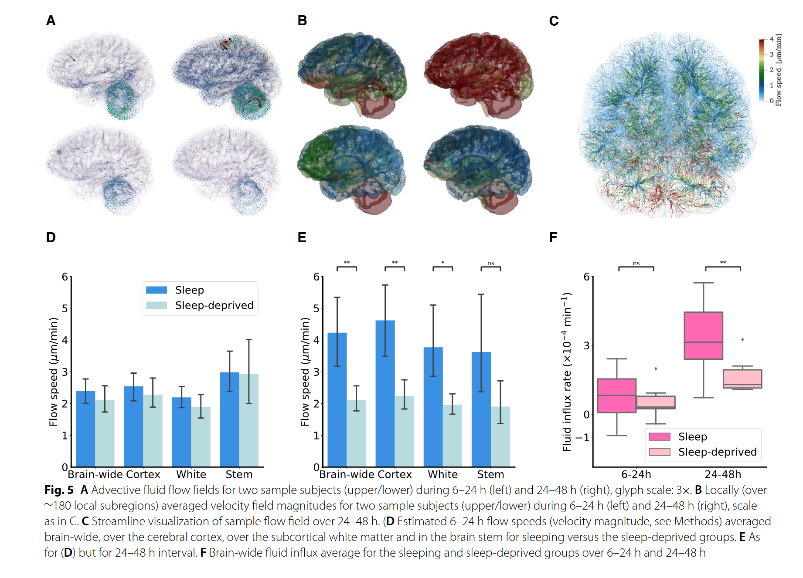
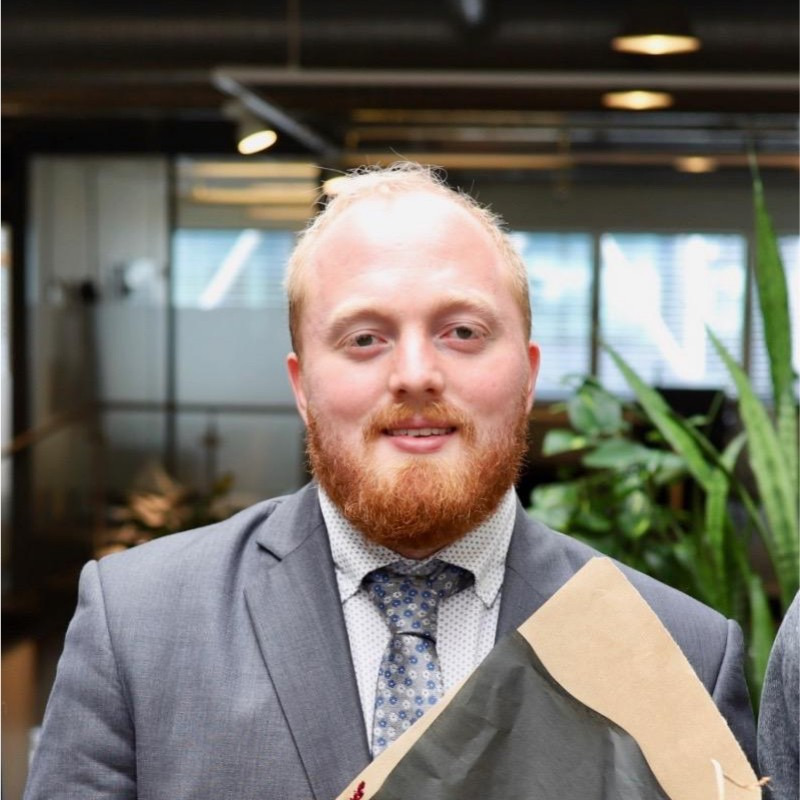
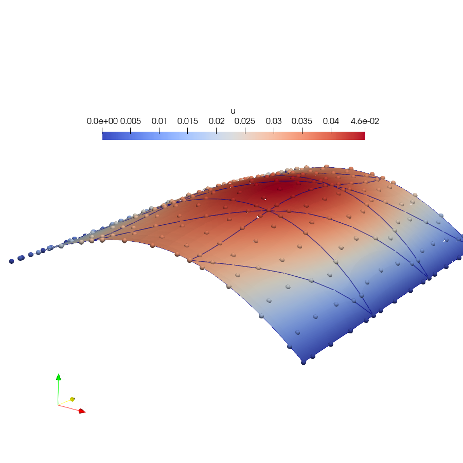
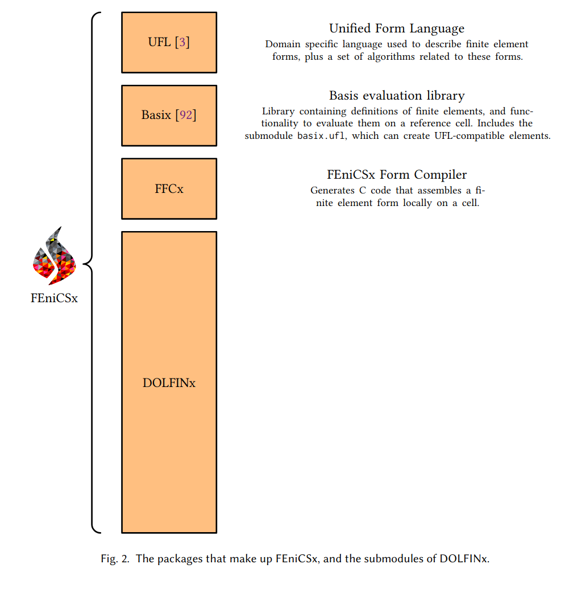
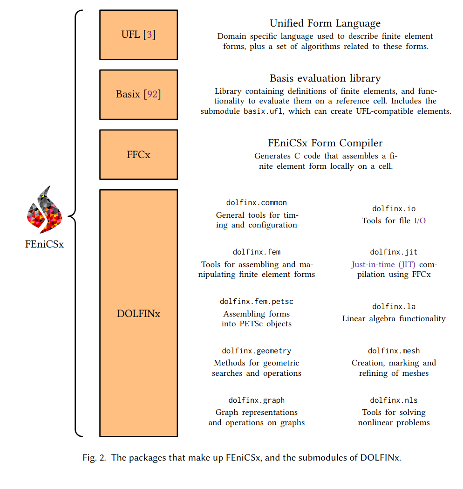
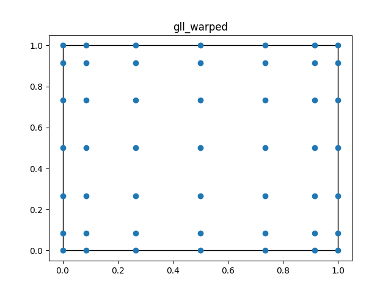
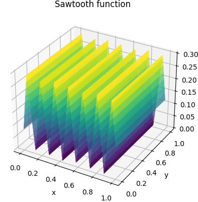
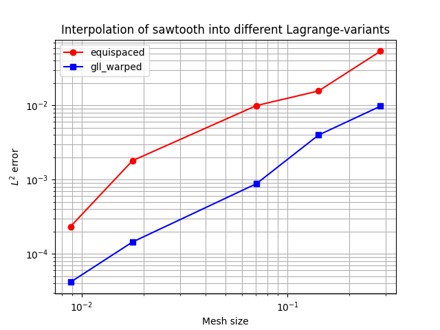

# An introduction to finite element modelling in FEniCS

<center>
Jørgen S. Dokken
<center/>

<center>
<b> dokken@simula.no </b>
<center/>

<center>
<a href="https://jsdokken.com">https://jsdokken.com</a>
<center/>

<center>
<div>

</div>
<!--  -->
<center/>

---

# About Simula

Founded in 2001 by the Norwegian Government

**6 research units**

- Simula Research Laboratory: Scientific Computing and Software engineering
- SimulaMet: Communication systems and machine intelligence
- Simula UiB: Cryptography
- Simula Innovation: Help for start-ups
- Simula Consulting: High-quality R&D consulting services
- Simula Academy: Researcher training and professional development

---

# Department of Scientific Computing and Numerical Analysis

<div class="columns">

<div>

<center>
Analysis and generic tools and algorithms for PDEs

<br>

<center/>
</div>
<div>
<center>
  Models for brain tissue
  
   <font size="6">
   Vinje et al. (2023)
   <br> 
  <a href="https://doi.org/10.1186/s12987-023-00459-8">10.1186/s12987-023-00459-8</a>
   </font> 
<center/>
</div>
</div>

---

# About me

<div data-marpit-fragment>

</div>
<div data-marpit-fragment>

- **2016-2019:** PhD in informatics from UiO/Simula

</div>

<div data-marpit-fragment>

- **2019-**: Forum Admin for the FEniCS discourse
- **2019-2022**: Post-doc at Department of Engineering, University of Cambridge

</div>

<div data-marpit-fragment>

- **2022-**: Member of the FEniCS Steering Council
- **2022-**: Consulting for Simula Consulting
- **2022-2023**: Research Engineer at SRL
- **2024--**: Senior Research Engineer at SRL
</div>



---

# Brief history of FEniCS


<div data-marpit-fragment>

- **2002**: First public version of a C++ library (DOLFIN)
- **2003**: FEniCS project was created

</div>
<div data-marpit-fragment>

- **2004**: Code generation (C++) using FFC
- **2005**: First Python interface (PyDOLFIN)

</div>

<div data-marpit-fragment>

- **2009**: Parallel (MPI support)
- **2009**: Unified form language (UFL) introduced

</div>

<div data-marpit-fragment>

- **2016--**: Sponsored by NumFOCUS
- **2017--**: DOLFINx ([10.5281/zenodo.10447665](https://doi.org/10.5281/zenodo.10447665))

</div>
<div data-marpit-fragment>

- ~3000 users on the FEniCS Discourse forum
- ~12 000 monthly downloads

</div>
<center>

<center/>

---

# The Poisson equation



```python
from mpi4py import MPI
import dolfinx
import dolfinx.fem.petsc as petsc
import ufl
import numpy as np

mesh = dolfinx.mesh.create_unit_square(MPI.COMM_WORLD, 3, 3)
V = dolfinx.fem.functionspace(mesh, ("Lagrange", 5))


```

---

# The Poisson equation


```python
from mpi4py import MPI
import dolfinx
import dolfinx.fem.petsc as petsc
import ufl
import numpy as np

mesh = dolfinx.mesh.create_unit_square(MPI.COMM_WORLD, 3, 3)
V = dolfinx.fem.functionspace(mesh, ("Lagrange", 5))

u, v = ufl.TrialFunction(V), ufl.TestFunction(V)
a = ufl.inner(ufl.grad(u), ufl.grad(v)) * ufl.dx
x, y = ufl.SpatialCoordinate(mesh)
f = x * ufl.sin(y * ufl.pi)
L = ufl.inner(f, v) * ufl.dx


+


```

---

# The Poisson equation

```python
from mpi4py import MPI
import dolfinx
import dolfinx.fem.petsc as petsc
import ufl
import numpy as np

mesh = dolfinx.mesh.create_unit_square(MPI.COMM_WORLD, 3, 3)
V = dolfinx.fem.functionspace(mesh, ("Lagrange", 5))

u, v = ufl.TrialFunction(V), ufl.TestFunction(V)
a = ufl.inner(ufl.grad(u), ufl.grad(v)) * ufl.dx
x, y = ufl.SpatialCoordinate(mesh)
f = x * ufl.sin(y * ufl.pi)
L = ufl.inner(f, v) * ufl.dx

boundary_dofs = dolfinx.fem.locate_dofs_geometrical(
    V, lambda x: np.isclose(x[0], 0) | np.isclose(x[0], 1))
u_bc = dolfinx.fem.Constant(mesh, 0.0)

bcs = [dolfinx.fem.dirichletbc(u_bc, boundary_dofs, V)]
options = {"ksp_type": "preonly", "pc_type": "lu"}
problem = petsc.LinearProblem(
    a, L, bcs=bcs, petsc_options=options
)
uh = problem.solve()
with dolfinx.io.VTXWriter(mesh.comm, "uh.bp", [uh]) as bp:
    bp.write(0.0)
```


---

# How does it work?

### Package overview



---

# How does it work?

### Package overview



---

# Basix

<div class="columns">
<div>

- A finite element tabulation library
- Provides quadrature schemes
- Written in C++ with a Python interface
  - Runtime tabulation
- Custom finite elements
- DOI: <a href="https://doi.org/10.21105/joss.03982">10.21105/joss.03982</a>

</div>
<iframe width="600" height="500" src="https://docs.fenicsproject.org/basix/v0.8.0/python/", title="Basix github repository"></iframe>

---

# Basix yields extra control over finite elements

```python
import basix.ufl
degree = 10
lagrange = basix.ufl.element(
    "Lagrange", "quadrilateral", degree, basix.LagrangeVariant.equispaced)
lagrange_gll = basix.ufl.element(
    "Lagrange", "quadrilateral", degree, basix.LagrangeVariant.gll_warped)
```

<div class="columns">

<div>


</div>

<div>



</div>
</div>

---

# Basix tabulate arbitrary order derivatives

```python
dtype = numpy.float64 # Can be changed to float 32 for lower precision
discontinuous = True
element = basix.ufl.element("Lagrange", "quadrilateral", 2,
                            dtype=dtype, discontinuous=discontinuous)
points = numpy.array([[0.2, 0.5], [0.3,0.82]], dtype=dtype)
print("Basis functions:\n", element.tabulate(0, points))
print("Basis derivatives:\n", element.tabulate(1, points)[1:])
```

```
Basis functions:
 [[[-0.     0.     0.    -0.    -0.     0.48  -0.12  -0.     0.64 ]
  [-0.032  0.014  0.147 -0.063 -0.097  0.165 -0.071  0.441  0.496]]]
Basis derivatives:
 [[[-0.    -0.    -0.    -0.    -0.    -2.2   -0.2   -0.     2.4  ]
  [ 0.207 -0.023 -0.945  0.105 -0.184 -1.063  0.118  0.84   0.945]]

 [[-0.48   0.12   0.48  -0.12  -0.64   0.     0.     0.64   0.   ]
  [ 0.078 -0.034  0.638 -0.274  0.235 -0.717  0.307  1.915 -2.15 ]]]

```

---

# Why do we care?



<div data-marpit-fragment>

<div>
</div>

<div>

```python
def saw_tooth(x):
    f = 4 * abs(x[0] - 0.43)
    for _ in range(8):
        f = abs(f - 0.3)
    return f

msh = dolfinx.mesh.create_unit_square(MPI.COMM_WORLD, N, M,
                                      cell_type=dolfinx.mesh.CellType.quadrilateral)

ufl_element = basix.ufl.element(basix.ElementFamily.P,
                                msh.basix_cell(), 10, variant)
V = dolfinx.fem.functionspace(msh, ufl_element)

# Approximate sawtooth function by interpolation
uh = dolfinx.fem.Function(V)
uh.interpolate(lambda x: saw_tooth(x))

# Evaluate sawtooth function in quadrature points
x = ufl.SpatialCoordinate(msh)
u_exact = saw_tooth(x)

# Compute L2 error
diff = u_exact - uh
M = dolfinx.fem.form(ufl.inner(diff, diff) * ufl.dx)
error = np.sqrt(msh.comm.allreduce(dolfinx.fem.assemble_scalar(M), op=MPI.SUM))
```

</div>

---

# We observe reduced convergence for equispaced Lagrange elements

<!--  -->

<center>

<center/>

<center>
<a href="https://docs.fenicsproject.org/dolfinx/main/python/demos/demo_lagrange_variants.html">Runge's phenomenon</a>

<center/>

---

# The FEniCS form compiler (FFCx) is used to generate C code from Python

<!--  -->

<div class="columns">
<div>

```python
import ufl
import basix.ufl

c_el = basix.ufl.element("Lagrange", "triangle", 1, shape=(2, ))
mesh = ufl.Mesh(c_el)

el = basix.ufl.element("Lagrange", "triangle", 2)

V = ufl.FunctionSpace(mesh, el)

u, v = ufl.TrialFunction(V), ufl.TestFunction(V)
a = ufl.inner(u, v) * ufl.dx

forms = [a]
```

```bash
python3 -m ffcx script.py
```

</div>
<iframe width="500" height="300" src="S.pdf", title="Computational graph of a mass matrix"></iframe>
</div>

---

# FFCx generates code to assemble the mass matrix for any element

<!--  -->

```c
void tabulate_tensor_integral_814d6545520c96b29b3c162b3f5d484bbf83c565(double* restrict A,
                                    const double* restrict w,
                                    const double* restrict c,
                                    const double* restrict coordinate_dofs,
                                    const int* restrict entity_local_index,
                                    const uint8_t* restrict quadrature_permutation)
{
// Quadrature rules
static const double weights_39d[6] = {0.054975871827661, 0.054975871827661, 0.054975871827661, 0.1116907948390055, 0.1116907948390055, 0.1116907948390055};
// Precomputed values of basis functions and precomputations
// FE* dimensions: [permutation][entities][points][dofs]
static const double FE1_C0_D10_Q39d[1][1][1][3] = {{{{-1.0, 1.0, 0.0}}}};
static const double FE1_C1_D01_Q39d[1][1][1][3] = {{{{-1.0, 0.0, 1.0}}}};
static const double FE2_C0_Q39d[1][1][6][6] = {{{{-0.07480380774819603, 0.5176323419876736, -0.07480380774819671, 0.2992152309927871, 0.03354481152314834, 0.2992152309927839},
  {-0.07480380774819613, -0.0748038077481966, 0.5176323419876735, 0.2992152309927871, 0.2992152309927838, 0.03354481152314828},
  {0.5176323419876713, -0.0748038077481967, -0.07480380774819674, 0.03354481152314866, 0.2992152309927869, 0.2992152309927868},
  {-0.04820837781551195, -0.08473049309397784, -0.04820837781551192, 0.1928335112620479, 0.7954802262009061, 0.1928335112620478},
  {-0.04820837781551193, -0.048208377815512, -0.08473049309397786, 0.1928335112620479, 0.192833511262048, 0.7954802262009062},
  {-0.08473049309397794, -0.04820837781551188, -0.04820837781551195, 0.7954802262009061, 0.1928335112620479, 0.1928335112620479}}}};
```

</div>

---

# Generated code continued

```c
// ------------------------
// Section: Jacobian
// Inputs: FE1_C1_D01_Q39d, coordinate_dofs, FE1_C0_D10_Q39d
// Outputs: J_c1, J_c2, J_c3, J_c0
double J_c0 = 0.0;
double J_c3 = 0.0;
double J_c1 = 0.0;
double J_c2 = 0.0;
{
  for (int ic = 0; ic < 3; ++ic)
  {
    J_c0 += coordinate_dofs[(ic) * 3] * FE1_C0_D10_Q39d[0][0][0][ic];
    J_c3 += coordinate_dofs[(ic) * 3 + 1] * FE1_C1_D01_Q39d[0][0][0][ic];
    J_c1 += coordinate_dofs[(ic) * 3] * FE1_C1_D01_Q39d[0][0][0][ic];
    J_c2 += coordinate_dofs[(ic) * 3 + 1] * FE1_C0_D10_Q39d[0][0][0][ic];
  }
}
// ------------------------
double sp_39d_0 = J_c0 * J_c3;
double sp_39d_1 = J_c1 * J_c2;
double sp_39d_2 = -sp_39d_1;
double sp_39d_3 = sp_39d_0 + sp_39d_2;
double sp_39d_4 = fabs(sp_39d_3);
```

---

# Generated code continued

```c
for (int iq = 0; iq < 6; ++iq)
{
  // Section: Intermediates
  // Inputs:
  // Outputs: fw0
  double fw0 = 0;
  {
    fw0 = sp_39d_4 * weights_39d[iq];
  }
  // Section: Tensor Computation
  // Inputs: FE2_C0_Q39d, fw0
  // Outputs: A
  {
    double temp_0[6] = {0};
    for (int j = 0; j < 6; ++j)
    {
      temp_0[j] = fw0 * FE2_C0_Q39d[0][0][iq][j];
    }
    for (int j = 0; j < 6; ++j)
    {
      for (int i = 0; i < 6; ++i)
      {
        A[6 * (i) + (j)] += FE2_C0_Q39d[0][0][iq][i] * temp_0[j];
      }
    }
  }
}
```

---

# Features

<!--  -->

<div class="columns">

<div>

- Single and double precision
- Real and complex valued tensors
- Assembly into arbitrary order tensors
- Curved cells for intervals, triangles, quadrilaterals, tetrahedra, hexahedra
- Discontinuous (broken) variants of all elements

</div>
<div>

<div data-marpit-fragment>

<style scoped>
table {
    height: 100%;
    width: 100%;
    font-size: 15px;
    color: black
}
</style>

| Family                           | Degrees        |
| -------------------------------- | -------------- |
| Lagrange                         | $\geq 0$       |
| Nedelec first and second kind    | $\geq 1$       |
| Raviart-Thomas                   | $\geq 1$       |
| Brezzi-Douglas-Marini            | $\geq 1$       |
| Regge                            | $\geq 0$       |
| Hellan-Herrmann-Johnson          | $\geq 0$       |
| Crouzeix-Raviart                 | $\geq 1$       |
| Discontinuous Polynomial Cubical | $\geq 0$       |
| Bubble                           | Cell dependent |
| Iso                              | $\geq 1$       |

</div>
</div>

---

# How does it work through Python?

- Just in time compilation with the [C Foreign Funcion Interface](https://cffi.readthedocs.io/en/stable/) (CFFI)
- C++ code is interfaced to Python using [Nanobind](https://nanobind.readthedocs.io/en/latest/)

```python
from mpi4py import MPI
import basix.ufl
import dolfinx
import ufl

mesh = dolfinx.mesh.create_unit_cube(
    MPI.COMM_WORLD, 10, 12, 13,
    cell_type=dolfinx.mesh.CellType.tetrahedron)

el = basix.ufl.element("Lagrange", mesh.topology.cell_name(), 3)

V = dolfinx.fem.functionspace(mesh, el)

u, v = ufl.TrialFunction(V), ufl.TestFunction(V)
a = ufl.inner(u, v) * ufl.dx
compiled_form = dolfinx.fem.form(a)
```

---

# Mesh creation using Numpy arrays

```python
import numpy as np
from mpi4py import MPI

import basix.ufl
import dolfinx
import ufl

x = np.array([[0.0, 0.0], [1.0, 0.0], [2.0, 0.0],
              [0.0, 1.0], [1.0, 1.0], [2.0, 1.0]], dtype=np.float32)
cells = np.array([[0, 1, 3, 4], [1, 2, 4, 5]], dtype=np.int64)
coordinate_element = basix.ufl.element("Lagrange", "quadrilateral", 1,
                                       shape=(x.shape[1],))
msh = dolfinx.mesh.create_mesh(MPI.COMM_SELF, cells, x, ufl.Mesh(coordinate_element))

```

<div data-marpit-fragment>

<div>

No re-ordering of cells to ensure consistent global orientations, see: Scroggs, Dokken, Richardson, Wells, 2022: [DOI: 10.1145/3524456](https://doi.org/10.1145/3524456)

</div>

---

# How to create a mesh in parallel?

```python
if (rank:=MPI.COMM_WORLD.rank) == 0:
    x = np.array([[0.0, 0.0], [1.0, 0.0], [2.0, 0.0]], dtype=np.float32)
    cells = np.array([[0, 1, 3, 4]], dtype=np.int64)
elif rank == 1:
    x = np.array([[0.0, 1.0], [1.0, 1.0], [2.0, 1.0]], dtype=np.float32)
    cells = np.array([[1, 2, 4, 5]], dtype=np.int64)
else:
    x = np.empty((0, 2), dtype=np.float32)
    cells = np.empty((0, 4), dtype=np.int64)
coordinate_element = basix.ufl.element("Lagrange", "quadrilateral", 1,
                                       shape=(x.shape[1],))
msh = dolfinx.mesh.create_mesh(MPI.COMM_WORLD, cells, x, ufl.Mesh(coordinate_element))
```

- Array interface makes it easier to interface with any meshing format
- No copying when moving data to C++ through nanobind (`std::span`)

---

# When a mesh is read in with multiple processes (MPI) the cells are distributed

<div class="columns">
<div>


</div>
<div>


</div>
</div>

<div data-marpit-fragment>

Custom partitioning example: [jsdokken.com/dolfinx_docs/meshes.html](https://jsdokken.com/dolfinx_docs/meshes.html)

</div>

---

<!-- # All entities (vertex, edge, facet, cell) has a notion of ownership

Makes mesh-view construction in parallel "easy" and safe

<div class="columns">
<div>


</div>
<div>


</div>
</div>

--- -->

<!--
# Custom partitioning

```python
if (rank:=MPI.COMM_WORLD.rank) == 0:
    cells = np.array([[0, 1, 3, 4]], dtype=np.int64)
    def partitioner(comm: MPI.Intracomm, n, m, topo):
        # The cell on this process will be owned by rank 2, and ghosted on rank 0
        return dolfinx.graph.adjacencylist(np.array([2, 0], dtype=np.int32), np.array([0,2],dtype=np.int32))
elif rank == 1:
    cells = np.array([[1, 2, 4, 5]], dtype=np.int64)
    def partitioner(comm: MPI.Intracomm, n, m, topo):
        # The cell on this process will be owned by rank 1, and ghosted on 0 and 2
        return dolfinx.graph.adjacencylist(np.array([1, 0, 2], dtype=np.int32), np.array([0,3],dtype=np.int32))
else:
    cells = np.empty((0, 4), dtype=np.int64)
    def partitioner(comm: MPI.Intracomm, n, m, topo):
        # No cells on process
        return dolfinx.graph.adjacencylist(np.empty(0, dtype=np.int32), np.zeros(1, dtype=np.int32))

coordinate_element = basix.ufl.element("Lagrange", "quadrilateral", 1,
                                       shape=(x.shape[1],))
msh = dolfinx.mesh.create_mesh(MPI.COMM_WORLD, cells, x, ufl.Mesh(coordinate_element), partitioner=partitioner)
```
<div data-marpit-fragment>

<div>

```bash
rank=0 Owned cells: 0 Ghosted cells: 2 Total cells: 2
rank=1 Owned cells: 1 Ghosted cells: 0 Total cells: 2
rank=2 Owned cells: 1 Ghosted cells: 1 Total cells: 2
```

</div>
</div>

--- -->

### What if I want to create my own integration kernels?

```python
c_signature = ffcx.codegeneration.utils.numba_ufcx_kernel_signature(
    dolfinx.default_scalar_type, dolfinx.default_real_type)

@numba.cfunc(c_signature, nopython=True)
def tabulate_A(A_, w_, c_, coords_, entity_local_index, quadrature_permutation=None):
    ...


```

</div>

---

### What if I want to create my own integration kernels?

```python
c_signature = ffcx.codegeneration.utils.numba_ufcx_kernel_signature(
    dolfinx.default_scalar_type, dolfinx.default_real_type)

@numba.cfunc(c_signature, nopython=True)
def tabulate_A(A_, w_, c_, coords_, entity_local_index, quadrature_permutation=None):
    # Wrap pointers as a Numpy arrays
    A = numba.carray(A_, (dim, dim))
    coordinate_dofs = numba.carray(coords_, (3, 3))

    # Compute Jacobian determinant
    x0, y0 = coordinate_dofs[0, :2]
    x1, y1 = coordinate_dofs[1, :2]
    x2, y2 = coordinate_dofs[2, :2]
    detJ = abs((x0 - x1) * (y2 - y1) - (y0 - y1) * (x2 - x1))
    # M_hat is pre-computed local mass matrix
    A[:] = detJ * M_hat


```

</div>

---

### What if I want to create my own integration kernels?

```python
c_signature = ffcx.codegeneration.utils.numba_ufcx_kernel_signature(
    dolfinx.default_scalar_type, dolfinx.default_real_type)

@numba.cfunc(c_signature, nopython=True)
def tabulate_A(A_, w_, c_, coords_, entity_local_index, quadrature_permutation=None):
    # Wrap pointers as a Numpy arrays
    A = numba.carray(A_, (dim, dim))
    coordinate_dofs = numba.carray(coords_, (3, 3))

    # Compute Jacobian determinant
    x0, y0 = coordinate_dofs[0, :2]
    x1, y1 = coordinate_dofs[1, :2]
    x2, y2 = coordinate_dofs[2, :2]
    detJ = abs((x0 - x1) * (y2 - y1) - (y0 - y1) * (x2 - x1))
    # M_hat is pre-computed local mass matrix
    A[:] = detJ * M_hat

formtype = dolfinx.cpp.fem.Form_float64
top = msh.topology
cells = np.arange(top.index_map(top.dim).size_local, dtype=np.int32)
integrals = {dolfinx.fem.IntegralType.cell: [(-1, tabulate_A.address, cells), ]}
coefficients_A, constants_A = [], []
a = dolfinx.fem.Form(formtype([V._cpp_object, V._cpp_object],
                              integrals, [], [], False, None))
```

</div>

---

# Some examples

<div class="columns">

<div>
<iframe width="600" height="420" src="https://jsdokken.com/dolfinx-tutorial/", title="FEniCS tutorial"></iframe>
</div>

<div data-marpit-fragment>

<div>

<center>

<center/>
<center>

<center/>
</div>

</div>
