# An introduction to finite element modelling in FEniCS

<center>
Jørgen S. Dokken
<center/>

<center>
<b> dokken@simula.no </b>
<center/>

<center>
<a href="https://jsdokken.com">https://jsdokken.com</a>
<center/>

<center>
<div>

</div>
<!--  -->
<center/>

---

# About Simula

Founded in 2001 by the Norwegian Government

**6 research units**

- Simula Research Laboratory: Scientific Computing and Software engineering
- SimulaMet: Communication systems and machine intelligence
- Simula UiB: Cryptography
- Simula Innovation: Help for start-ups
- Simula Consulting: High-quality R&D consulting services
- Simula Academy: Researcher training and professional development

---

# Department of Scientific Computing and Numerical Analysis

<div class="columns">

<div>

<center>
Analysis and generic tools and algorithms for PDEs

<br>

<center/>
</div>
<div>
<div data-marpit-fragment>
<center>
  Models for brain tissue
  
   <font size="6">
   Vinje et al. (2023)
   <br> 
  <a href="https://doi.org/10.1186/s12987-023-00459-8">10.1186/s12987-023-00459-8</a>
   </font> 
<center/>
</div>
</div>
</div>

<!-- --- -->

<!-- # About me

<div data-marpit-fragment>

</div>
<div data-marpit-fragment>

- **2016-2019:** PhD in informatics from UiO/Simula

</div>

<div data-marpit-fragment>

- **2019-**: Forum Admin for the FEniCS discourse
- **2019-2022**: Post-doc at Department of Engineering, University of Cambridge

</div>

<div data-marpit-fragment>

- **2022-**: Member of the FEniCS Steering Council
- **2022-**: Consulting for Simula Consulting
- **2022-2023**: Research Engineer at SRL
- **2024--**: Senior Research Engineer at SRL
</div>

 -->

---

# Brief history of FEniCS


**2002:** First public version of DOLFIN (Dynamic Object oriented Library for FINite element computation)

<center>
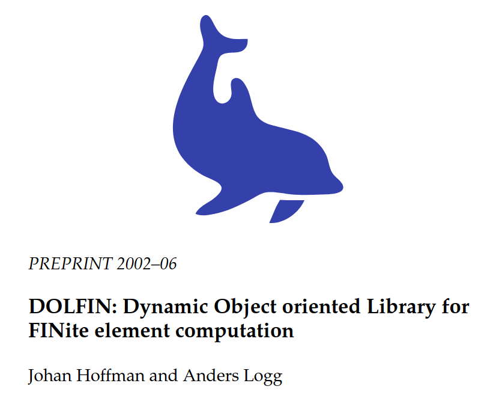
<center/>

---

# Brief history of FEniCS


**2002:** First public version of DOLFIN (Dynamic Object oriented Library for FINite element computation)

<center>
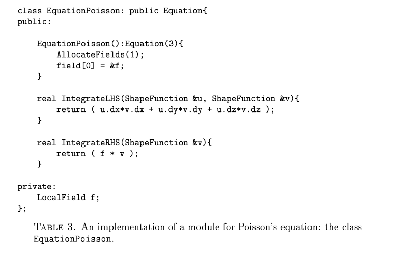<br>
<font size="5">
Setting up a Poisson problem using operator overloading
</font>
<center/>

---

# Brief history of FEniCS

<!--  -->

**2003**: Creation of the FEniCS Project

<font size="3">

- Prof. Todd Dupont, University of Chicago
- Dr. Johan Hoffman Courant Institute of Mathematical Sciences, New York
- Prof. Claes Johnson, Chalmers University of Technology, Gothenburg
- Ass. Prof. Robert C. Kirby, University of Chicago
- Ass. Prof. Mats Larson, Chalmers
- Mr. Anders Logg, Chalmers

</font>

<center>
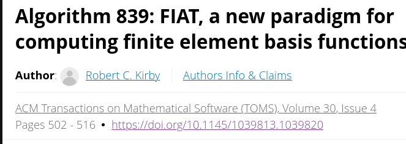
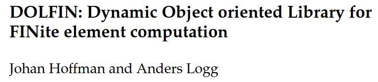
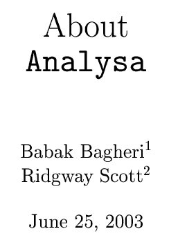
<br>
<font size="5">
The original core components of FEniCS
</font>
<center/>

---

# Brief history of FEniCS


**2004**: Code generation (C++/C) introduced

<center>
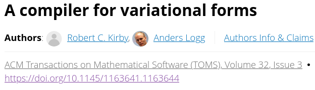
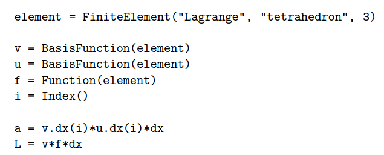
<br>

---

# Brief history of FEniCS


<div data-marpit-fragment>

- **2005**: First Python interface and PETSc used as solver backend
- **2007**: Just in time compilation
- **2009**: MPI support

---

# Brief history of FEniCS


**2009**: Unified Form Language introduced

<center>
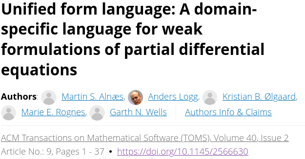
<br>
<center>

---

# Brief history of FEniCS

**2012**: FEniCS book (~3800 citations)

<center>
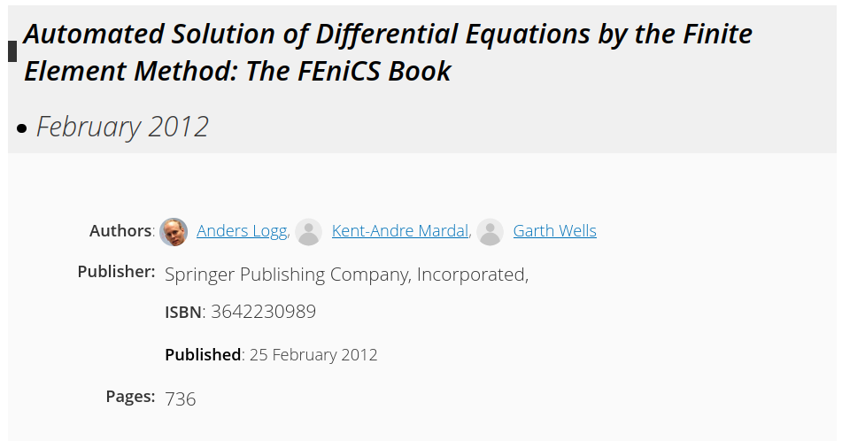
<br>
<center>

---

# Brief history of FEniCS


**2016--**: Sponsored by NumFOCUS

<center>

<center/>

---

# Brief history of FEniCS


**2017--**: DOLFINx development
DOI: [10.5281/zenodo.10447665](https://doi.org/10.5281/zenodo.10447665)

<center>
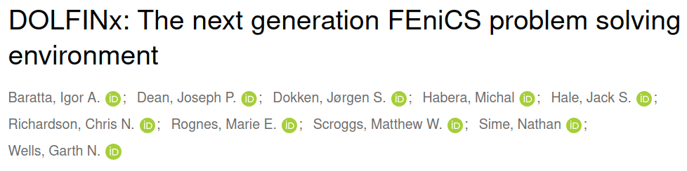
<br>
<center>
<center>

<center/>

---


# Some statistics

- Over 200 contributors over 22 years
- 3 300 registered users on the [Discourse forum](https://fenicsproject.discourse.group/)
- ~120 000 page views per month
- ~5 000 citations accumulated for the referenced papers

<center>

<center/>

---

---

# The Poisson equation


```python
from mpi4py import MPI
import dolfinx
import dolfinx.fem.petsc as petsc
import ufl
import numpy as np

mesh = dolfinx.mesh.create_unit_square(MPI.COMM_WORLD, 3, 3)
V = dolfinx.fem.functionspace(mesh, ("Lagrange", 5))


```

---

# The Poisson equation


```python
from mpi4py import MPI
import dolfinx
import dolfinx.fem.petsc as petsc
import ufl
import numpy as np

mesh = dolfinx.mesh.create_unit_square(MPI.COMM_WORLD, 3, 3)
V = dolfinx.fem.functionspace(mesh, ("Lagrange", 5))

u, v = ufl.TrialFunction(V), ufl.TestFunction(V)
a = ufl.inner(ufl.grad(u), ufl.grad(v)) * ufl.dx
x, y = ufl.SpatialCoordinate(mesh)
f = x * ufl.sin(y * ufl.pi)
L = ufl.inner(f, v) * ufl.dx


```

---

# The Poisson equation

```python
from mpi4py import MPI
import dolfinx
import dolfinx.fem.petsc as petsc
import ufl
import numpy as np

mesh = dolfinx.mesh.create_unit_square(MPI.COMM_WORLD, 3, 3)
V = dolfinx.fem.functionspace(mesh, ("Lagrange", 5))

u, v = ufl.TrialFunction(V), ufl.TestFunction(V)
a = ufl.inner(ufl.grad(u), ufl.grad(v)) * ufl.dx
x, y = ufl.SpatialCoordinate(mesh)
f = x * ufl.sin(y * ufl.pi)
L = ufl.inner(f, v) * ufl.dx

boundary_dofs = dolfinx.fem.locate_dofs_geometrical(
    V, lambda x: np.isclose(x[0], 0) | np.isclose(x[0], 1))
u_bc = dolfinx.fem.Constant(mesh, 0.0)

bcs = [dolfinx.fem.dirichletbc(u_bc, boundary_dofs, V)]


```


---

# The Poisson equation

```python
from mpi4py import MPI
import dolfinx
import dolfinx.fem.petsc as petsc
import ufl
import numpy as np

mesh = dolfinx.mesh.create_unit_square(MPI.COMM_WORLD, 3, 3)
V = dolfinx.fem.functionspace(mesh, ("Lagrange", 5))

u, v = ufl.TrialFunction(V), ufl.TestFunction(V)
a = ufl.inner(ufl.grad(u), ufl.grad(v)) * ufl.dx
x, y = ufl.SpatialCoordinate(mesh)
f = x * ufl.sin(y * ufl.pi)
L = ufl.inner(f, v) * ufl.dx

boundary_dofs = dolfinx.fem.locate_dofs_geometrical(
    V, lambda x: np.isclose(x[0], 0) | np.isclose(x[0], 1))
u_bc = dolfinx.fem.Constant(mesh, 0.0)

bcs = [dolfinx.fem.dirichletbc(u_bc, boundary_dofs, V)]
options = {"ksp_type": "preonly", "pc_type": "lu"}
problem = petsc.LinearProblem(
    a, L, bcs=bcs, petsc_options=options
)
uh = problem.solve()
with dolfinx.io.VTXWriter(mesh.comm, "uh.bp", [uh]) as bp:
    bp.write(0.0)
```


---

# How does it work?

### Package overview


---

# How does it work?

### Package overview


---

# Basix

<!-- footer: Scroggs et al., (2022). Basix: a runtime finite element basis evaluation library. Journal of Open Source Software, 3982, DOI: [https://10.21105/joss.03982](0.21105/joss.03982) -->

<div class="columns">
<div>

<div data-marpit-fragment>

- A C++ finite element tabulation library

</div>
<div data-marpit-fragment>

- Provides quadrature schemes

</div>
<div data-marpit-fragment>

- Python interface using nanobind

</div>
<div data-marpit-fragment>

- Can be used as a runtime tabulation library

</div>

</div>

<iframe width="600" height="450" src="https://docs.fenicsproject.org/basix/main/python/demo/demo_custom_element.py.html#creating-a-custom-element", title="Creating a custom element"></iframe>

---

<!-- footer: <br> -->

# Basix yields extra control over finite elements

```python
import basix.ufl
degree = 10
lagrange = basix.ufl.element(
    "Lagrange", "quadrilateral", degree, basix.LagrangeVariant.equispaced)
lagrange_gll = basix.ufl.element(
    "Lagrange", "quadrilateral", degree, basix.LagrangeVariant.gll_warped)
```

<div class="columns">

<div>


</div>

<div>


</div>
</div>

---

# Basix tabulate arbitrary order derivatives

```python
dtype = numpy.float64 # Can be changed to float 32 for lower precision
discontinuous = True
element = basix.ufl.element("Lagrange", "quadrilateral", 2,
                            dtype=dtype, discontinuous=discontinuous)
points = numpy.array([[0.2, 0.5], [0.3,0.82]], dtype=dtype)
print("Basis functions:\n", element.tabulate(0, points))
print("Basis derivatives:\n", element.tabulate(1, points)[1:])
```

<div data-marpit-fragment>

```
Basis functions:
 [[[-0.     0.     0.    -0.    -0.     0.48  -0.12  -0.     0.64 ]
  [-0.032  0.014  0.147 -0.063 -0.097  0.165 -0.071  0.441  0.496]]]
Basis derivatives:
 [[[-0.    -0.    -0.    -0.    -0.    -2.2   -0.2   -0.     2.4  ]
  [ 0.207 -0.023 -0.945  0.105 -0.184 -1.063  0.118  0.84   0.945]]

 [[-0.48   0.12   0.48  -0.12  -0.64   0.     0.     0.64   0.   ]
  [ 0.078 -0.034  0.638 -0.274  0.235 -0.717  0.307  1.915 -2.15 ]]]
```

</div>

---

# Why do we care?


<div data-marpit-fragment>

<div>
</div>

<div>

```python
def saw_tooth(x):
    f = 4 * abs(x[0] - 0.43)
    for _ in range(8):
        f = abs(f - 0.3)
    return f

msh = dolfinx.mesh.create_unit_square(MPI.COMM_WORLD, N, M,
                                      cell_type=dolfinx.mesh.CellType.quadrilateral)

ufl_element = basix.ufl.element(basix.ElementFamily.P,
                                msh.basix_cell(), 10, variant)
V = dolfinx.fem.functionspace(msh, ufl_element)

# Approximate sawtooth function by interpolation
uh = dolfinx.fem.Function(V)
uh.interpolate(lambda x: saw_tooth(x))

# Evaluate sawtooth function in quadrature points
x = ufl.SpatialCoordinate(msh)
u_exact = saw_tooth(x)

# Compute L2 error
diff = u_exact - uh
M = dolfinx.fem.form(ufl.inner(diff, diff) * ufl.dx)
error = np.sqrt(msh.comm.allreduce(dolfinx.fem.assemble_scalar(M), op=MPI.SUM))
```

</div>

---

# We observe reduced convergence for equispaced Lagrange elements

<!--  -->

<center>

<center/>

<center>
<a href="https://docs.fenicsproject.org/dolfinx/main/python/demos/demo_lagrange_variants.html">Runge's phenomenon</a>

<center/>

---

# The FEniCS form compiler (FFCx) is used to generate C code from Python

<!--  -->

```python
import ufl
import basix.ufl

c_el = basix.ufl.element("Lagrange", "triangle", 1, shape=(2, ))
mesh = ufl.Mesh(c_el)

el = basix.ufl.element("Lagrange", "triangle", 2)
V = ufl.FunctionSpace(mesh, el)

u, v = ufl.TrialFunction(V), ufl.TestFunction(V)
a = ufl.inner(u, v) * ufl.dx

forms = [a]
```

---

```bash
python3 -m ffcx script.py
```

<center>
<iframe width="1000" height="550" src="S.pdf", title="Computational graph of a mass matrix"></iframe>
</center>

---

# FFCx generates code to assemble the mass matrix

```c
void tabulate_tensor_integral_814d6545520c96b29b3c162b3f5d484bbf83c565(double* restrict A,
                                    const double* restrict w,
                                    const double* restrict c,
                                    const double* restrict coordinate_dofs,
                                    const int* restrict entity_local_index,
                                    const uint8_t* restrict quadrature_permutation)
{
// Quadrature rules
static const double weights_39d[6] = {0.054975871827661, 0.054975871827661, 0.054975871827661, 0.1116907948390055, 0.1116907948390055, 0.1116907948390055};
// Precomputed values of basis functions and precomputations
// FE* dimensions: [permutation][entities][points][dofs]
static const double FE1_C0_D10_Q39d[1][1][1][3] = {{{{-1.0, 1.0, 0.0}}}};
static const double FE1_C1_D01_Q39d[1][1][1][3] = {{{{-1.0, 0.0, 1.0}}}};
static const double FE2_C0_Q39d[1][1][6][6] = {{{{-0.07480380774819603, 0.5176323419876736, -0.07480380774819671, 0.2992152309927871, 0.03354481152314834, 0.2992152309927839},
  {-0.07480380774819613, -0.0748038077481966, 0.5176323419876735, 0.2992152309927871, 0.2992152309927838, 0.03354481152314828},
  {0.5176323419876713, -0.0748038077481967, -0.07480380774819674, 0.03354481152314866, 0.2992152309927869, 0.2992152309927868},
  {-0.04820837781551195, -0.08473049309397784, -0.04820837781551192, 0.1928335112620479, 0.7954802262009061, 0.1928335112620478},
  {-0.04820837781551193, -0.048208377815512, -0.08473049309397786, 0.1928335112620479, 0.192833511262048, 0.7954802262009062},
  {-0.08473049309397794, -0.04820837781551188, -0.04820837781551195, 0.7954802262009061, 0.1928335112620479, 0.1928335112620479}}}};
```

</div>

---

# Generated code continued

```c
// ------------------------
// Section: Jacobian
// Inputs: FE1_C1_D01_Q39d, coordinate_dofs, FE1_C0_D10_Q39d
// Outputs: J_c1, J_c2, J_c3, J_c0
double J_c0 = 0.0;
double J_c3 = 0.0;
double J_c1 = 0.0;
double J_c2 = 0.0;
{
  for (int ic = 0; ic < 3; ++ic)
  {
    J_c0 += coordinate_dofs[(ic) * 3] * FE1_C0_D10_Q39d[0][0][0][ic];
    J_c3 += coordinate_dofs[(ic) * 3 + 1] * FE1_C1_D01_Q39d[0][0][0][ic];
    J_c1 += coordinate_dofs[(ic) * 3] * FE1_C1_D01_Q39d[0][0][0][ic];
    J_c2 += coordinate_dofs[(ic) * 3 + 1] * FE1_C0_D10_Q39d[0][0][0][ic];
  }
}
// ------------------------
double sp_39d_0 = J_c0 * J_c3;
double sp_39d_1 = J_c1 * J_c2;
double sp_39d_2 = -sp_39d_1;
double sp_39d_3 = sp_39d_0 + sp_39d_2;
double sp_39d_4 = fabs(sp_39d_3);
```

---

# Generated code continued

```c
for (int iq = 0; iq < 6; ++iq)
{
  // Section: Intermediates
  // Inputs:
  // Outputs: fw0
  double fw0 = 0;
  {
    fw0 = sp_39d_4 * weights_39d[iq];
  }
  // Section: Tensor Computation
  // Inputs: FE2_C0_Q39d, fw0
  // Outputs: A
  {
    double temp_0[6] = {0};
    for (int j = 0; j < 6; ++j)
    {
      temp_0[j] = fw0 * FE2_C0_Q39d[0][0][iq][j];
    }
    for (int j = 0; j < 6; ++j)
    {
      for (int i = 0; i < 6; ++i)
      {
        A[6 * (i) + (j)] += FE2_C0_Q39d[0][0][iq][i] * temp_0[j];
      }
    }
  }
}
```

---

# Features

<!--  -->

<div class="columns">

<div>

- Single and double precision
- Real and complex valued tensors
- Assembly into arbitrary order tensors
- Curved cells for intervals, triangles, quadrilaterals, tetrahedra, hexahedra
- Discontinuous (broken) variants of all elements

</div>
<div>

<div data-marpit-fragment>

<style scoped>
table {
    height: 100%;
    width: 100%;
    font-size: 15px;
    color: black
}
</style>

| Family                           | Degrees        |
| -------------------------------- | -------------- |
| Lagrange                         | $\geq 0$       |
| Nedelec first and second kind    | $\geq 1$       |
| Raviart-Thomas                   | $\geq 1$       |
| Brezzi-Douglas-Marini            | $\geq 1$       |
| Regge                            | $\geq 0$       |
| Hellan-Herrmann-Johnson          | $\geq 0$       |
| Crouzeix-Raviart                 | $\geq 1$       |
| Discontinuous Polynomial Cubical | $\geq 0$       |
| Bubble                           | Cell dependent |
| Iso                              | $\geq 1$       |

</div>
</div>

---

# How does it work through Python?

- Just in time compilation with the [C Foreign Function Interface](https://cffi.readthedocs.io/en/stable/) (CFFI)
- C++ code is interfaced to Python using [Nanobind](https://nanobind.readthedocs.io/en/latest/)

```python
from mpi4py import MPI
import basix.ufl
import dolfinx
import ufl

mesh = dolfinx.mesh.create_unit_cube(
    MPI.COMM_WORLD, 10, 12, 13,
    cell_type=dolfinx.mesh.CellType.tetrahedron)

V = dolfinx.fem.functionspace(mesh, el, ("Lagrange", 3))
u, v = ufl.TrialFunction(V), ufl.TestFunction(V)
a = ufl.inner(u, v) * ufl.dx

compiled_form = dolfinx.fem.form(a)
```

---

---

# The Signorini problem $^{1, 2}$

<!--  footer: $^1$ Dokken, Farrell, Keith, Surowiec, _The latent variable proximal point algorithm for problems with pointwise constraints_ , In preparation. $^2$ Keith, Surowiec. _Proximal Galerkin: A structure-preserving finite element method for pointwise bound constraints._ arXiv:2307.12444 (2023)<br>-->
<div class=columns>
<div>

$$
\begin{align*}
\nabla \cdot (C \epsilon(\mathbf{u})) &= \mathbf{f} \text{ in } \Omega\\
\mathbf{u} &= \mathbf{u}_D \text{ on } \delta\Omega_D \\
C\epsilon(\mathbf{u})\mathbf{n} &= 0 \text{ on } \delta\Omega_N\\
\mathbf{u}\cdot \hat{\mathbf{n}} &\leq g \text{ on } \Gamma\\
\sigma_n(\mathbf{u}) &= (C\epsilon(\mathbf{u})\mathbf{n})\cdot \mathbf{n}\\
\sigma_n(\mathbf{u}) \mathbf{n} &\leq 0 \text{ on } \Gamma\\
\sigma_n(\mathbf{u})(\mathbf{u}\cdot \hat{\mathbf{n}}-g) &= 0 \text{ on } \Gamma
\end{align*}
$$

</div>
<div>
<center>
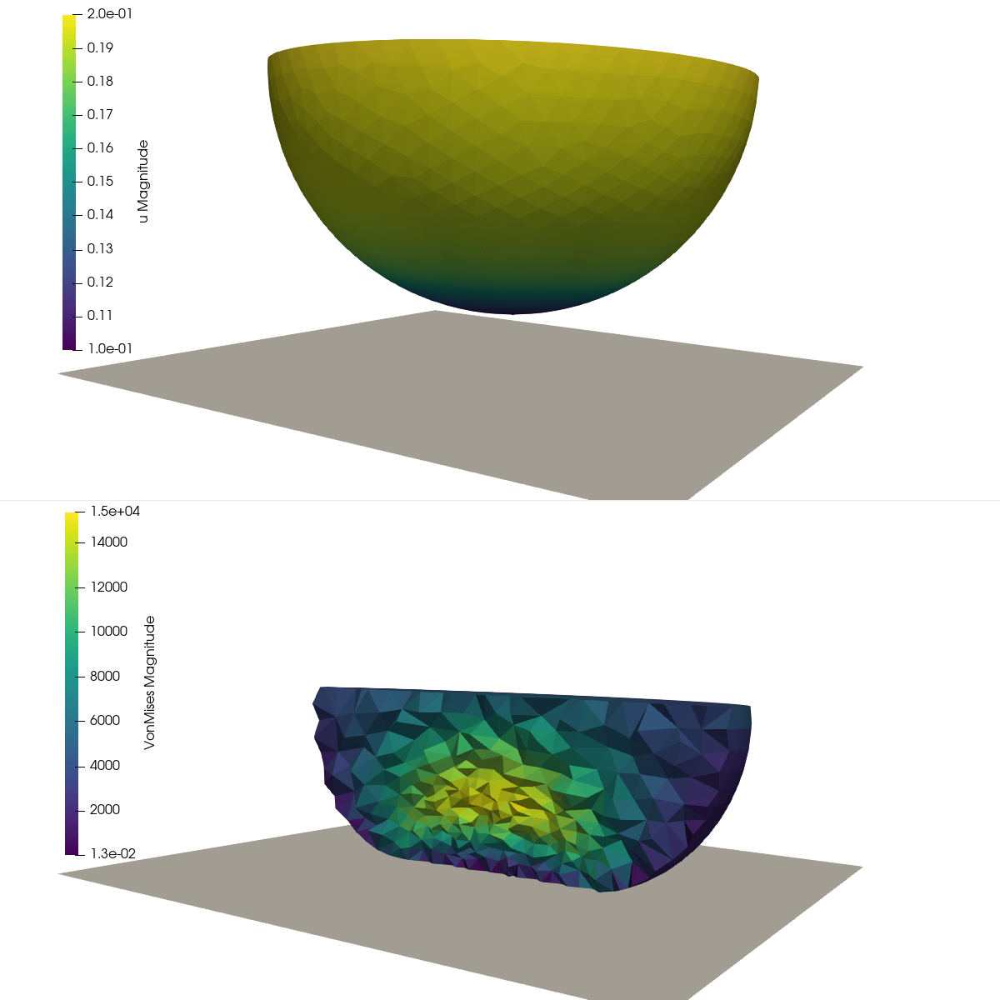
</center>

</div>

---

# Minimization reformulation

Rephrase as

$$
\begin{align*}
\min_{\mathbf{u}\in \mathcal{K}} J(\mathbf{u}) = \frac{1}{2} \int_\Omega (C\epsilon(\mathbf{u}):\epsilon(\mathbf{v}))~\mathrm{d}x -
\int_\Omega \mathbf{f}\cdot \mathbf{u}~\mathrm{d}x
\end{align*}
$$

where
$$\mathcal{K} = \{ \mathbf{u}\in V_{\mathbf{u}_D} \vert \mathbf{u}\cdot  \hat{\mathbf{n}} \leq g \}$$

---

# Latent variable proximal point algorithm

Let $\mathbf{u}\in V(\Omega)$, $\psi\in Q(\Gamma)$.
Given $\alpha_k$, $\psi_{k-1}$,

- Solve:

$$
\begin{align*}
\alpha_k(\sigma(\mathbf{u}), \epsilon(\mathbf{v}))_\Omega - (\psi, \mathbf{v}\cdot \mathbf{n})_\Gamma &= -\alpha_k(\mathbf{f}, v)_\Omega - (\psi^{k-1}, \mathbf{v}\cdot \mathbf{n})_\Gamma\\
(\mathbf{u}\cdot \mathbf{n}, w)_\Gamma - (e^{\psi}, w)_\Gamma &= (g, w)_\Gamma
\end{align*}
$$

- Check for convergence.
- Update latent variable $\psi^{k-1}$, $\alpha_k$.

</div>

</div>

---

# Features of the method

<div class=columns>
<div>
<div data-marpit-fragment>

- $\alpha_k$ bounded

</div>
<div data-marpit-fragment>

- $e^{\psi} = \mathbf{u}\cdot{n} - g$ guaranteed to be positive for any latent variable $\psi$.

</div>
<div data-marpit-fragment>

- Latent variable $\psi$ is not limited to first order spaces.

</div>
<div data-marpit-fragment>

- Exhibits mesh independent convergence.

</div>
</div>

<div>

<center>

</center>
</div>

---

# How does one implement this in FEniCSx?

<!--footer: <br>-->

---

# DOLFINx supports sub-meshes$^3$

<!--footer: $^3$ Dean J., _Mathematical and computational aspects of solving mixed-domain problems using the finite element method_, DOI: 10.17863/CAM.108292 (2023)<br><br>-->

```python
c_facets = mt.find(contact_bndry)
submesh, submesh_to_mesh = dolfinx.mesh.create_submesh(mesh, mt.dim, c_facets)[0:2]


```

---

# DOLFINx supports sub-meshes$^3$

```python
c_facets = mt.find(contact_bndry)
submesh, submesh_to_mesh, _, _ = dolfinx.mesh.create_submesh(mesh, mt.dim, c_facets)

V = dolfinx.fem.functionspace(mesh, ("Lagrange", degree, (gdim, )))

W = dolfinx.fem.functionspace(submesh, ("Larange", degree))


```

---

# DOLFINx supports sub-meshes$^3$

```python
c_facets = mt.find(contact_bndry)
submesh, submesh_to_mesh, _, _ = dolfinx.mesh.create_submesh(mesh, mt.dim, c_facets)

V = dolfinx.fem.functionspace(mesh, ("Lagrange", degree, (gdim, )))

W = dolfinx.fem.functionspace(submesh, ("Larange", degree))

facet_imap = mesh.topology.index_map(mt.dim)
num_facets = facet_imap.size_local + facet_imap.num_ghosts
mesh_to_submesh = np.full(num_facets, -1)
mesh_to_submesh[submesh_to_mesh] = np.arange(len(submesh_to_mesh))
entity_maps = {submesh: mesh_to_submesh}
```

---

# Mixed assembly using block structures

```python
u = dolfinx.fem.Function(V)
v = ufl.TestFunction(V)
psi = dolfinx.fem.Function(W)
psi_k = dolfinx.fem.Function(W)
w = ufl.TestFunction(W)
n = ufl.FacetNormal(mesh)
alpha = dolfinx.fem.Constant(mesh, 1.0)
f, g, n_g = ...
dx = ufl.Measure("dx", domain=mesh)
ds = ufl.Measure("ds", domain=mesh,
        subdomain_data=facet_tag,
        subdomain_id=contact_bndry)
```

---

# Mixed assembly continued

<!--  footer: <br>-->

```python
def epsilon(w):
    return ufl.sym(ufl.grad(w))

def sigma(w, mu, lmbda):
    ew = epsilon(w)
    gdim = ew.ufl_shape[0]
    return 2.0 * mu * epsilon(w) + lmbda * ufl.tr(ufl.grad(w)) * ufl.Identity(gdim)


F0 = alpha * ufl.inner(sigma(u, mu, lmbda), epsilon(v)) * dx - alpha * ufl.inner(f, v) * dx
F0 += -ufl.inner(psi - psi_k, ufl.dot(v, n)) * ds
F1 = ufl.inner(ufl.dot(u, n_g), w) * ds
F1 += ufl.inner(ufl.exp(psi), w) * ds - ufl.inner(g, w) * ds

F = dolfinx.fem.form([F0, F1], entity_maps=entity_maps)
```

---

# Mixed assembly continued

```python
jac00 = ufl.derivative(F0, u)
jac01 = ufl.derivative(F0, psi)
jac10 = ufl.derivative(F1, u)
jac11 = ufl.derivative(F1, psi)

J = dolfinx.fem.form([[jac00, jac01], [jac10, jac11]],
                     entity_maps=entity_maps)
```

**`J` and `F` can be passed to a blocked Newton solver**

---

---

<!-- footer: Full code available at: <br>https://gist.github.com/jorgensd/8a5c32f491195e838f5863ca88b27bce<br>-->

# Different function spaces on domain subsets

```python
submesh, cell_map = dolfinx.mesh.create_submesh(mesh, tdim, subset_cells)[0:2]
# Define variational form...
compiled_F = dolfinx.fem.form(F, entity_maps=entity_maps)
```

<div class="columns">
<div>
Different function spaces in each subdomain
<br>

$$
\begin{align*}
-\nabla\cdot(k_i\nabla u_i)&=f_i \text{ in } \Omega_i\\
u&=u_{D_i} \text{ on } \delta\Omega_{i,D} \\
%k\frac{\partial u_i}{\partial n}&=0 \text{ on } \delta\Omega_{i,N}\\
u_i &= u_j \text{ on } \Gamma_{i,j}\\
k_i\frac{\partial u_i}{\partial n} &= k_j\frac{\partial u_j}{\partial n} \text{ on } \Gamma_{i,j}
\end{align*}
$$

</div>
<div>
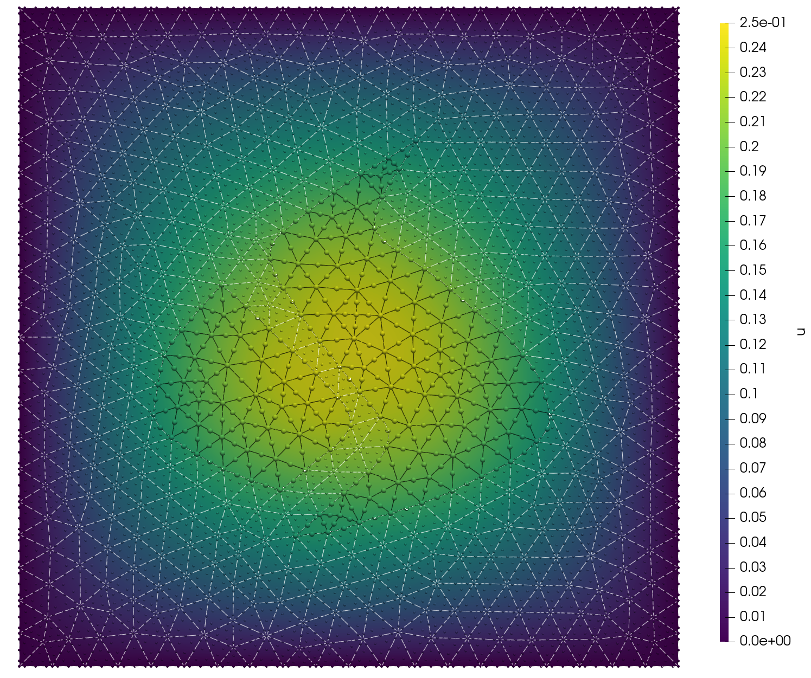
</div>

---

# Post-processing / coupling

<!-- footer: <br>-->

---

# Evaluation of expressions at any point in reference cell

```python
mesh = dolfinx.mesh.create_unit_square(MPI.COMM_WORLD, 3, 3, dolfinx.cpp.mesh.CellType.quadrilateral)
V = dolfinx.fem.functionspace(mesh, ("Lagrange", 2, (mesh.geometry.dim, )))
u = dolfinx.fem.Function(V)

def f(x):
    return 1/2*x[0]**2 - 2 *x[1]**2, -3/2*x[0]**2 + 1/2*x[1]**2

u.interpolate(f)


```

---

# Evaluation of expressions at any point in reference cell

```python
mesh = dolfinx.mesh.create_unit_square(MPI.COMM_WORLD, 3, 3, dolfinx.cpp.mesh.CellType.quadrilateral)
V = dolfinx.fem.functionspace(mesh, ("Lagrange", 2, (mesh.geometry.dim, )))
u = dolfinx.fem.Function(V)

def f(x):
    return 1/2*x[0]**2 - 2 *x[1]**2, -3/2*x[0]**2 + 1/2*x[1]**2

u.interpolate(f)

ref_x = np.array([[0.5, 0.5]])
gradu_squared = dolfinx.fem.Expression(ufl.inner(ufl.grad(u), ufl.grad(u)), ref_x, comm=mesh.comm)

cells = dolfinx.mesh.locate_entities(mesh, mesh.topology.dim, lambda x: x[0]<0.4)
values = gradu_squared.eval(mesh,cells)

```

---

# Interpolation of expressions

```python
Q = dolfinx.fem.functionspace(mesh, ("DQ", 1))
q = dolfinx.fem.Function(Q)

expr = u[1].dx(0)
compiled_expression = dolfinx.fem.Expression(
    expr, Q.element.interpolation_points())
q.interpolate(compiled_expression)
```

---

# Evaluation of expressions over facets

```python
n = ufl.FacetNormal(mesh)
flux = ufl.dot(u, n)
x_ref_facet = np.array([[0.2], [0.7]])
flux_expr = dolfinx.fem.Expression(flux, x_ref_facet, comm=mesh.comm)


```

---

# Evaluation of expressions over facets

```python
n = ufl.FacetNormal(mesh)
flux = ufl.dot(u, n)
x_ref_facet = np.array([[0.2], [0.7]])
flux_expr = dolfinx.fem.Expression(flux, x_ref_facet, comm=mesh.comm)

fdim = mesh.topology.dim - 1
left_facets = dolfinx.mesh.locate_entities_boundary(
  mesh, fdim, lambda x: x[0]<1e-14)
integration_entities = dolfinx.fem.compute_integration_domains(
      dolfinx.fem.IntegralType.exterior_facet, mesh.topology,
      left_facets, fdim)
flux_values = flux_expr.eval(mesh, integration_entities)

```

---

# Transfer data to facet-submesh

```python
def move_to_facet_quadrature(ufl_expr, mesh, sub_facets, scheme="default", degree=6):
    fdim = mesh.topology.dim - 1
    # Create submesh
    bndry_mesh, entity_map, _, _ = dolfinx.mesh.create_submesh(mesh, fdim, sub_facets)
    # Create quadrature space on submesh
    q_el = basix.ufl.quadrature_element(bndry_mesh.basix_cell(), ufl_expr.ufl_shape , scheme, degree)
    Q = dolfinx.fem.functionspace(bndry_mesh, q_el)


```

---

# Transfer data to facet-submesh

```python
def move_to_facet_quadrature(ufl_expr, mesh, sub_facets, scheme="default", degree=6):
    fdim = mesh.topology.dim - 1
    # Create submesh
    bndry_mesh, entity_map, _, _ = dolfinx.mesh.create_submesh(mesh, fdim, sub_facets)
    # Create quadrature space on submesh
    q_el = basix.ufl.quadrature_element(bndry_mesh.basix_cell(), ufl_expr.ufl_shape , scheme, degree)
    Q = dolfinx.fem.functionspace(bndry_mesh, q_el)

    # Compute where to evaluate expression per submesh cell
    integration_entities = compute_integration_domains(
      IntegralType.exterior_facet, mesh.topology, entity_map, fdim)
    compiled_expr = dolfinx.fem.Expression(ufl_expr, Q.element.interpolation_points())

    # Evaluate expression
    q = dolfinx.fem.Function(Q)
    q.x.array[:] = compiled_expr.eval(mesh, integration_entities).reshape(-1)
    return q

```

---

# Example using Scifem$^4$

```python
u = Function(V, name="Velocity")
u.interpolate(lambda x: (np.sin(x[1])*np.cos(x[0]), x[0]+x[1]**2))

exterior_facets = dolfinx.mesh.exterior_facet_indices(mesh.topology)
flux = ufl.dot(ufl.grad(u), n)
q = move_to_facet_quadrature(flux, mesh, exterior_facets)
q.name = "dot(grad(u), n)"

import scifem
scifem.xdmf.create_pointcloud("flux.xdmf", [q])
with dolfinx.io.VTXWriter(mesh.comm, "flux.bp", [u]) as bp:
    bp.write(0.0)
```

<!--  footer: $^4$ H. Finsberg & J.S. Dokken. (2024). scientificcomputing/scifem: v0.2.5. https://github.com/scientificcomputing/scifem <br><br>-->

---

# Example using Scifem$^4$

<center>
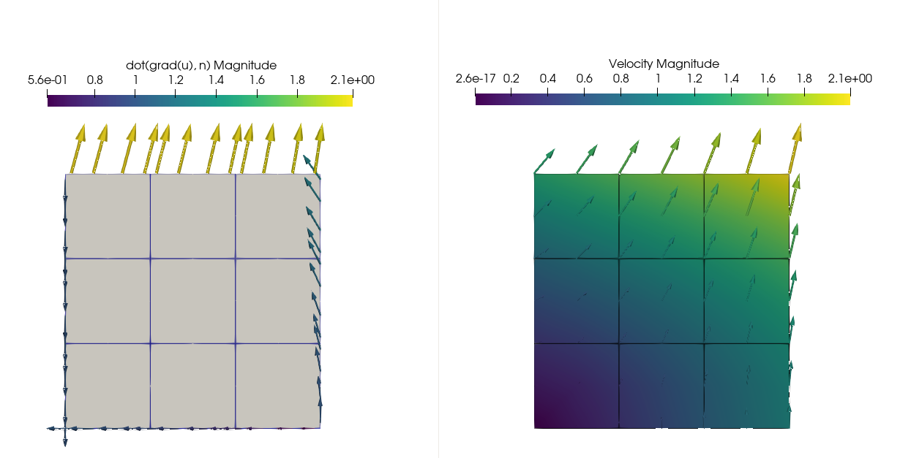
<center/>

---

# Real function spaces in DOLFINx$^4$

```python
V = dolfinx.fem.functionspace(mesh, ("Lagrange", 1))
R = scifem.create_real_functionspace(mesh)
u = ufl.TrialFunction(V)
lmbda = ufl.TrialFunction(R)
du = ufl.TestFunction(V)
dl = ufl.TestFunction(R)
zero = dolfinx.fem.Constant(mesh, dolfinx.default_scalar_type(0.0))
```

---

# Real function spaces in DOLFINx$^4$

```python
a00 = ufl.inner(ufl.grad(u), ufl.grad(du)) * ufl.dx
a01 = ufl.inner(lmbda, du) * ufl.dx
a10 = ufl.inner(u, dl) * ufl.dx
L0 = ufl.inner(f, du) * ufl.dx + ufl.inner(g, du) * ufl.ds
L1 = ufl.inner(zero, dl) * ufl.dx

a = dolfinx.fem.form([[a00, a01], [a10, None]])
L = dolfinx.fem.form([L0, L1])
```

---

# Real function spaces in DOLFINx$^4$

```python
A = dolfinx.fem.petsc.assemble_matrix_block(a)
A.assemble()
b = dolfinx.fem.petsc.assemble_vector_block(L, a, bcs=[])

# Pass on to PETSc
# See: https://scientificcomputing.github.io/scifem/examples/real_function_space.html
# for more details
```

---

# Resources

- Checkpointing in DOLFINx$^5$
- Multi-point constraints in DOLFINx: https://github.com/jorgensd/dolfinx_mpc
- DOLFINx tutorial: https://jsdokken.com/dolfinx-tutorial/
- FEniCS @ Sorbonne: https://jsdokken.com/FEniCS23-tutorial
- SciFEM: https://scientificcomputing.github.io/scifem

<!--  footer: $^5$ J.S. Dokken. _ADIOS4DOLFINx: A framework for checkpointing in FEniCS_ (2024) Journal of Open Source Software, 9(96), 6451, <a href=https://doi.org/10.21105/joss.06451>10.21105/joss.06451</a> <br><br>-->
