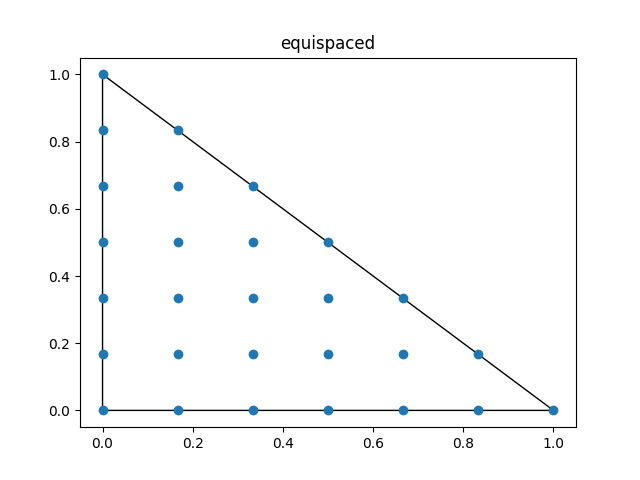
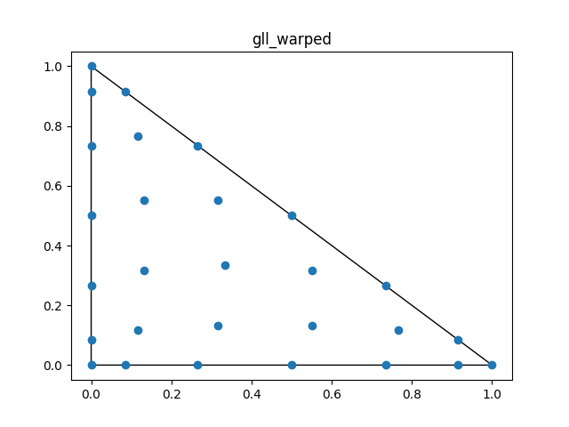
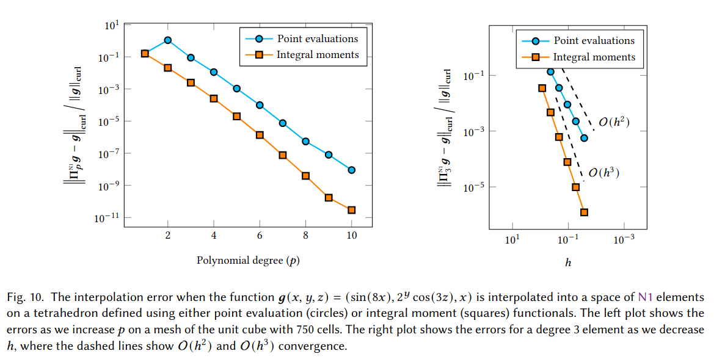
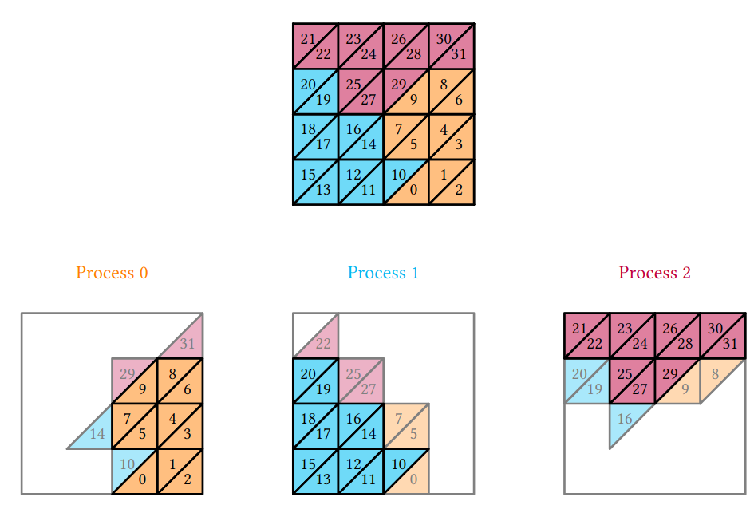
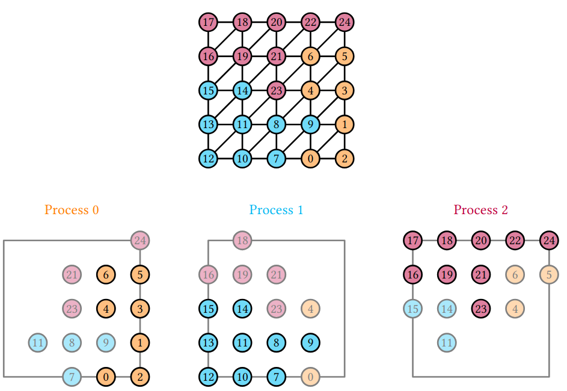
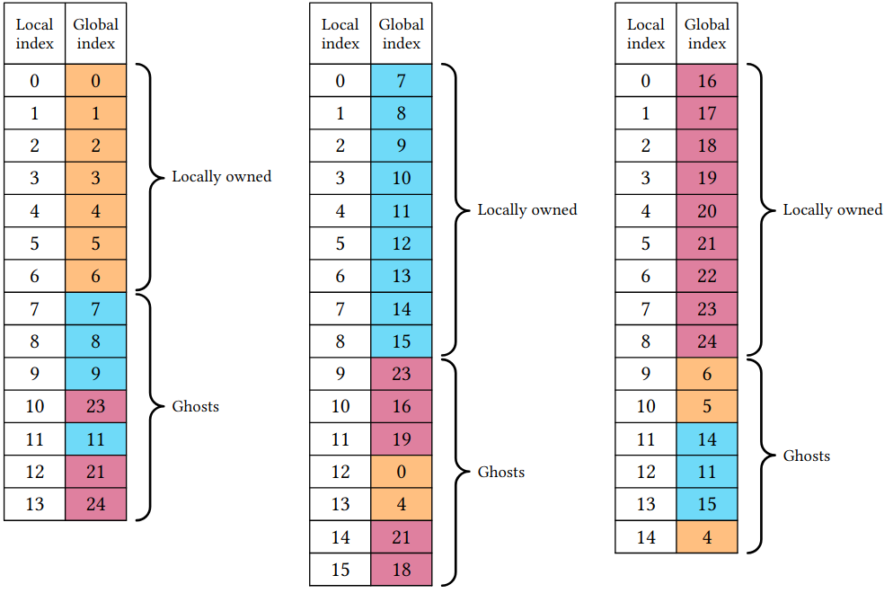

# DOLFINx: The next generation FEniCS problem solving environment

<center>
Baratta, I. A., Dean, J. P., Dokken, J. S., Habera, M., Hale, J. S., Richardson, C. N., Rognes, M. E., Scroggs, M. W., Sime, N., & Wells, G. N.
<center/>

<center>
<b> dokken@simula.no </b>
<center/>

### [Zenodo: 10.5281/zenodo.10447666](https://doi.org/10.5281/zenodo.10447666)

---

# Brief history of finite elements

<div class="columns">
<div>

* 1940s: Rayleigh-Ritz/Ritz Galerkin method
* 1970s: General purpose finite element software
* 1990s: Object orientation
* 2000s: User-friendliness
* 2020s: High performance computing
</div>
<div>
<iframe width="560" height="315" src="https://www.youtube.com/embed/lrpj3cZrKn4?si=rQY8RsGJEXfYNfIs" title="YouTube video player" frameborder="0" allow="accelerometer; autoplay; clipboard-write; encrypted-media; gyroscope; picture-in-picture; web-share" allowfullscreen></iframe>
</div>

<div>

---

# Brief history of the FEniCS project


* 2003: Initiated in Netherlands, Sweden and USA
* 2006-2016: Hans Petter era: CBC
* 2017-Present: Development of DOLFINx
* ~2000 users on the Forum
* ~12 000 monthly downloads

---

# Motivation for a new API

* Age: Code 15+ years old
* Maintainability
* Scalability
* Extendability


---

# Implicitness in DOLFIN


```python
from dolfin import *
import time
mesh = UnitSquareMesh(1, 1)
V = FunctionSpace(mesh, "Lagrange", 5)
u, v = TrialFunction(V), TestFunction(V)
a = inner(grad(u), grad(v))*dx
for i in range(3):
    start = time.perf_counter()
    assemble(a)
    end = time.perf_counter()
    print(f"{i}: {end-start:.2e}")
```
<div data-marpit-fragment>

Output:

```bash
0: 3.30e+00
1: 3.94e-04
2: 3.10e-04
```
</div>

---

# Explicit control in DOLFINx
```python
from mpi4py import MPI
import dolfinx
import ufl
import time

mesh = dolfinx.mesh.create_unit_square(MPI.COMM_WORLD, 1, 1)
V = dolfinx.fem.functionspace(mesh, ("Lagrange", 1))

u, v = ufl.TrialFunction(V), ufl.TestFunction(V)
a = ufl.inner(ufl.grad(u), ufl.grad(v))*ufl.dx

start_c = time.perf_counter()
a_compiled = dolfinx.fem.form(a)
end_c = time.perf_counter()
print(f"Compilation: {end_c-start_c:.2e}")

for i in range(3):
    start = time.perf_counter()
    dolfinx.fem.assemble_matrix(a_compiled)
    end = time.perf_counter()
    print(f"{i}: {end-start:.2e}")
```

---
# Explicit control continued

```bash
Compilation: 1.58e-01
0: 2.26e-04
1: 5.69e-05
2: 4.18e-05
```
<div data-marpit-fragment>

# Same experiment for P1

<div class="columns">
<div>

DOLFIN
```bash

0: 3.27e+00
1: 4.29e-04
2: 3.04e-04
```
</div>
<div>

DOLFINx
```
Compilation: 1.30e-01
0: 2.11e-04
1: 7.79e-05
2: 5.05e-05
```
</div>
<div>
<div>

---

# Package overview


---

# Basix

<div class="columns">
<div>

* A finite element tabulation library
* Provides quadrature schemes
* Written in C++ with a Python interface
  * Runtime tabulation
* Custom finite elements
</div>
<iframe width="600" height="500" src="https://docs.fenicsproject.org/basix/v0.7.0.post0/python/", title="Basix github repository"></iframe>


---

# Basix yields extra control over finite elements


```python
import basix.ufl
from basix import CellType, ElementFamily, LagrangeVariant
degree = 6
lagrange = basix.ufl.element(
    ElementFamily.P, CellType.triangle, degree, LagrangeVariant.equispaced)
lagrange_gll = basix.ufl.element(
    ElementFamily.P, CellType.triangle, degree, LagrangeVariant.gll_warped)
```
<div class="columns">

<div>



</div>

<div>



</div>
</div>


--- 

# Lagrange variants are important for higher order finite element modelling

<div data-marpit-fragment>

<div>

[Runge's phenomenon: Variants of Lagrange elements (DOLFINx demos)](https://docs.fenicsproject.org/dolfinx/v0.7.3/python/demos/demo_lagrange_variants.html)

<div class="columns">
<div>


</div>


</div>

</div>


---

# Proper representation of dual basis

<iframe width="1000" height="500" src="https://defelement.com/elements/examples/triangle-nedelec1-lagrange-1.html", title="Nedelec 1 degree 1 on triangle"></iframe>


---

# Proper dual basis leads to accurate interpolation  




---

# Code generation

What happens under the hood?

```python
import dolfin as df

degree = 1
N = 7

mesh = df.UnitIntervalMesh(10)
f = df.Expression("sin(N*pi*x[0])", N=N, degree=degree, domain=mesh)
int_f = df.assemble(f*df.dx)
```

---

# Can we do better?

<div data-marpit-fragment>

<div>

```python
x = df.SpatialCoordinate(mesh)
g = df.sin(N*df.pi*x[0])
int_g = df.assemble(g*df.dx)

```
</div>

```bash
degree=1, N=7, int_f=5.10e-02, int_g=9.04e-02, 43.62% difference
degree=3, N=7, int_f=9.13e-02, int_g=9.04e-02, 1.06% difference
degree=5, N=7, int_f=9.09e-02, int_g=9.04e-02, 0.64% difference
```

---

# Can we do even better?

<div data-marpit-fragment>

<div>

```python
x = df.SpatialCoordinate(mesh)
g = df.sin(df.Constant(N)*df.pi*x[0])
int_g = df.assemble(g*df.dx)
```

</div>

<div>

**DOLFINx equivalent**

```python
mesh = dolfinx.mesh.create_unit_interval(MPI.COMM_WORLD, 10)
x = ufl.SpatialCoordinate(mesh)
N = dolfinx.fem.Constant(mesh, 7.)
f = ufl.sin(N * ufl.pi* x[0])
compiled_form = dolfinx.fem.form(f*ufl.dx)
```

</div>

```python
N.value = 3
print(dolfinx.fem.assemble_scalar(compiled_form))
```

</div>

---

# Evaluation of UFL-expressions

<div data-marpit-fragment>

<div>

```python
V = dolfinx.fem.functionspace(mesh, ("Lagrange", 3))
u = dolfinx.fem.Function(V)
u.interpolate(lambda x: 3*x[0]**3)
grad_u_squared = ufl.dot(ufl.grad(u), ufl.grad(u))
point_in_reference_element = np.array([0.5])
compiled_expression = dolfinx.fem.Expression(grad_u_squared, point_in_reference_element)
print(compiled_expression.eval(mesh, cells))
```
<div>

* Also supports for expression evaluation of [facet expressions](https://github.com/FEniCS/dolfinx/pull/3062) (`FacetNormals`)
* Can also be used in interpolation: `u.interpolate(compiled_expression)`

</div>

---

# Mesh creation

```python
import numpy as np
from mpi4py import MPI

import basix.ufl
import dolfinx
import ufl

x = np.array([[0.0, 0.0], [1.0, 0.0], [2.0, 0.0],
              [0.0, 1.0], [1.0, 1.0], [2.0, 1.0]], dtype=np.float32)
cells = np.array([[0, 1, 3, 4], [1, 2, 4, 5]], dtype=np.int64)
coordinate_element = basix.ufl.element("Lagrange", "quadrilateral", 1,
                                       shape=(x.shape[1],))
msh = dolfinx.mesh.create_mesh(MPI.COMM_SELF, cells, x, ufl.Mesh(coordinate_element))

```

<div data-marpit-fragment>

<div>

No re-ordering of cells to ensure consistent global orientations, see: Scroggs, Dokken, Richardson, Wells, 2022: [DOI: 10.1145/3524456](https://doi.org/10.1145/3524456)

</div>

---

# Parallel reading

```python
if (rank:=MPI.COMM_WORLD.rank) == 0:
    x = np.array([[0.0, 0.0], [1.0, 0.0], [2.0, 0.0]], dtype=np.float32)
    cells = np.array([[0, 1, 3, 4]], dtype=np.int64) 
elif rank == 1:
    x = np.array([[0.0, 1.0], [1.0, 1.0], [2.0, 1.0]], dtype=np.float32)
    cells = np.array([[1, 2, 4, 5]], dtype=np.int64)
else:
    x = np.empty((0, 2), dtype=np.float32)
    cells = np.empty((0, 4), dtype=np.int64)
coordinate_element = basix.ufl.element("Lagrange", "quadrilateral", 1,
                                       shape=(x.shape[1],))
msh = dolfinx.mesh.create_mesh(MPI.COMM_WORLD, cells, x, ufl.Mesh(coordinate_element))
```

* Array interface makes it easier to interface with any meshing format
* No copying when moving data to C++ through nanobind (`std::span`)

---

# When a mesh is read in with multiple processes (MPI) the cells are distributed

<div class="columns">
<div>



</div>
<div>


</div>
</div>

---

# All entities (vertex, edge, facet, cell) has a notion of ownership

Makes mesh-view construction in parallel "easy" and safe

<div class="columns">
<div>



</div>
<div>



</div>
</div>

---


# Custom partitioning

```python
if (rank:=MPI.COMM_WORLD.rank) == 0:
    cells = np.array([[0, 1, 3, 4]], dtype=np.int64)
    def partitioner(comm: MPI.Intracomm, n, m, topo):
        # The cell on this process will be owned by rank 2, and ghosted on rank 0
        return dolfinx.graph.adjacencylist(np.array([2, 0], dtype=np.int32), np.array([0,2],dtype=np.int32))
elif rank == 1:
    cells = np.array([[1, 2, 4, 5]], dtype=np.int64)
    def partitioner(comm: MPI.Intracomm, n, m, topo):
        # The cell on this process will be owned by rank 1, and ghosted on 0 and 2
        return dolfinx.graph.adjacencylist(np.array([1, 0, 2], dtype=np.int32), np.array([0,3],dtype=np.int32))
else:
    cells = np.empty((0, 4), dtype=np.int64)
    def partitioner(comm: MPI.Intracomm, n, m, topo):
        # No cells on process
        return dolfinx.graph.adjacencylist(np.empty(0, dtype=np.int32), np.zeros(1, dtype=np.int32))

coordinate_element = basix.ufl.element("Lagrange", "quadrilateral", 1,
                                       shape=(x.shape[1],))
msh = dolfinx.mesh.create_mesh(MPI.COMM_WORLD, cells, x, ufl.Mesh(coordinate_element), partitioner=partitioner)
```
<div data-marpit-fragment>

<div>

```bash
rank=0 Owned cells: 0 Ghosted cells: 2 Total cells: 2
rank=1 Owned cells: 1 Ghosted cells: 0 Total cells: 2
rank=2 Owned cells: 1 Ghosted cells: 1 Total cells: 2
```

</div>
</div>

---

# Custom assembly if UFL doesn't quite fit

```python
c_signature = ffcx.codegeneration.utils.numba_ufcx_kernel_signature(
    dolfinx.default_scalar_type, dolfinx.default_real_type)

@numba.cfunc(c_signature, nopython=True)
def tabulate_A(A_, w_, c_, coords_, entity_local_index, quadrature_permutation=None):
    # Wrap pointers as a Numpy arrays
    A = numba.carray(A_, (dim, dim))
    coordinate_dofs = numba.carray(coords_, (3, 3))

    x0, y0 = coordinate_dofs[0, :2]
    x1, y1 = coordinate_dofs[1, :2]
    x2, y2 = coordinate_dofs[2, :2]

    # Compute Jacobian determinant and fill the output array with
    # precomputed mass matrix scaled by the Jacobian
    detJ = abs((x0 - x1) * (y2 - y1) - (y0 - y1) * (x2 - x1))
    # M_hat is pre-computed local mass matrix using for instance Basix to tabulate
    # basis functions at specified quadrature points
    A[:] = detJ * M_hat

formtype = dolfinx.cpp.fem.Form_float64
cells = np.arange(msh.topology.index_map(msh.topology.dim).size_local, dtype=np.int32)
integrals = {dolfinx.fem.IntegralType.cell: [(-1, tabulate_A.address, cells), ]}
coefficients_A, constants_A = [], []
a = dolfinx.fem.Form(formtype([V._cpp_object, V._cpp_object],
                              integrals, [], [], False, None))
```

---