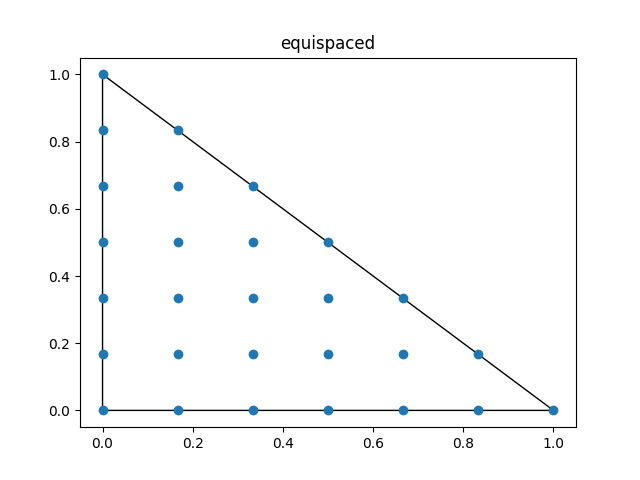
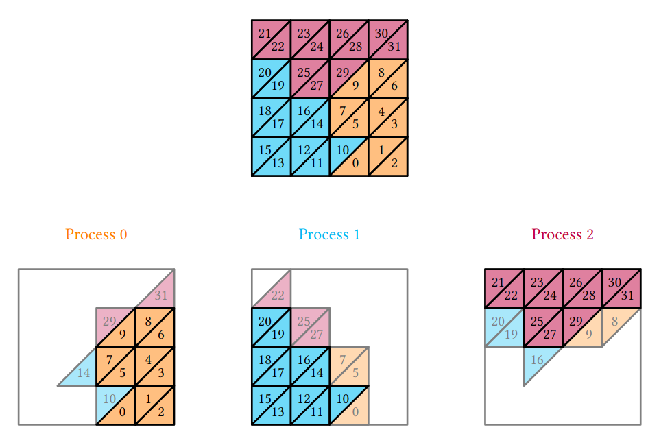
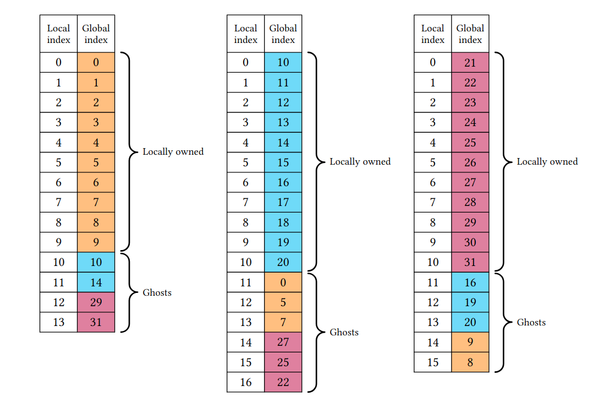
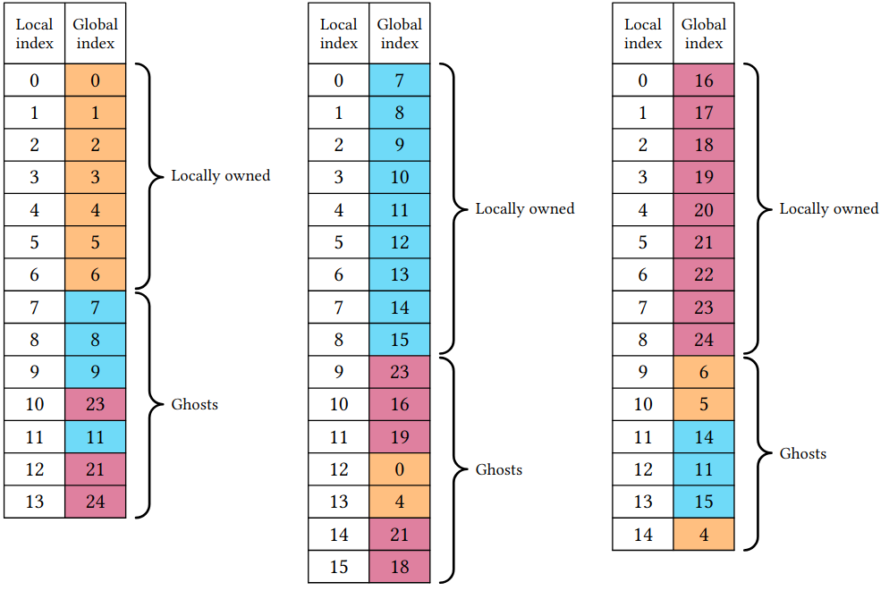

# An introduction to finite element modelling in FEniCS

<center>
Jørgen S. Dokken
<center/>

<center>
<b> dokken@simula.no </b>
<center/>

<center>
<div>

</div>

<center/>

---

# Brief history of finite elements

<div class="columns">
<div>

* **1910s**: Rayleigh-Ritz/Ritz Galerkin method
* **1940s**: First finite element software for structural problems
* **1970s**: General purpose finite element software
* **1990s**: Object oriented programming
* **2000s**: User-friendliness
* **2020s**: High performance computing

</div>

<div>

Find $u\in V_0$ such that 

$$
R(x) = - \nabla \cdot (\nabla u) - f = 0  \text{ in } \Omega \\
$$

Define
$$
u_h = \sum_{i=1}^{N} u_i \phi_i(x)
$$

Define an inner product $\langle \cdot , \rangle: V_0 \times V_0 \rightarrow \mathbb{R}$ such that 

$$
\langle R(x), \phi_i \rangle = 0 \qquad\forall i=1,\cdots,N
$$

</div>

</div>

---

# Brief history of FEniCS


* 2002: First public version of a C++ library (DOLFIN)
* 2003: FEniCS project was created
* 2004: Code generation (C++) using FFC
* 2005: First Python interface (PyDOLFIN)
* 2009: Parallel (MPI support)
* 2009: Unified form language (UFL) introduced
* 2016--: Sponsored by NumFOCUS 
* 2017--: Development of DOLFINx
* ~2000 users on the FEniCS Discourse forum
* ~12 000 monthly downloads

<center>

<center/>

---

# A minimal example - The Poisson equation
```python
from mpi4py import MPI
import dolfinx
import dolfinx.fem.petsc as petsc
import ufl
import numpy as np

mesh = dolfinx.mesh.create_unit_square(MPI.COMM_WORLD, 3, 3)
V = dolfinx.fem.functionspace(mesh, ("Lagrange", 5))

u, v = ufl.TrialFunction(V), ufl.TestFunction(V)
a = ufl.inner(ufl.grad(u), ufl.grad(v)) * ufl.dx
x, y = ufl.SpatialCoordinate(mesh)
f = x * ufl.sin(y * ufl.pi)
L = ufl.inner(f, v) * ufl.dx

boundary_dofs = dolfinx.fem.locate_dofs_geometrical(
    V, lambda x: np.isclose(x[0], 0) | np.isclose(x[0], 1))
u_bc = dolfinx.fem.Constant(mesh, 0.0)

bcs = [dolfinx.fem.dirichletbc(u_bc, boundary_dofs, V)]
problem = petsc.LinearProblem(
    a, L, bcs=bcs, petsc_options={"ksp_type": "preonly", "pc_type": "lu"}
)
uh = problem.solve()
with dolfinx.io.VTXWriter(mesh.comm, "uh.bp", [uh], engine="BP4") as bp:
    bp.write(0.0)
```

---

# Package overview


---

# Basix

<div class="columns">
<div>

* A finite element tabulation library
* Provides quadrature schemes
* Written in C++ with a Python interface
  * Runtime tabulation
* Custom finite elements
</div>
<iframe width="600" height="500" src="https://docs.fenicsproject.org/basix/v0.7.0.post0/python/", title="Basix github repository"></iframe>


---

# Basix yields extra control over finite elements


```python
import basix.ufl
degree = 6
lagrange = basix.ufl.element(
    "Lagrange", "triangle", degree, basix.LagrangeVariant.equispaced)
lagrange_gll = basix.ufl.element(
    "Lagrange", "triangle", degree, basix.LagrangeVariant.gll_warped)
```
<div class="columns">

<div>



</div>

<div>


</div>
</div>


--- 

# Lagrange variants are important for higher order finite element modelling

<div data-marpit-fragment>

<div>

[Runge's phenomenon: Variants of Lagrange elements (DOLFINx demos)](https://docs.fenicsproject.org/dolfinx/v0.7.3/python/demos/demo_lagrange_variants.html)

<div class="columns">
<div>


</div>


</div>

</div>


---

# Proper representation of dual basis

<iframe width="1000" height="500" src="https://defelement.com/elements/examples/triangle-nedelec1-lagrange-1.html", title="Nedelec 1 degree 1 on triangle"></iframe>


---

# Proper dual basis leads to accurate interpolation  


---

# Can we do even better?

<div data-marpit-fragment>


```python
x = df.SpatialCoordinate(mesh)
g = df.sin(df.Constant(N)*df.pi*x[0])
int_g = df.assemble(g*df.dx)
```

</div>

<div data-marpit-fragment>

**DOLFINx equivalent**

```python
mesh = dolfinx.mesh.create_unit_interval(MPI.COMM_WORLD, 10)
x = ufl.SpatialCoordinate(mesh)
N = dolfinx.fem.Constant(mesh, 7.)
f = ufl.sin(N * ufl.pi* x[0])
compiled_form = dolfinx.fem.form(f*ufl.dx)
```

</div>
<div data-marpit-fragment>

```python
N.value = 3
print(dolfinx.fem.assemble_scalar(compiled_form))
```

</div>

---

# Evaluation of UFL-expressions

<div data-marpit-fragment>

<div>

```python
V = dolfinx.fem.functionspace(mesh, ("Lagrange", 3))
u = dolfinx.fem.Function(V)
u.interpolate(lambda x: 3*x[0]**3)
grad_u_squared = ufl.dot(ufl.grad(u), ufl.grad(u))
point_in_reference_element = np.array([0.5])
compiled_expression = dolfinx.fem.Expression(grad_u_squared, point_in_reference_element)
print(compiled_expression.eval(mesh, cells))
```
<div>

* Also supports for expression evaluation of [facet expressions](https://github.com/FEniCS/dolfinx/pull/3062) (`FacetNormals`)
* Can also be used in interpolation: `u.interpolate(compiled_expression)`

</div>

---

# Mesh creation

```python
import numpy as np
from mpi4py import MPI

import basix.ufl
import dolfinx
import ufl

x = np.array([[0.0, 0.0], [1.0, 0.0], [2.0, 0.0],
              [0.0, 1.0], [1.0, 1.0], [2.0, 1.0]], dtype=np.float32)
cells = np.array([[0, 1, 3, 4], [1, 2, 4, 5]], dtype=np.int64)
coordinate_element = basix.ufl.element("Lagrange", "quadrilateral", 1,
                                       shape=(x.shape[1],))
msh = dolfinx.mesh.create_mesh(MPI.COMM_SELF, cells, x, ufl.Mesh(coordinate_element))

```

<div data-marpit-fragment>

<div>

No re-ordering of cells to ensure consistent global orientations, see: Scroggs, Dokken, Richardson, Wells, 2022: [DOI: 10.1145/3524456](https://doi.org/10.1145/3524456)

</div>

---

# Parallel reading

```python
if (rank:=MPI.COMM_WORLD.rank) == 0:
    x = np.array([[0.0, 0.0], [1.0, 0.0], [2.0, 0.0]], dtype=np.float32)
    cells = np.array([[0, 1, 3, 4]], dtype=np.int64) 
elif rank == 1:
    x = np.array([[0.0, 1.0], [1.0, 1.0], [2.0, 1.0]], dtype=np.float32)
    cells = np.array([[1, 2, 4, 5]], dtype=np.int64)
else:
    x = np.empty((0, 2), dtype=np.float32)
    cells = np.empty((0, 4), dtype=np.int64)
coordinate_element = basix.ufl.element("Lagrange", "quadrilateral", 1,
                                       shape=(x.shape[1],))
msh = dolfinx.mesh.create_mesh(MPI.COMM_WORLD, cells, x, ufl.Mesh(coordinate_element))
```

* Array interface makes it easier to interface with any meshing format
* No copying when moving data to C++ through nanobind (`std::span`)

---

# When a mesh is read in with multiple processes (MPI) the cells are distributed

<div class="columns">
<div>



</div>
<div>



</div>
</div>

---

# All entities (vertex, edge, facet, cell) has a notion of ownership

Makes mesh-view construction in parallel "easy" and safe

<div class="columns">
<div>


</div>
<div>



</div>
</div>

---


# Custom partitioning

```python
if (rank:=MPI.COMM_WORLD.rank) == 0:
    cells = np.array([[0, 1, 3, 4]], dtype=np.int64)
    def partitioner(comm: MPI.Intracomm, n, m, topo):
        # The cell on this process will be owned by rank 2, and ghosted on rank 0
        return dolfinx.graph.adjacencylist(np.array([2, 0], dtype=np.int32), np.array([0,2],dtype=np.int32))
elif rank == 1:
    cells = np.array([[1, 2, 4, 5]], dtype=np.int64)
    def partitioner(comm: MPI.Intracomm, n, m, topo):
        # The cell on this process will be owned by rank 1, and ghosted on 0 and 2
        return dolfinx.graph.adjacencylist(np.array([1, 0, 2], dtype=np.int32), np.array([0,3],dtype=np.int32))
else:
    cells = np.empty((0, 4), dtype=np.int64)
    def partitioner(comm: MPI.Intracomm, n, m, topo):
        # No cells on process
        return dolfinx.graph.adjacencylist(np.empty(0, dtype=np.int32), np.zeros(1, dtype=np.int32))

coordinate_element = basix.ufl.element("Lagrange", "quadrilateral", 1,
                                       shape=(x.shape[1],))
msh = dolfinx.mesh.create_mesh(MPI.COMM_WORLD, cells, x, ufl.Mesh(coordinate_element), partitioner=partitioner)
```
<div data-marpit-fragment>

<div>

```bash
rank=0 Owned cells: 0 Ghosted cells: 2 Total cells: 2
rank=1 Owned cells: 1 Ghosted cells: 0 Total cells: 2
rank=2 Owned cells: 1 Ghosted cells: 1 Total cells: 2
```

</div>
</div>

---

# Custom assembly if UFL doesn't quite fit

```python
c_signature = ffcx.codegeneration.utils.numba_ufcx_kernel_signature(
    dolfinx.default_scalar_type, dolfinx.default_real_type)

@numba.cfunc(c_signature, nopython=True)
def tabulate_A(A_, w_, c_, coords_, entity_local_index, quadrature_permutation=None):
    # Wrap pointers as a Numpy arrays
    A = numba.carray(A_, (dim, dim))
    coordinate_dofs = numba.carray(coords_, (3, 3))

    x0, y0 = coordinate_dofs[0, :2]
    x1, y1 = coordinate_dofs[1, :2]
    x2, y2 = coordinate_dofs[2, :2]

    # Compute Jacobian determinant and fill the output array with
    # precomputed mass matrix scaled by the Jacobian
    detJ = abs((x0 - x1) * (y2 - y1) - (y0 - y1) * (x2 - x1))
    # M_hat is pre-computed local mass matrix using for instance Basix to tabulate
    # basis functions at specified quadrature points
    A[:] = detJ * M_hat

formtype = dolfinx.cpp.fem.Form_float64
cells = np.arange(msh.topology.index_map(msh.topology.dim).size_local, dtype=np.int32)
integrals = {dolfinx.fem.IntegralType.cell: [(-1, tabulate_A.address, cells), ]}
coefficients_A, constants_A = [], []
a = dolfinx.fem.Form(formtype([V._cpp_object, V._cpp_object],
                              integrals, [], [], False, None))
```

---

# Example of nesting kernels

- Mass lumping
- Static condensation
```python
@numba.cfunc(c_signature, nopython=True)
def tabulate_A_wrapped(A_, w_, c_, coords_, entity_local_index, quadrature_permutation=None):
    A = numba.carray(A_, (dim, dim))

    # Allocate new Numpy array where temporary tabulation is stored
    M = np.zeros_like(A)

    w = numba.carray(w_, (dim, ))
    c = numba.carray(c_, (1, ))

    # Call the compiled kernel (from_buffer is required to extract the
    # underlying data pointer)
    ufcx_kernel(ffi.from_buffer(M), ffi.from_buffer(w),
                ffi.from_buffer(c), coords_, entity_local_index,
                quadrature_permutation)

    # Row sum matrix M and store into diagonal of the output matrix A
    np.fill_diagonal(A, np.sum(M, axis=1))
  ```

  ---

# Additional resources

<iframe width="1200" height="250" src="https://fenicsproject.org/fenics-2024/", title="FEniCS 24 Conference"></iframe>

<div class="columns">
<div>
<iframe width="600" height="250" src="https://jsdokken.com/dolfinx-tutorial/", title="FEniCS tutorial"></iframe>
</div>
<iframe width="600" height="250" src="http://jsdokken.com/FEniCS23-tutorial/", title="FEniCSx tutorial @ Sorbonne"></iframe>
</div>
</div>

---