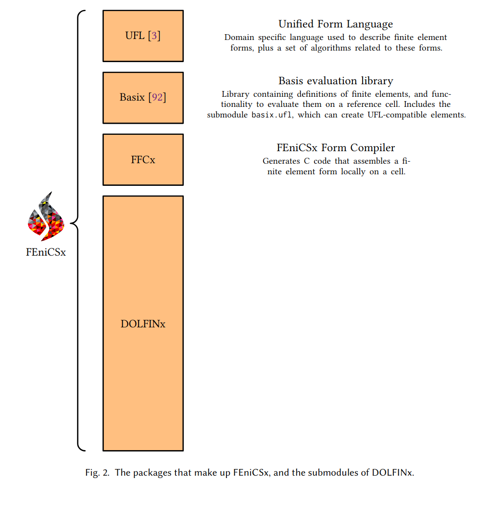
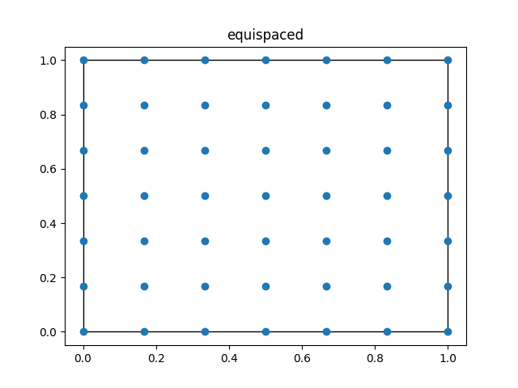
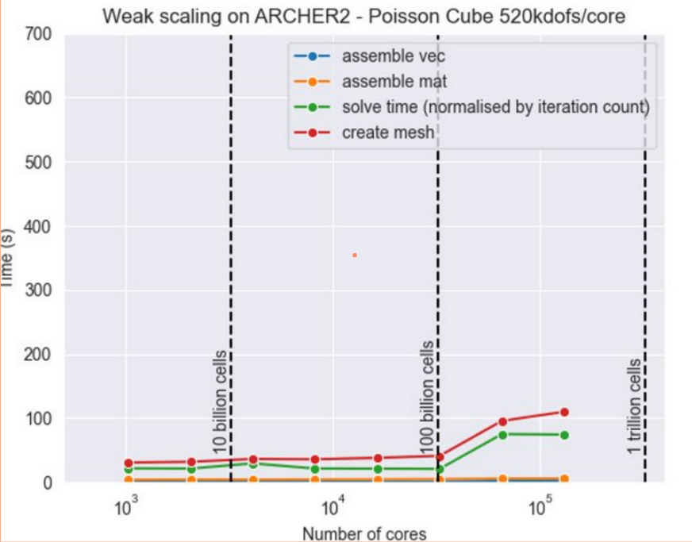

# Differentiable programming for partial differential equations in the FEniCS framework

<center>
Jørgen S. Dokken
<center/>

<center>
<b> dokken@simula.no </b>
<center/>

<center>
<a href="https://jsdokken.com">https://jsdokken.com</a>
<center/>

<center>
<div>

</div>
<!--  -->
<center/>

---

# Brief history of the finite element method (FEM)

<!--  -->


<div>

* **1910s**: Rayleigh-Ritz/Ritz-Galerkin method
* **1940s**: Birth of the FEM
* **1958**: First open source FE software
* **1970s**: General purpose FE software and mathematical rigorousness
* **1990s**: Object oriented programming
* **2000s**: User-friendliness (Python)
* **2010s**: High performance computing

<center>

<center/>

---

# FEM in a nutshell

<div class="skewed-columns">
<div>

Find $u\in V_0$ such that

$$
R(x) = - \nabla \cdot (\nabla u) - f = 0  \text{ in } \Omega \\
$$

Define

$$
u_h = \sum_{i=1}^{N} u_i \phi_i(x)
$$

and an inner product

$$
\langle \cdot , \cdot \rangle: V_0 \times V_0 \rightarrow \mathbb{R}
$$

such that

$$
\langle R(x), \phi_i \rangle = 0 \qquad\forall i=1,\cdots,N
$$
</div>
<div>


</div>

---

# Brief history of FEniCS


<div data-marpit-fragment>

- **2002**: First public version of a C++ library (DOLFIN)
- **2003**: FEniCS project was created

</div>
<div data-marpit-fragment>

- **2004**: Code generation (C++) using FFC
- **2005**: First Python interface (PyDOLFIN)

</div>

<div data-marpit-fragment>

- **2009**: Parallel (MPI support)
- **2009**: Unified form language (UFL) introduced

</div>

<div data-marpit-fragment>

- **2016--**: Sponsored by NumFOCUS
- **2017--**: DOLFINx ([10.5281/zenodo.10447665](https://doi.org/10.5281/zenodo.10447665))

</div>
<div data-marpit-fragment>

- ~3700 users on the FEniCS Discourse forum
- Available through Conda, Docker, Spack, Debian, LaunchPad

</div>
<center>

<center/>

---

# Some examples

<div class="columns">

<div>

</div>

<div data-marpit-fragment>

<div>

<center>

<center/>
<center>

<center/>
</div>

</div>

---

# The Poisson equation


```python
from mpi4py import MPI
import dolfinx
import dolfinx.fem.petsc as petsc
import ufl
import numpy as np

mesh = dolfinx.mesh.create_unit_square(MPI.COMM_WORLD, 3, 3)
V = dolfinx.fem.functionspace(mesh, ("Lagrange", 5))


```

---

# The Poisson equation


```python
from mpi4py import MPI
import dolfinx
import dolfinx.fem.petsc as petsc
import ufl
import numpy as np

mesh = dolfinx.mesh.create_unit_square(MPI.COMM_WORLD, 3, 3)
V = dolfinx.fem.functionspace(mesh, ("Lagrange", 5))

u, v = ufl.TrialFunction(V), ufl.TestFunction(V)
a = ufl.inner(ufl.grad(u), ufl.grad(v)) * ufl.dx
x, y = ufl.SpatialCoordinate(mesh)
f = x * ufl.sin(y * ufl.pi)
L = ufl.inner(f, v) * ufl.dx


```

---

# The Poisson equation

```python
from mpi4py import MPI
import dolfinx
import dolfinx.fem.petsc as petsc
import ufl
import numpy as np

mesh = dolfinx.mesh.create_unit_square(MPI.COMM_WORLD, 3, 3)
V = dolfinx.fem.functionspace(mesh, ("Lagrange", 5))

u, v = ufl.TrialFunction(V), ufl.TestFunction(V)
a = ufl.inner(ufl.grad(u), ufl.grad(v)) * ufl.dx
x, y = ufl.SpatialCoordinate(mesh)
f = x * ufl.sin(y * ufl.pi)
L = ufl.inner(f, v) * ufl.dx

boundary_dofs = dolfinx.fem.locate_dofs_geometrical(
    V, lambda x: np.isclose(x[0], 0) | np.isclose(x[0], 1))
u_bc = dolfinx.fem.Constant(mesh, 0.0)

bcs = [dolfinx.fem.dirichletbc(u_bc, boundary_dofs, V)]
options = {"ksp_type": "preonly", "pc_type": "lu"}
problem = petsc.LinearProblem(
    a, L, bcs=bcs, petsc_options=options,
    petsc_options_prefix="solver"
)
uh = problem.solve()
with dolfinx.io.VTXWriter(mesh.comm, "uh.bp",
                          [uh], engine="BP4") as bp:
    bp.write(0.0)
```


---

# How does it work?

### Package overview



---

# How does it work?

### Package overview


---

# Basix

<!--  -->

<div class="columns">
<div>

- A finite element tabulation library
- Provides quadrature schemes
- Written in C++ with a Python interface
  - Runtime tabulation
- Custom finite elements

</div>
<iframe width="600" height="500" src="https://docs.fenicsproject.org/basix/v0.9.0/python/", title="Basix github repository"></iframe>

---

<!--  -->

# Basix yields extra control over finite elements

```python
import basix.ufl
degree = 10
lagrange = basix.ufl.element(
    "Lagrange", "quadrilateral", degree, basix.LagrangeVariant.equispaced)
lagrange_gll = basix.ufl.element(
    "Lagrange", "quadrilateral", degree, basix.LagrangeVariant.gll_warped)
```

<div class="columns">

<div>



</div>

<div>


</div>
</div>

---

# Why do we care?


<div data-marpit-fragment>

<div>
</div>

<div>

```python
from mpi4py import MPI
import numpy as np
import basix.ufl
import dolfinx
import ufl

def saw_tooth(x):
    f = 4 * abs(x[0] - 0.43)
    for _ in range(8):
        f = abs(f - 0.3)
    return f

def approximate_sawtooth(N: int, M: int, variant: basix.LagrangeVariant)->float:

    msh = dolfinx.mesh.create_unit_square(MPI.COMM_WORLD, N, M,
                                          cell_type=dolfinx.mesh.CellType.quadrilateral)
    ufl_element = basix.ufl.element(basix.ElementFamily.P, msh.basix_cell(), 10, variant)
    V = dolfinx.fem.functionspace(msh, ufl_element)
    uh = dolfinx.fem.Function(V)
    uh.interpolate(lambda x: saw_tooth(x))

    x = ufl.SpatialCoordinate(msh)
    u_exact = saw_tooth(x)
    M = dolfinx.fem.form((u_exact - uh) ** 2 * ufl.dx)
    error = np.sqrt(msh.comm.allreduce(dolfinx.fem.assemble_scalar(M), op=MPI.SUM))
    return hs, error
```

</div>

---

# We observe reduced convergence for equispaced Lagrange elements

<!--  -->

<center>

<center/>

<center>
<a href="https://docs.fenicsproject.org/dolfinx/main/python/demos/demo_lagrange_variants.html">Runge's phenomenon</a>

<center/>

---

# The FEniCS form compiler (FFCx) is used to generate C code from Python

<!--  -->

<div class="columns">
<div>

```python
import ufl
import basix.ufl

c_el = basix.ufl.element("Lagrange", "triangle", 1, shape=(2, ))
mesh = ufl.Mesh(c_el)

el = basix.ufl.element("Lagrange", "triangle", 3)

V = ufl.FunctionSpace(mesh, el)

u, v = ufl.TrialFunction(V), ufl.TestFunction(V)
a = ufl.inner(u, v) * ufl.dx

forms = [a]
```

```bash
python3 -m ffcx script.py
```

</div>
<iframe width="500" height="300" src="S.pdf", title="Computational graph of a mass matrix"></iframe>
</div>

---

# FFCx generates code to assemble the mass matrix for any element

<!--  -->

```c

void tabulate_tensor_integral_a80de02e2fc39315d8672b75da91b1586209cb47(double* restrict A,
                                    const double* restrict w,
                                    const double* restrict c,
                                    const double* restrict coordinate_dofs,
                                    const int* restrict entity_local_index,
                                    const uint8_t* restrict quadrature_permutation)
{
// Quadrature rules
static const double weights_39d[6] = {0.054975871827661, 0.054975871827661, 0.054975871827661, 0.1116907948390055, 0.1116907948390055, 0.1116907948390055};
// Precomputed values of basis functions and precomputations
// FE* dimensions: [permutation][entities][points][dofs]
static const double FE1_C0_D10_Q39d[1][1][1][3] = {{{{-1.0, 1.0, 0.0}}}};
static const double FE1_C1_D01_Q39d[1][1][1][3] = {{{{-1.0, 0.0, 1.0}}}};
static const double FE2_C0_Q39d[1][1][6][6] = {{{{-0.07480380774819603, 0.5176323419876736, -0.07480380774819671, 0.2992152309927871, 0.03354481152314834, 0.2992152309927839},
  {-0.07480380774819613, -0.0748038077481966, 0.5176323419876735, 0.2992152309927871, 0.2992152309927838, 0.03354481152314828},
  {0.5176323419876713, -0.0748038077481967, -0.07480380774819674, 0.03354481152314866, 0.2992152309927869, 0.2992152309927868},
  {-0.04820837781551195, -0.08473049309397784, -0.04820837781551192, 0.1928335112620479, 0.7954802262009061, 0.1928335112620478},
  {-0.04820837781551193, -0.048208377815512, -0.08473049309397786, 0.1928335112620479, 0.192833511262048, 0.7954802262009062},
  {-0.08473049309397794, -0.04820837781551188, -0.04820837781551195, 0.7954802262009061, 0.1928335112620479, 0.1928335112620479}}}};
// ------------------------
}
```

</div>

---

# Generated code continued (Jacobian)

```c
// ------------------------
// Section: Jacobian
// Inputs: coordinate_dofs, FE1_C1_D01_Q39d, FE1_C0_D10_Q39d
// Outputs: J_c3, J_c1, J_c2, J_c0
double J_c0 = 0.0;
double J_c3 = 0.0;
double J_c1 = 0.0;
double J_c2 = 0.0;
{
  for (int ic = 0; ic < 3; ++ic)
  {
    J_c0 += coordinate_dofs[(ic) * 3] * FE1_C0_D10_Q39d[0][0][0][ic];
    J_c3 += coordinate_dofs[(ic) * 3 + 1] * FE1_C1_D01_Q39d[0][0][0][ic];
    J_c1 += coordinate_dofs[(ic) * 3] * FE1_C1_D01_Q39d[0][0][0][ic];
    J_c2 += coordinate_dofs[(ic) * 3 + 1] * FE1_C0_D10_Q39d[0][0][0][ic];
  }
}
// ------------------------
double sp_39d_0 = J_c0 * J_c3;
double sp_39d_1 = J_c1 * J_c2;
double sp_39d_2 = -sp_39d_1;
double sp_39d_3 = sp_39d_0 + sp_39d_2;
double sp_39d_4 = fabs(sp_39d_3);
```

---

# Generated code continued (local tensor)

```c
for (int iq = 0; iq < 6; ++iq)
{
  // Section: Intermediates
  double fw0 = 0;
  {
    fw0 = sp_39d_4 * weights_39d[iq];
  }
  // Section: Tensor Computation
  // Inputs: FE2_C0_Q39d, fw0
  // Outputs: A
  {
    double temp_0[6] = {0};
    for (int j = 0; j < 6; ++j)
    {
      temp_0[j] = fw0 * FE2_C0_Q39d[0][0][iq][j];
    }
    for (int j = 0; j < 6; ++j)
    {
      for (int i = 0; i < 6; ++i)
      {
        A[6 * (i) + (j)] += FE2_C0_Q39d[0][0][iq][i] * temp_0[j];
      }
    }
  }
}
```

---

# Features

<!--  -->

<div class="columns">

<div>

- Single and double precision
- Real and complex valued tensors
- Assembly into arbitrary order tensors
- Curved cells for intervals, triangles, quadrilaterals, tetrahedra, hexahedra
- Discontinuous (broken) variants of all elements

</div>
<div>

<div data-marpit-fragment>

<style scoped>
table {
    height: 100%;
    width: 100%;
    font-size: 15px;
    color: black
}
</style>

| Family                           | Degrees        |
| -------------------------------- | -------------- |
| Lagrange                         | $\geq 0$       |
| Nedelec first and second kind    | $\geq 1$       |
| Raviart-Thomas                   | $\geq 1$       |
| Brezzi-Douglas-Marini            | $\geq 1$       |
| Regge                            | $\geq 0$       |
| Hellan-Herrmann-Johnson          | $\geq 0$       |
| Crouzeix-Raviart                 | $\geq 1$       |
| Discontinuous Polynomial Cubical | $\geq 0$       |
| Bubble                           | Cell dependent |
| Iso                              | $\geq 1$       |

</div>
</div>

---

# How does it work through Python?

- Just in time compilation with the [C Foreign Funcion Interface](https://cffi.readthedocs.io/en/stable/) (CFFI)
- C++ code is interfaced to Python using [Nanobind](https://nanobind.readthedocs.io/en/latest/)

```python
from mpi4py import MPI
import basix.ufl
import dolfinx
import ufl

mesh = dolfinx.mesh.create_unit_cube(
    MPI.COMM_WORLD, 10, 12, 13,
    cell_type=dolfinx.mesh.CellType.tetrahedron)

el = basix.ufl.element("Lagrange", mesh.basix_cell(), 3)

V = dolfinx.fem.functionspace(mesh, el)
u, v = ufl.TrialFunction(V), ufl.TestFunction(V)
a = ufl.inner(u, v) * ufl.dx
compiled_form = dolfinx.fem.form(a)
```


---

# Automatic differentiation in FEniCS


---

# General PDE-constrained optimization

$$
\min_c \hat J (c) = \min_c J(c, u(c))
$$

such that

$$
F(u, c) = 0
$$


---

# Apply chain rule

$$
\begin{align*}
\frac{\mathrm{d}\hat J}{\mathrm{d} c} = \frac{\partial J}{\partial u}\frac{\mathrm{d} u}{\mathrm{d} c} + \frac{\partial J}{\partial c}
\end{align*}
$$

<div data-marpit-fragment>

<div>
<center>
<br>
In a discretized setting, what is the size of this problem?
</center>

$$
\begin{align*}
c &= \sum_{i=0}^Mc_i \psi_i(x) &&& u=\sum_{j=0}^N u_j\phi_j(x)
\end{align*}
$$

</div>
</div>

---

# The adjoint approach

$$
\begin{align*}
\left(\frac{\mathrm{d}{\hat J}}{\mathrm{d} c}\right)^*&=
\left(\frac{\partial F}{\partial c} \right)^*\lambda
+ \left(\frac{\partial J}{\partial c}\right)^*\\
\left(\frac{\partial F}{\partial u} \right)^*\lambda &= -\left(\frac{\partial J}{\partial u}\right)^*
\end{align*}
$$

<div data-marpit-fragment>

<div>
<center>
By solving an extra (linear) PDE, the adjoint equation, we can get the sensitivity with respect to any variation in c
</center>
</div>
</div>

---

# Similar equations to compute the hessian-vector product

**Requires:**
- First order adjoint equation
- Tangent linear equation
- Second order adjoint equiaton

---

# How would we compute an adjoint in FEniCS?

### Example: Poisson mother problem

$$
\min_{f\in Q} J(u) = \frac{1}{2} \int_\Omega (u-d)^2~\mathrm{d} x + \frac{\alpha}{2} \int_\Omega f^2~\mathrm{d} x
$$
subject to
$$
\begin{align*}
  -\kappa \Delta u &= f &&\text{ in }\Omega,\\
  u&=0 &&\text{ on } \partial\Omega.
\end{align*}
$$

<!-- footer: <center>For a complete description of this problem see for instance<br> [https://jsdokken.com/dxa/demos/poisson_mother.html](https://jsdokken.com/dxa/demos/poisson_mother.html)</center> -->

---

<!-- footer: <b></b> -->


# We use UFL to define the functional and the PDE

```python
  V = dolfinx.fem.functionspace(mesh, ("Lagrange", 1))
  Q = dolfinx.fem.functionspace(mesh, ("DG", 0))
  du = ufl.TrialFunction(V)
  f = dolfinx.fem.Function(Q)
  uh = dolfinx.fem.Function(V)
  dv = ufl.TestFunction(V)
  alpha = dolfinx.fem.Constant(mesh, 1.0)
  F = ufl.inner(ufl.grad(uh), ufl.grad(dv)) * ufl.dx - ufl.inner(f, dv) * ufl.dx
  J = 1 / 2 * ufl.inner(uh - d, uh - d) * ufl.dx + alpha / 2 * f**2 * ufl.dx
```

---

# We use UFL to derive the adjoint equation 

```python
dFdu = ufl.derivative(F, uh, du)
dFdu_adj = ufl.adjoint(dFdu)
dJdu = ufl.derivative(J, uh)
lmbda = dolfinx.fem.Function(V)
problem_adj = dolfinx.fem.petsc.LinearProblem(
        dFdu_adj, dJdu, u=lmbda, petsc_options=petsc_options,
        petsc_options_prefix="adjoint_problem_", bcs=[bc]
    )
problem_adj.solve()
```

---

# We can easily compute the sensitivity

```python
dJdf = ufl.derivative(J, f)
dFdf = ufl.derivative(F, f)
Jac_adj = -ufl.action(ufl.adjoint(dFdm), lmbda) + dJdm
Jac_vec = dolfinx.fem.assemble_vector(dolfinx.fem.form(Jac_adj))
Jac_vec.scatter_reverse(dolfinx.la.InsertMode.add)
Jac_vec.scatter_forward()
```

---

# This reciepe is the same for any linear or non-linear PDE

With the caviat that it is painful to implement time-stepping, which is usually done through finite differencing

$$
\frac{\partial u}{\partial t} - \kappa \nabla \cdot \nabla u = g
$$

$$
\frac{u^{n}-u^{n-1}}{\Delta t} - \kappa \nabla \cdot \nabla u^n = g^n
$$

<div data-marpit-fragment>
<div style="font-size:30px">
This results in a sequence of adjoint equations that propagates backwards in time.
</div>
</div>

---

# For this we introduce an AD tool: pyadjoint

- Github: [dolfin-adjoint/pyadjoint](https://github.com/dolfin-adjoint/pyadjoint)
- Started as part of dolfin-adjoint/firedrake-adjoint, DOI: [10.21105/joss.01292](https://doi.org/10.21105/joss.01292)
- Operator-overloading (You provide the tlm, adjoint, second order adjoint for each operation that is overloaded)
- Creates a computational tape that we can propagate through forwards and backwards

---

<iframe width="1200" height="600" src="https://jsdokken.com/dxa/demos/poisson_mother.html", title="Poisson mother in DOLFINx-adjoint"></iframe>

---

# Does it work for large problems?

<div class="columns">
<div>


</div>
<div>


</div>
</div>

---

### We use MPI neighborhood communicators

<center>

</center>

<!-- footer: <center>Created by Chris Richardson, Institute for Energy and Environmental Flows, University of Cambridge<br> Funded by UKRI EPSRC: EP/S005072/1  </center> -->

--- 

<!-- footer: <center></center> -->


# Summary

- Presented the finite element method and how it works within the FEniCS framework
- Covered the basics of PDE constrained optimization
- How one can implement automatic differentiation within FEniCS


---

---

<iframe width="1200" height="600" src="https://jsdokken.com/FEniCS-workshop/src/multiphysics/coupling.html", title="Co-dimensional coupling"></iframe>

---

<iframe width="1200" height="600" src="https://jsdokken.com/dolfinx-tutorial/chapter2/amr.html", title="Adaptive mesh refinement in DOLFINx"></iframe>

---
