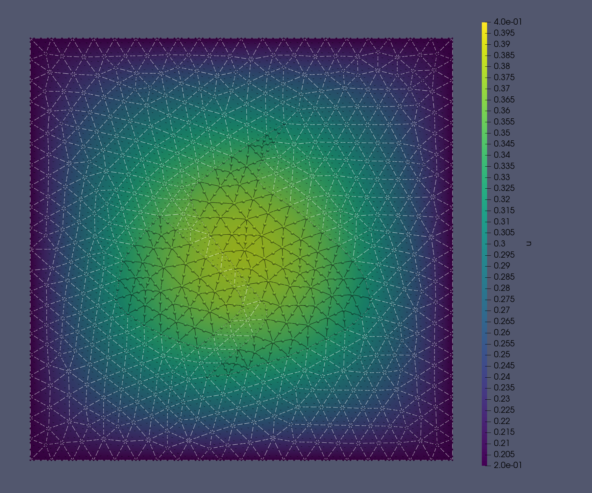

# An overview of the FEniCS project

<center>
Jørgen S. Dokken
<br>
PDESoft 2024
<center/>

<center>
<b> dokken@simula.no </b>
<center/>

<center>
<a href="https://jsdokken.com">https://jsdokken.com</a>
<center/>

<center>
<div>

</div>
<!--  -->
<center/>

<!-- # Brief history of FEniCS


<div data-marpit-fragment>

- **2002**: First public version of a C++ library (DOLFIN)
- **2003**: FEniCS project was created

</div>
<div data-marpit-fragment>

- **2006-2016**: Center for Biomedical Computing
- **2009**: Unified form language (UFL) introduced

</div>

<div data-marpit-fragment>

- ~3000 users on the FEniCS Discourse forum
- ~12 000 monthly downloads

</div>

--- -->

---

# An overview of the FEniCS project

<center>

<br>DOI: <a href="https://doi.org/10.5281/zenodo.10447665">10.5281/zenodo.10447665</a>
<br>
<center/>

---

# How does it work?

### Package overview


---

# How does it work?

### Package overview


---

# Creating variational formulation (1/4)

```python
import ufl
from basix.ufl import element

# Create a symbolic representation of a mesh
cell = "triangle"
c_el = element("Lagrange", cell, 1, shape=(2,))
domain = ufl.Mesh(c_el)

# Create a symbolic representation of a function space
el = element("Lagrange", cell, 3, discontinuous=True)
V = ufl.FunctionSpace(domain, el)
```

---

# Creating a variational formulation (2/4)

```python
# Define problem specific variables
h = 2 * ufl.Circumradius(domain)
n = ufl.FacetNormal(domain)
x, y = ufl.SpatialCoordinate(domain)
g = ufl.sin(2 * ufl.pi * x) + ufl.cos(y)
f = ufl.Coefficient(V)
alpha = ufl.Constant(domain)
gamma = ufl.Constant(domain)
u = ufl.TrialFunction(V)
v = ufl.TestFunction(V)
```

---

# Creating a variational formulation (3/4)

```python
# Define variational formulation
ds = ufl.Measure("ds", domain=domain)
dx = ufl.Measure("dx", domain=domain)
dS = ufl.Measure("dS", domain=domain)

F = ufl.inner(ufl.grad(u), ufl.grad(v)) * dx - f * v * dx

# Nitsche terms
def flux_term(u, v):
    return -ufl.dot(n, ufl.grad(u)) * v


F += flux_term(v, u) * ds + alpha / h * u * v * ds + flux_term(u, v) * ds
F -= flux_term(v, g) * ds + alpha / h * g * v * ds
```

---

# Creating a variational formulation (4/4)

```python
# Interior penalty/DG terms
def dg_flux(u, v):
    return -ufl.dot(ufl.avg(ufl.grad(u)), ufl.jump(v, n))


F += dg_flux(u, v) * dS + dg_flux(v, u) * dS
F += gamma / ufl.avg(h) * ufl.inner(ufl.jump(v, n), ufl.jump(u, n)) * dS

a, L = ufl.system(F)
```

---

# Generating integration kernels

**C++**

```bash
python3 -m ffcx dg_form.py
```

<div data-marpit-fragment>

**Python**

```python
from mpi4py import MPI
import dolfinx
from dg_form import a, L, alpha, gamma, el, f

compiled_a = dolfinx.fem.compile_form(MPI.COMM_WORLD, a)
compiled_L = dolfinx.fem.compile_form(MPI.COMM_WORLD, L)
```

</div>

---

# Solving a discrete problem (Path 1)

```python
import numpy as np

d_cell = dolfinx.mesh.to_type(el.cell_type.name)
mesh = dolfinx.mesh.create_unit_square(MPI.COMM_WORLD, 6, 7, d_cell)
Vh = dolfinx.fem.functionspace(mesh, el)

# Create coefficients and constants
alp = dolfinx.fem.Constant(mesh, 25.0)
gam = dolfinx.fem.Constant(mesh, 25.0)
fh = dolfinx.fem.Function(Vh)
fh.interpolate(lambda x: x[0] + 2 * np.sin(x[1]))

# Attach data to generated code
a_form = dolfinx.fem.create_form(
    compiled_a, [Vh, Vh], mesh, {}, {alpha: alp, gamma: gam})
L_form = dolfinx.fem.create_form(compiled_L, [Vh], mesh, {f: fh}, {alpha: alp})
```

---

---

# Solving a discrete problem - Path 2 (1/3)

```python
# Create discrete domain and function space
dtype = np.float32
mesh = dolfinx.mesh.create_unit_square(MPI.COMM_WORLD, 6, 7,
                                       dolfinx.mesh.CellType.triangle,
                                       dtype=dtype)
Vh = dolfinx.fem.functionspace(mesh, ("DG", 3))
```

---

# Solving a discrete problem - Path 2 (2/3)

```python
# Define problem specific variables
h = 2 * ufl.Circumradius(mesh)
n = ufl.FacetNormal(mesh)
x, y = ufl.SpatialCoordinate(mesh)
g = ufl.sin(2 * ufl.pi * x) + ufl.cos(y)
f = dolfinx.fem.Function(Vh, dtype=dtype)
f.interpolate(lambda x: x[0] + 2 * np.sin(x[1]))
alpha = dolfinx.fem.Constant(mesh, dtype(25.0))
gamma = dolfinx.fem.Constant(mesh, dtype(25.0))
u = ufl.TrialFunction(Vh)
v = ufl.TestFunction(Vh)
```

---

# Solving a discrete problem - Path 2 (2/3)

```python
# Define variational formulation
ds = ufl.Measure("ds", domain=mesh)
dx = ufl.Measure("dx", domain=mesh)
dS = ufl.Measure("dS", domain=mesh)

F = ufl.inner(ufl.grad(u), ufl.grad(v)) * dx - f * v * dx
# Add Nitsche and DG/IP terms
F += ....

a, L = ufl.system(F)

a_form = dolfinx.fem.form(a, dtype=dtype)
L_form = dolfinx.fem.form(L, dtype=dtype)
```

---

# Solving a discrete problem (assembly + solve)

```python
import dolfinx.fem.petsc
uh = dolfinx.fem.Function(Vh, name="uh", dtype=dtype)
solver_options = {
    "ksp_type": "preonly",
    "pc_type": "lu",
    "pc_factor_mat_solver_type": "mumps",
}
problem = dolfinx.fem.petsc.LinearProblem(
    a_form, L_form, u=uh, petsc_options=solver_options
)
problem.solve()
print(f"Solver converged with {problem.solver.getConvergedReason()}")
```

---

# Outputting

Supports arbitrary (discontinuous) Lagrange functions

```python
# ADIOS2 VTXWriter
with dolfinx.io.VTXWriter(mesh.comm, "solution_2.bp", [uh], engine="BP4") as bp:
    bp.write(0.0)
```


---

# Multiphysics

```python
submesh, submesh_to_mesh, _, _ = dolfinx.mesh.create_submesh(mesh, tdim, subset_cells)
# Define variational form...
compiled_F = dolfinx.fem.form(F, entity_maps=entity_maps)
```

<div class="columns">
<div>
<br>
<br>

$$
\begin{align*}
-\nabla\cdot(k\nabla u_i)&=f_i \text{ in } \Omega_i\\
u&=u_{D_i} \text{ on } \delta\Omega_{i,D} \\
%k\frac{\partial u_i}{\partial n}&=0 \text{ on } \delta\Omega_{i,N}\\
u_i &= u_j \text{ on } \Gamma_{i,j}\\
k\frac{\partial u_i}{\partial n} &= \frac{\partial u_j}{\partial n} \text{ on } \Gamma_{i,j}
\end{align*}
$$

</div>
<div>

</div>

---

# The Signorini problem $^{1, 2}$

<!--  footer: $^1$ Dokken, Farrell, Keith, Surowiec, _The latent variable proximal point algorithm for problems with pointwise constraints_ , In preparation. $^2$Keith, Surowiec. _Proximal Galerkin: A structure-preserving finite element method for pointwise bound constraints._ arXiv preprint arXiv:2307.12444 (2023) -->

<br>
<div class=columns>
<div>

$$
\begin{align*}
\nabla \cdot (\sigma(\mathbf{u})) &= \mathbf{f} \text{ in } \Omega\\
\mathbf{u} &= \mathbf{u}_D \text{ on } \delta\Omega_D \\
\sigma(\mathbf{u})\mathbf{n} &= 0 \text{ on } \delta\Omega_N\\
\mathbf{u}\cdot \mathbf{n} &\leq g \text{ on } \Gamma\\
\sigma_n(\mathbf{u})\mathbf{n} &\leq 0 \text{ on } \Gamma\\
\sigma_n(\mathbf{u})(\mathbf{u}\cdot \mathbf{n}-g) &= 0 \text{ on } \Gamma
\end{align*}
$$

</div>

<div>

**Latent variable proximal point algorithm**
Let $\mathbf{u}\in V(\Omega)$, $\psi\in Q(\Gamma)$

$$
\begin{align*}
\alpha_k(\sigma(\mathbf{u}), \epsilon(\mathbf{v}))_\Omega - (\psi, \mathbf{v}\cdot \mathbf{n})_\Gamma &= -\alpha_k(\mathbf{f}, v)_\Omega - (\psi^{k-1}, \mathbf{v}\cdot \mathbf{n})_\Gamma\\
(\mathbf{u}\cdot \mathbf{n}, w)_\Gamma - (e^{\psi}, w)_\Gamma &= (g, w)_\Gamma
\end{align*}
$$

Given $\alpha_k$, $\psi_{k-1}$

- Solve saddle point problem
- Check for convergence
- Update latent variable $\psi^{k-1}$, $\alpha_k$

</div>
</div>
<br>

---

# The Signorini problem $^{1,2}$

<center>

</center>

---

<!--  footer: <br> -->

---
