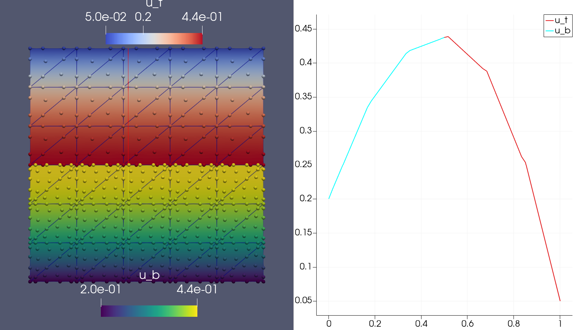
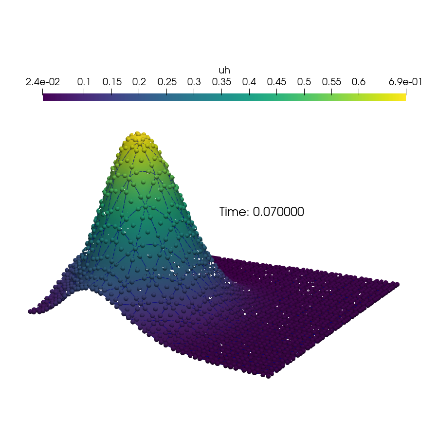
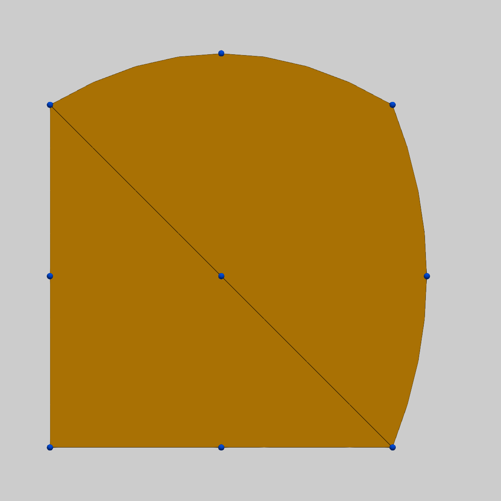
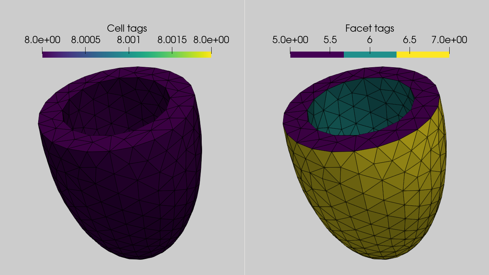

# An introduction to finite element modelling in FEniCSx

<center>
Jørgen S. Dokken
<center/>

<center>
<b> dokken@simula.no </b>
<center/>

<center>
<a href="https://jsdokken.com">https://jsdokken.com</a>
<center/>

<center>
<div>

</div>
<!--  -->
<center/>

---

# Brief history of FEniCS


<div data-marpit-fragment>

- **2002**: First public version of a C++ library (DOLFIN)
- **2003**: FEniCS project was created

</div>
<div data-marpit-fragment>

- **2006-2016**: Center for Biomedical Computing
- **2009**: Unified form language (UFL) introduced

</div>

<div data-marpit-fragment>

- ~3000 users on the FEniCS Discourse forum
- ~12 000 monthly downloads

</div>

---

# Why do we need DOLFINx?

<div data-marpit-fragment>
<center>
DOI: <a href="https://doi.org/10.5281/zenodo.10447665">10.5281/zenodo.10447665</a>
<center/>


</div>

---

# Heat equation with temporal and spatial dependencies

$$
\begin{align*}
\frac{\partial u}{\partial t} - \nabla \cdot( k(t) \nabla u) &= f(x,y,t) \qquad \text{in } \Omega \\
\frac{\partial u}{\partial n} &= 0 \qquad \text{on } \partial \Omega\\
u(\cdot, 0) &= \frac{1}{2\pi \sigma} e^{-\frac{1}{2}\left(\frac{x-\mu}{\sigma}\right)^2} e^{-\frac{1}{2}\left(\frac{y-\mu}{\sigma}\right)^2} \\
k(t) &= \begin{cases}
0.1 \quad \text{if } t \le 0.5\\
0.05 \quad \text{if } t \geq 0.5
\end{cases}\\
f(x,y,t) &= \begin{cases}
0.4\cdot y \quad \text{if } x \le 0.5\\
0.5\cdot t\quad \text{if } x \geq 0.5
\end{cases}
\end{align*}
$$

---

# DOLFINx is a library not a language

```python
from mpi4py import MPI
import dolfinx

mesh = dolfinx.mesh.create_unit_square(MPI.COMM_WORLD, 15, 15)
V = dolfinx.fem.functionspace(mesh, ("Lagrange", 3))

```

---

# How to define time-dependent constants?

$$
\begin{align*}
k(t) &= \begin{cases}
0.1 \quad \text{if } t \le 0.5\\
0.05 \quad \text{if } t \geq 0.5
\end{cases}
\end{align*}
$$

```python
dt = dolfinx.fem.Constant(mesh, 0.01)
dt.value = 0.005 # Direct assignment

def k_func(t):
    return 0.1 if t < 0.5 else 0.05

t = 0
k = dolfinx.fem.Constant(mesh, k_func(t))
while t < 1:
    # Update t
    t += float(dt)
    # Update k
    k.value = k_func(t)
```

---

# Spatially varying expressions

$$
\begin{align*}
  f(x,y,t) &= \begin{cases}
  0.4\cdot y \quad \text{if } x \le 0.5\\
  0.5\cdot t\quad \text{if } x\geq 0.5
\end{cases}
\end{align*}
$$

```python
import ufl
x, y = ufl.SpatialCoordinate(mesh)
condition = ufl.lt(x, 0.5)
t_c = dolfinx.fem.Constant(mesh, 0.)
true_statement = 0.4 * y
false_statement = 0.5 * t_c
f = ufl.conditional(condition, true_statement, false_statement)
while float(t_c) < 1:
    # Update t_c (implicit update of f)
    t_c.value += float(dt)
```

---

# Defining the full variational form

$$
\frac{\partial u}{\partial t} - \nabla \cdot( k(t) \nabla u) = f(x,y,t) \qquad \text{in } \Omega
$$

$$
F(u_h, v)=\frac{1}{\Delta t}(u_h-u_n, v)_\Omega + k(t)\cdot (\nabla u , \nabla v)_\Omega -(f, v)_\Omega=0
$$

```python
u = ufl.TrialFunction(V)
u_n = dolfinx.fem.Function(V)
dudt = (u - u_n) / dt
v = ufl.TestFunction(V)
dx = ufl.Measure("dx", domain=mesh)
F = dudt * v * dx + k * ufl.inner(ufl.grad(u), ufl.grad(v)) * dx - f * v * dx
a, L = ufl.system(F)
a_compiled = dolfinx.fem.form(a)
L_compiled = dolfinx.fem.form(L)
```

---

# Define an initial condition

$$
u(\cdot, 0) = \frac{1}{2\pi \sigma} e^{-\frac{1}{2}\left(\frac{x-\mu}{\sigma}\right)^2} e^{-\frac{1}{2}\left(\frac{y-\mu}{\sigma}\right)^2}
$$

```python
import numpy as np
def u_init(x, sigma=0.1, mu=0.3):
    """
    The input function x is a (3, number_of_points) numpy array, which is then
    evaluated with the vectorized numpy functions for efficiency
    """
    return 1./(2 * np.pi * sigma)*np.exp(-0.5*((x[0]-mu)/sigma)**2)*np.exp(-0.5*((x[1]-mu)/sigma)**2)

u_n.interpolate(u_init)
```

---

# Defining the linear solver

Find $u_h\in V$ such that $a(u_h, v)=L(v) \quad \forall v\in V$.

```python
import dolfinx.fem.petsc
uh = dolfinx.fem.Function(V, name="uh")
petsc_options = {"ksp_type": "preonly",
                 "pc_type": "lu", "pc_factor_mat_solver_type": "mumps"}
problem = dolfinx.fem.petsc.LinearProblem(
    a_compiled, L_compiled, u=uh, bcs=[], petsc_options=petsc_options)
```

---

# Solving the time dependent problem



```python
bp_file = dolfinx.io.VTXWriter(mesh.comm, "u.bp", [uh], engine="BP4")
t = 0
while t < 1:
    t += float(dt)
    k.value = k_func(t)
    problem.solve()
    # Update previous solution
    u_n.x.array[:] = uh.x.array
    bp_file.write(t)
bp_file.close()
```

---

# Heat equation with P-1 elements

<center>

<center/>

---

# Assembly with higher order N1Curl elements

$$
A = \int_\Omega (\nabla \times u) \cdot (\nabla \times v)~\mathrm{d}x
$$

<center>

<center/>

---

---

# Mesh creation with raw numpy arrays

```python
import numpy as np
from mpi4py import MPI
import dolfinx
import ufl
import basix.ufl
nodes = np.array(
    [
        [0.0, 0.0],
        [1.0, 0.0],
        [0.0, 1.0],
        [0.5, 0.5],
        [0, 0.5],
        [0.5, 0],
        [1.0, 1.0],
        [1.1, 0.5],
        [0.5, 1.15],
    ],
    dtype=np.float32,
)
connectivity = np.array([[0, 1, 2, 3, 4, 5],
                         [1, 2, 6, 8, 7, 5]], dtype=np.int64)
c_el = basix.ufl.element("Lagrange", "triangle", 2, shape=(nodes.shape[1],))
domain = dolfinx.mesh.create_mesh(MPI.COMM_SELF, connectivity, nodes, ufl.Mesh(c_el))

```

---

# Mesh creation continued

```python
with dolfinx.io.VTXWriter(domain.comm, "mesh.bp", domain, engine="BP4") as bp:
    bp.write(0.0)
```

<center>

<center/>

---

# GMSH interface (cardiac-geometries-core)

```python
import subprocess
from pathlib import Path

import dolfinx.io.gmshio
fname = "lv-mesh.msh"
cmd = f"geo lv-ellipsoid {fname}"

subprocess.run(cmd.split(" "))

from mpi4py import MPI
import dolfinx
mesh, ct, ft = dolfinx.io.gmshio.read_from_msh(fname, comm=MPI.COMM_WORLD, rank=0)
```

---

# Interaction directly with GMSH Python API

```python
mesh, cell_markers, facet_markers = model_to_mesh(gmsh.model, MPI.COMM_WORD, 0, gdim=2)
```

<center>

<center/>

### Stay for next talk by Henrik for more hearts

---

---

# Non-linear problems

Solve a sequence of problems

$$
u_{k+1} = u_k - \alpha\delta u_k
$$

$$
{J}_F(u_k)\delta u_k = F(u_k)
$$

```python
uh = dolfinx.fem.Function(V)
u_n = dolfinx.fem.Function(V)
dudt = (uh - u_n) / dt
v = ufl.TestFunction(V)
dx = ufl.Measure("dx", domain=mesh)
F = dudt * v * dx + k * ufl.inner(ufl.grad(uh), ufl.grad(v)) * dx - f * v * dx
```

---

# Non-linear problems continued

Solve a sequence of problems

$$
u_{k+1} = u_k - \alpha\delta u_k
$$

$$
{J}_F(u_k)\delta u_k = F(u_k)
$$

```python
import dolfinx.fem.petsc
import dolfinx.nls.petsc

problem = dolfinx.fem.petsc.NonlinearProblem(F, u=uh, bcs=[])
solver = dolfinx.nls.petsc.NewtonSolver(mesh.comm, problem)
ksp = solver.krylov_solver
ksp.setType("preonly")
pc = ksp.getPC()
pc.setType("lu")
pc.setFactorSolverType("mumps")
```

---

# Interpolation onto subset of cells

```python
from mpi4py import MPI
import dolfinx
import ufl

mesh = dolfinx.mesh.create_unit_square(
    MPI.COMM_WORLD, 25, 25, dolfinx.mesh.CellType.quadrilateral
)

V = dolfinx.fem.functionspace(mesh, ("Lagrange", 3, (2,)))
subdomain_cells = dolfinx.mesh.locate_entities(
    mesh, mesh.topology.dim, lambda x: (x[0] > 0.8) & (x[1] > 0.2)
)
uh = dolfinx.fem.Function(V)
uh.interpolate(lambda x: (0.05 * x[1] ** 2, 0 * x[0]), cells=subdomain_cells)
```

---

# Interpolation of any ufl expression

```python
def epsilon(u):
    return ufl.sym(ufl.grad(u))


def sigma(u, lmbda=2, mu=0.5):
    return lmbda * ufl.nabla_div(u) * ufl.Identity(len(u)) + 2 * mu * epsilon(u)


s = sigma(uh) - 1.0 / 3 * ufl.tr(sigma(uh)) * ufl.Identity(len(uh))
von_Mises = ufl.sqrt(3.0 / 2 * ufl.inner(s, s))

Q = dolfinx.fem.functionspace(mesh, ("DQ", 2))
compiled_expr = dolfinx.fem.Expression(von_Mises, Q.element.interpolation_points())
q = dolfinx.fem.Function(Q, name="VonMises")
q.interpolate(compiled_expr)

```

---

# Hungry for more?

<div class="columns">

<div>
<iframe width="550" height="420" src="https://jsdokken.com/dolfinx-tutorial/", title="FEniCS tutorial"></iframe>
</div>

<!-- <div data-marpit-fragment> -->

<div>

<center>

**Other new features**

- Complex number support
- Single/double precision
- Quadrilateral and hexahedral (unordered) meshes
- Arbitrary order (discontinuous) Lagrange outputs
- Custom mesh partitioning
- Proper definition of higher order elements

<center/>
<center>

<center/>
</div>

<!-- </div> -->
