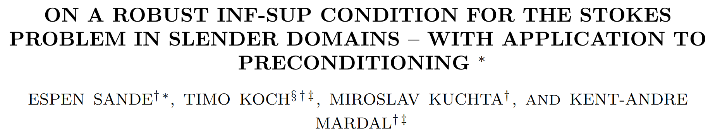
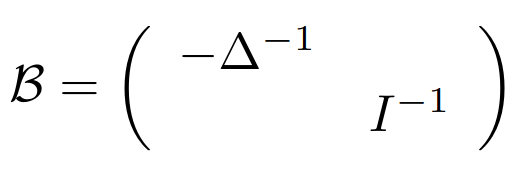
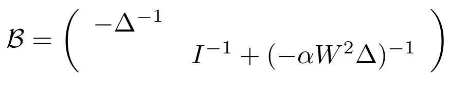

# FEM for brain simulation

<center>
Jørgen S. Dokken
<br>
<br>
Workshop on challenges associated with real-world poromechanical simulation 
<br><br>
<center/>

<center>
<b> dokken@simula.no </b>
<center/>

<center>
<a href="https://jsdokken.com">https://jsdokken.com</a>
<center/>

<center>
<div>

</div>
 -->
<center/>

---

# What do we do at Simula?

---

<center>

<br>
<p style="font-size: 20px;">
Meshed brain with subarachnoid spaces from Valnes and Mardal
<i>
Meshing the intracranial compartments: The
cerebellum, cerebrum, brainstem, and
cerebrospinal fluid
</i>, 2025, To appear in Dokken et al. 
</i>Mathematical Modelling of the Human Brain II From Glymphatics to Deep Learning</i>
</p>
<center>

---

# Poroelasticity of the brain

<div class="columns">
<div>

- Brain model as linear poroelastic medium

  - $\mathbf{d}$ (displacement)
  - $p_p$ (pore-pressure)
  - $\phi$ (total pressure)

  

- Time-dependent Stokes in fluid

</div>
<center>

<br>
<p style="font-size: 20px;">
Simplified illustration of the brain
<i>
Human intracranial pulsatility
during the cardiac cycle: a computational
modelling framework
</i>2022, Causemann et al.
<i>Fluids and Barriers of the CNS</i>
</p>
<center/>
</div>

---

<center>

<center/>

<p style="font-size: 20px;">
Fluid flow in the CSF using MUMPS and FEniCS/Multiphenics to solve the full system from
<i>
Human intracranial pulsatility
during the cardiac cycle: a computational
modelling framework
</i>2022, Causemann et al.
<i>Fluids and Barriers of the CNS</i>
</p>

---

# Fluid channels in the brain are narrow

<div class="columns">
<div>
<center>

<center/>
</div>
<div>
<center>

<center/>
</div>
</div>
<p style="font-size: 20px;">
Stokes flow in Cereboral Spinal Fluid. <b>1155 GMRES iterations</b> to convergence with a <b>left preconditioner</b> from Hornkjøl et al. <i>Segmenting, meshing, and modeling CSF spaces</i>, , to appear in Dokken et al. 
</i>Mathematical Modelling of the Human Brain II From Glymphatics to Deep Learning</i>
</p>

---

# Potential solution - New preconditioners

<center>

<br>


<center/>

---

# All of the above examples is implemented in some flavor of FEniCS

<center>

<center/>

---

# Brief history of FEniCS


<div data-marpit-fragment>

- **2002**: First public version of a C++ library (DOLFIN)
- **2003**: FEniCS project was created

</div>
<div data-marpit-fragment>

- **2006-2016**: Center for Biomedical Computing
- **2009**: Unified form language (UFL) introduced

</div>

<div data-marpit-fragment>

- ~3000 users on the FEniCS Discourse forum
- ~12 000 monthly downloads

</div>

---

# An overview of the FEniCS project

<center>

<br>DOI: <a href="https://doi.org/10.5281/zenodo.10447665">10.5281/zenodo.10447665</a>
<br>
<center/>

---

---

<!--  footer: $^1$ Baratta, Dean, Dokken, Habera, Hale, Richardson, Rognes, Scroggs, Sime, Wells. 2023. DOLFINx: _The next generation FEniCS problem solving environment_. Zenodo. DOI: 10.5281/zenodo.10447666 <br><br> -->

# How does it work?

### Package overview${^1}$


---

# How does it work?

### Modularity${^1}$


---

<!--  footer: <br> -->

# UFL + Basix = Variational forms

```python
import ufl
from basix.ufl import element

cell = "triangle"
c_el = element("Lagrange", cell, 1, shape=(2,))
domain = ufl.Mesh(c_el)

el = element("Lagrange", cell, 3, discontinuous=True)
V = ufl.FunctionSpace(domain, el)
```

---

# Define problem specific symbolic variables

```python
h = 2 * ufl.Circumradius(domain)
n = ufl.FacetNormal(domain)
x, y = ufl.SpatialCoordinate(domain)
g = ufl.sin(2 * ufl.pi * x) + ufl.cos(y)
f = ufl.Coefficient(V)
alpha = ufl.Constant(domain)
gamma = ufl.Constant(domain)
u = ufl.TrialFunction(V)
v = ufl.TestFunction(V)
```

---

# Creating a variational formulation (1/2)

```python
ds = ufl.Measure("ds", domain=domain)
dx = ufl.Measure("dx", domain=domain)
dS = ufl.Measure("dS", domain=domain)

F = ufl.inner(ufl.grad(u), ufl.grad(v)) * dx - f * v * dx

# Nitsche terms
def flux_term(u, v):
    return -ufl.dot(n, ufl.grad(u)) * v


F += flux_term(v, u) * ds + alpha / h * u * v * ds + flux_term(u, v) * ds
F -= flux_term(v, g) * ds + alpha / h * g * v * ds
```

---

# Creating a variational formulation (2/2)

```python
# Interior penalty/DG terms
def dg_flux(u, v):
    return -ufl.dot(ufl.avg(ufl.grad(u)), ufl.jump(v, n))


F += dg_flux(u, v) * dS + dg_flux(v, u) * dS
F += gamma / ufl.avg(h) * ufl.inner(ufl.jump(v, n), ufl.jump(u, n)) * dS

a, L = ufl.system(F)
```

---

# PETSc solver interface (linear)

```python
import dolfinx.fem.petsc
uh = dolfinx.fem.Function(Vh, name="uh", dtype=dtype)
solver_options = {
    "ksp_type": "preonly",
    "pc_type": "lu",
    "pc_factor_mat_solver_type": "mumps",
}
problem = dolfinx.fem.petsc.LinearProblem(
    a_form, L_form, u=uh, petsc_options=solver_options,
    petsc_options_prefix="linear_problem_"
)
problem.solve()
print(f"Solver converged with {problem.solver.getConvergedReason()}")
```

---

# PETSc solver interface (nonlinear)

```python
bc = dolfinx.fem.dirichletbc(u_bc, dolfinx.fem.locate_dofs_topological(V, fdim, bc_facets))
petsc_options = {
    "snes_type": "newtonls",
    "snes_linesearch_type": "none",
    "ksp_type": "preonly",
    "pc_type": "lu",
    "pc_factor_mat_solver_type": "mumps",
    "ksp_error_if_not_converged": True,
    "snes_error_if_not_converged": True,
  }
F_blocked = ufl.extract_blocks(residual)
solver = dolfinx.fem.petsc.NonlinearProblem(F_blocked, [u, psi], bcs=bcs,
    kind="mpi",
    entity_maps=entity_maps,
    petsc_options=petsc_options, petsc_options_prefix="nonlinear_problem_")
solver.solve()
```

---

# FEniCS in the brain

---
