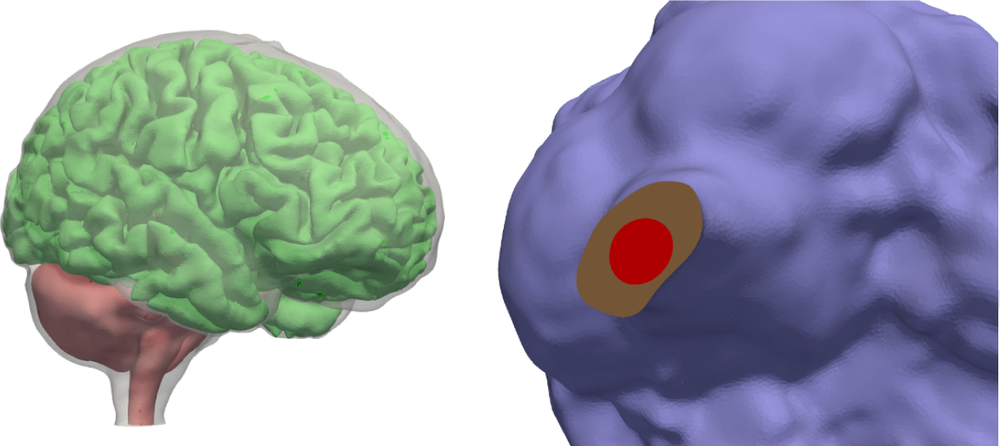
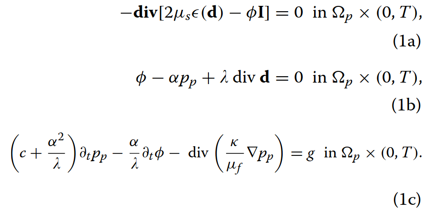
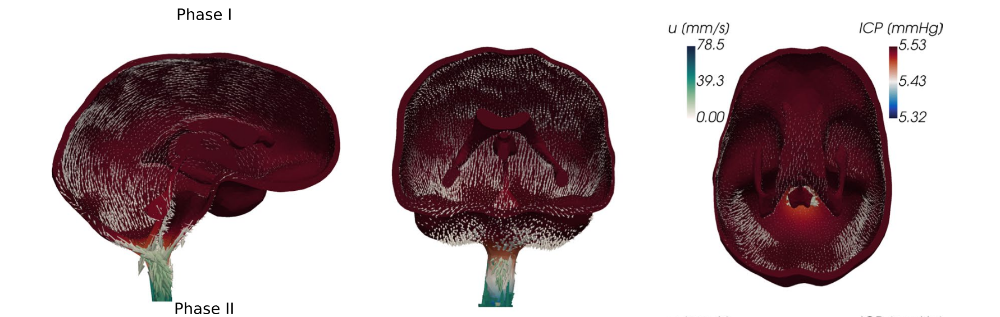
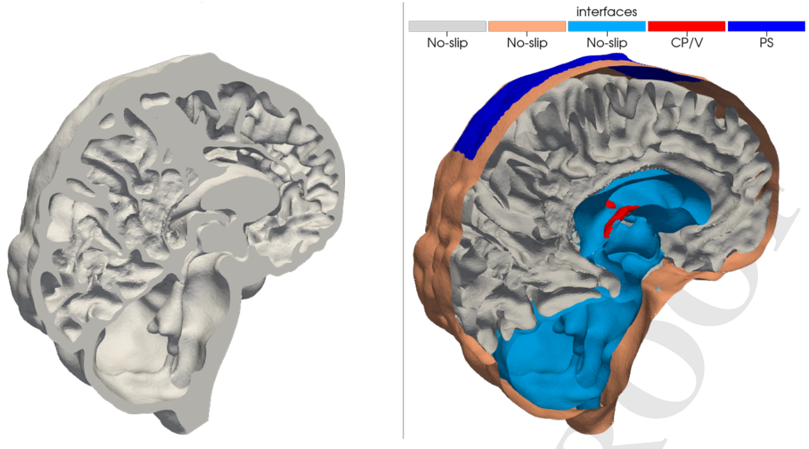
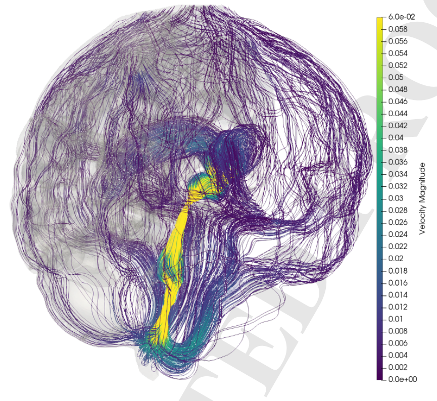
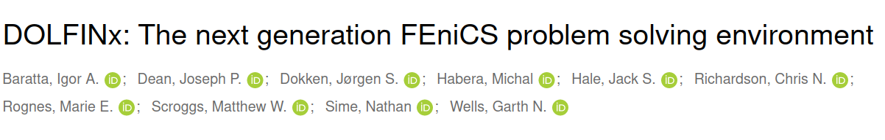
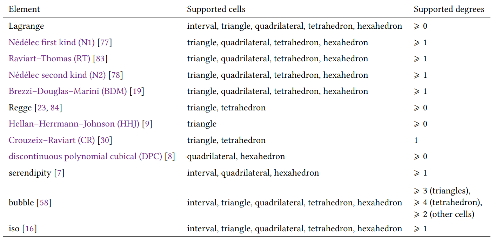
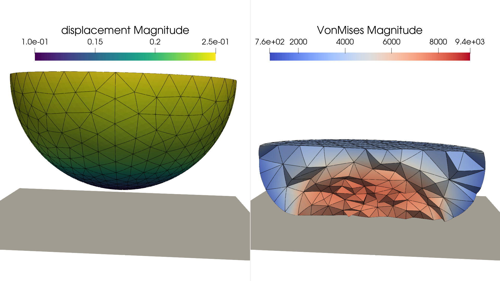
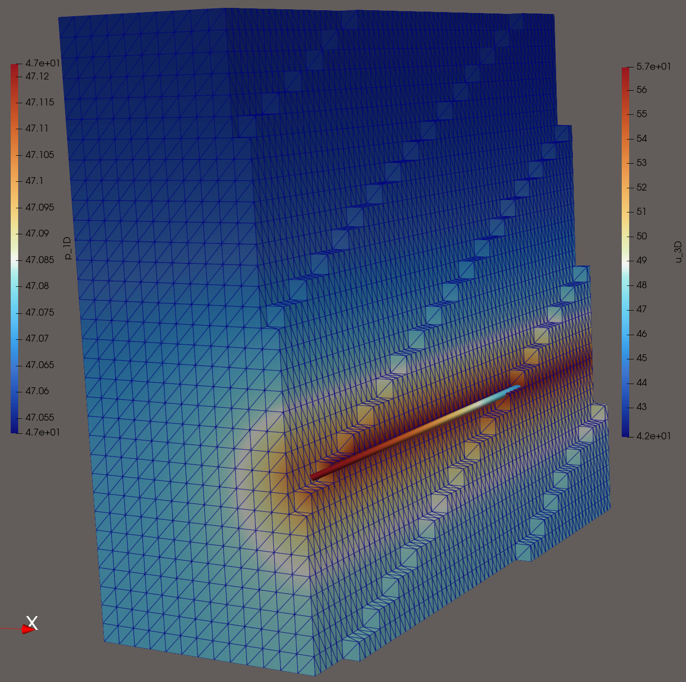

# FEM for brain simulation

<center>
Jørgen S. Dokken
<br>
<br>
Workshop on challenges associated with real-world poromechanical simulation 
<br><br>
<center/>

<center>
<b> dokken@simula.no </b>
<center/>

<center>
<a href="https://jsdokken.com">https://jsdokken.com</a>
<center/>

<center>
<div>

</div>
 -->
<center/>

---

# What do we do at Simula?

---

<center>

<br>
<p style="font-size: 20px;">
Meshed brain with subarachnoid spaces from Valnes and Mardal
<i>
Meshing the intracranial compartments: The
cerebellum, cerebrum, brainstem, and
cerebrospinal fluid
</i>, 2025, To appear in Dokken et al. 
</i>Mathematical Modelling of the Human Brain II From Glymphatics to Deep Learning</i>
</p>
<center>

---

# Poroelasticity of the brain

<div class="columns">
<div>

- Brain model as linear poroelastic medium

  - $\mathbf{d}$ (displacement)
  - $p_p$ (pore-pressure)
  - $\phi$ (total pressure)

  

- Time-dependent Stokes in fluid

</div>
<center>

<br>
<p style="font-size: 20px;">
Simplified illustration of the brain
<i>
Human intracranial pulsatility
during the cardiac cycle: a computational
modelling framework
</i>2022, Causemann et al.
<i>Fluids and Barriers of the CNS</i>
</p>
<center/>
</div>

---

<center>

<center/>

<p style="font-size: 20px;">
Fluid flow in the CSF using MUMPS and FEniCS/Multiphenics to solve the full system from
<i>
Human intracranial pulsatility
during the cardiac cycle: a computational
modelling framework
</i>2022, Causemann et al.
<i>Fluids and Barriers of the CNS</i>
</p>

---

# Standard preconditioning does not work on the brain

<div class="columns">
<div>
<center>

<center/>
</div>
<div>
<center>

<center/>
</div>
</div>
<p style="font-size: 20px;">
Stokes flow in Cereboral Spinal Fluid. <b>1155 GMRES iterations</b> to convergence with a <b>left preconditioner</b> from Hornkjøl et al. <i>Segmenting, meshing, and modeling CSF spaces</i>, , to appear in Dokken et al. 
</i>Mathematical Modelling of the Human Brain II From Glymphatics to Deep Learning</i>
</p>

---

# All of the above examples is implemented in some flavor of FEniCS

<center>

<center/>

---

# Brief history of FEniCS


<div data-marpit-fragment>

- **2002**: First public version of a C++ library (DOLFIN)
- **2003**: FEniCS project was created

</div>
<div data-marpit-fragment>

- **2006-2016**: Center for Biomedical Computing
- **2009**: Unified form language (UFL) introduced

</div>

<div data-marpit-fragment>

- ~3000 users on the FEniCS Discourse forum
- ~12 000 monthly downloads

</div>

---

# An overview of the FEniCS project

<center>

<br>DOI: <a href="https://doi.org/10.5281/zenodo.10447665">10.5281/zenodo.10447665</a>
<br>
<center/>

---

---

<!--  footer: $^1$ Baratta, Dean, <b>Dokken</b>, Habera, Hale, Richardson, Rognes, Scroggs, Sime, Wells. 2023. DOLFINx: _The next generation FEniCS problem solving environment_. Zenodo. DOI: 10.5281/zenodo.10447666 <br><br> -->

# How does it work?

### Package overview${^1}$


---

<!--  footer: <br> -->

# UFL + Basix = Variational forms

```python
import ufl
from basix.ufl import element

cell = "triangle"
c_el = element("Lagrange", cell, 1, shape=(2,))
domain = ufl.Mesh(c_el)

el = element("Lagrange", cell, 3, discontinuous=True)
V = ufl.FunctionSpace(domain, el)
```

---

<center>

<br>DOI: <a href="https://doi.org/10.5281/zenodo.10447665">10.5281/zenodo.10447665</a>
<center/>

---

# Now with SymFem${{}^{2}}$ support

```python
import symfem
import numpy as np
import symfem.basix_interface

# Create a BDFM element. These are not currently implemented in Basix
element = symfem.create_element("triangle", "BDFM", 2)
basix_ufl_element = symfem.basix_interface.create_basix_element(element, ufl=True)
```

<p style="font-size: 20px;"> Snippet from 
<a href="https://symfem.readthedocs.io/en/latest/demos/basix_interface.html">SymFEM demos</a>
</p>

<!--  footer: $^2$ Scroggs, 2021 _Symfem: a symbolic finite element definition library._, JOSS, DOI: 10.21105/joss.03556 <br><br> -->

---

# Define problem specific symbolic variables

```python
h = 2 * ufl.Circumradius(domain)
n = ufl.FacetNormal(domain)
x, y = ufl.SpatialCoordinate(domain)
g = ufl.sin(2 * ufl.pi * x) + ufl.cos(y)
f = ufl.Coefficient(V)
alpha = ufl.Constant(domain)
gamma = ufl.Constant(domain)
u = ufl.TrialFunction(V)
v = ufl.TestFunction(V)
```

---

# Creating a variational formulation (1/2)

```python
ds = ufl.Measure("ds", domain=domain)
dx = ufl.Measure("dx", domain=domain)
dS = ufl.Measure("dS", domain=domain)

F = ufl.inner(ufl.grad(u), ufl.grad(v)) * dx - f * v * dx

# Nitsche terms
def flux_term(u, v):
    return -ufl.dot(n, ufl.grad(u)) * v


F += flux_term(v, u) * ds + alpha / h * u * v * ds + flux_term(u, v) * ds
F -= flux_term(v, g) * ds + alpha / h * g * v * ds
```

---

# Creating a variational formulation (2/2)

```python
# Interior penalty/DG terms
def dg_flux(u, v):
    return -ufl.dot(ufl.avg(ufl.grad(u)), ufl.jump(v, n))


F += dg_flux(u, v) * dS + dg_flux(v, u) * dS
F += gamma / ufl.avg(h) * ufl.inner(ufl.jump(v, n), ufl.jump(u, n)) * dS

a, L = ufl.system(F)
```

---

# Creating non-linear problems

```python
# Symbolic differentiation
uh = ufl.Coefficient(V)
# Define F ...

F = ....

# Compute Jacobian
J = ufl.derivative(F,uh)
```

---

# Supports adjointing

```python
F = ufl.inner(ufl.grad(uh), ufl.grad(dv)) * ufl.dx - ufl.inner(f, dv) * ufl.dx
J = 1 / 2 * ufl.inner(uh - d, uh - d) * ufl.dx + alpha / 2 * f**2 * ufl.dx
dFdu = ufl.derivative(F, uh, du)
dFdu_adj = ufl.adjoint(dFdu)
dJdu = ufl.derivative(J, uh)
lmbda = dolfinx.fem.Function(V)
```

---

# How does it work?

<!--  footer: $^1$ Baratta, Dean, <b>Dokken</b>, Habera, Hale, Richardson, Rognes, Scroggs, Sime, Wells. 2023. DOLFINx: _The next generation FEniCS problem solving environment_. Zenodo. DOI: 10.5281/zenodo.10447666 <br><br> -->

### Modularity${^1}$


---

<center>

<br>DOI: <a href="https://doi.org/10.5281/zenodo.10447665">10.5281/zenodo.10447665</a>
<br>
<center/>

---

<!--  footer: <br> -->

---

# PETSc solver interface (linear)

```python
import dolfinx.fem.petsc
uh = dolfinx.fem.Function(Vh, name="uh", dtype=dtype)
solver_options = {
    "ksp_type": "preonly",
    "pc_type": "lu",
    "pc_factor_mat_solver_type": "mumps",
}
problem = dolfinx.fem.petsc.LinearProblem(
    a_form, L_form, u=uh, petsc_options=solver_options,
    petsc_options_prefix="linear_problem_"
)
problem.solve()
print(f"Solver converged with {problem.solver.getConvergedReason()}")
```

---

# PETSc solver interface (nonlinear)

```python
bc = dolfinx.fem.dirichletbc(u_bc, dolfinx.fem.locate_dofs_topological(V, fdim, bc_facets))
petsc_options = {
    "snes_type": "newtonls",
    "snes_linesearch_type": "none",
    "ksp_type": "preonly",
    "pc_type": "lu",
    "pc_factor_mat_solver_type": "mumps",
    "ksp_error_if_not_converged": True,
    "snes_error_if_not_converged": True,
  }
F_blocked = ufl.extract_blocks(residual)
solver = dolfinx.fem.petsc.NonlinearProblem(F_blocked, [u, psi], bcs=bcs,
    kind="mpi",
    entity_maps=entity_maps,
    petsc_options=petsc_options, petsc_options_prefix="nonlinear_problem_")
solver.solve()
```

---

# Block-preconditioning and subdomains

---

# Creating submeshes in DOLFINx

```python
omega_sub, sub_to_omega = dolfinx.mesh.create_submesh(omega, dim, tags.find(tag))[
        0:2]
```

---

# Create a symbolic representation in UFL of the mixed problem

```python
omega_sub, sub_to_omega = dolfinx.mesh.create_submesh(omega, dim, tags.find(tag))[
        0:2]
V = dolfinx.fem.functionspace(omega, ("Lagrange", 2, (omega.geometry.dim, )))
Q = dolfinx.fem.functionspace(omega_sub, ("Lagrange", 1))
W = ufl.MixedFunctionSpace(V, Q)
u, psi = ufl.TrialFunctions(W)
v, q = ufl.TestFunctions(W)
```

---

# Pass blocked system to linear or nonlinear solver

```python
F = ....
a, L = ufl.system(F)
P_blocked = ufl.extract_blocks(P)
a_blocked = ufl.extract_blocks(a)
L_blocked = ufl.extract_blocks(L)
problem = fem.petsc.LinearProblem(
    a_blocked, L_blocked u=[u, u_sub], P=P_blocked,
    kind="nest",
    bcs=bcs,
    entity_maps=[sub_to_omega],
    petsc_options_prefix="my_solver",
    petsc_options={
        "ksp_type": "gmres",
        "pc_type": "fieldsplit",
        "pc_fieldsplit_type": "additive",
        "ksp_rtol": 1e-8, .....
      })
```

---

# The Extra, Intral Membrane (EMI) model

<div class=columns>

<div>
<br>
<br>
<br>

$$
\begin{align*}
-\nabla \cdot (\sigma_e\nabla u_e) &= 0&& \text{in } \Omega_e\\
-\nabla \cdot (\sigma_i\nabla u_i) &= 0&& \text{in } \Omega_i\\
\sigma_e\nabla u_e\cdot \mathbf{n}_e = - \sigma_i\nabla u_i\cdot \mathbf{n}_i &\equiv I_m&&\text{at } \Gamma\\
v &=u_e-u_i&& \text{at } \Gamma\\
\frac{\partial v}{\partial t} &= \frac{1}{C_m}(I_m-I_{ion})&& \text{at } \Gamma
\end{align*}
$$

</div>
<div style="font-size:25px">
<br>
<br>
<center>

<sup>3</sup>Benedusi et al. 2024 <br>&nbsp; DOI: <a href="https://doi.org/10.1007/s10915-023-02449-2">10.1007/s10915-023-02449-2</a>
</center>
</div>

<br>

---

<!-- footer: $^4$Kutcha et al. (2021), Solving the EMI Equations using Finite Element Methods, In: Modeling Excitable Tissue. Simula SpringerBriefs on Computing, DOI: [10.1007/978-3-030-61157-6_5](https://doi.org/10.1007/978-3-030-61157-6_5)<br><br>
-->

# Various ways of modelling this equation$^4$

- Single-dimensional primal form
- Multi-dimensional primal form
- Single-dimensional mixed form
- Multi-dimensional mixed form

<div data-marpit-fragment >
<center>
<br>
<b style="font-size:35px">All models can be implemented in DOLFINx</b>
</center>
</div>

---

<!-- footer: <br>
 -->

# Single-dimensional primal form

Find $u^n_i\in V(\Omega_i)\equiv V_i$, $u^n_e\in V(\Omega_e)\equiv V_e$ such that

$$
\begin{align*}
\int_{\Omega_e} \sigma_e \nabla u^n_e \cdot \nabla v_e ~\mathrm{d}x
+ \int_{\Gamma}C_m (\Delta t)^{-1} (u^n_e - u^n_i) v_e~\mathrm{d}s
&=
-\int_{\Gamma} \left(\frac{C_m}{\Delta t}(u^{n-1}_e - u^{n-1}_i) + I_{ion} \right)v_e~\mathrm{d} s\\
\int_{\Omega_i} \sigma_i \nabla u^n_i \cdot \nabla v_i ~\mathrm{d}x
+ \int_{\Gamma}C_m (\Delta t)^{-1} (u^n_i - u^n_e) v_i~\mathrm{d}s
&= \int_{\Gamma} \left(\frac{C_m}{\Delta t}(u^{n-1}_e - u^{n-1}_i) + I_{ion} \right)v_i~\mathrm{d} s
\end{align*}
$$

for all $v_e \in V_e$ and $v_i \in V_i$.

---

# Use known preconditioner$^5$ of this problem

$$
\begin{pmatrix}
\int_{\Omega_e} \sigma_e \nabla u_e \cdot \nabla v_e~\mathrm{d} x & 0\\
0 & \int_{\Omega_i} \sigma_i \nabla u_i \cdot \nabla v_i + u_i v_i ~\mathrm{d}x
\end{pmatrix}
$$

```python
P = sigma_e * inner(grad(ue), grad(ve)) * dxE
P += sigma_i * inner(grad(ui), grad(vi)) * dxI
P += inner(ui, vi) * dxI
P_compiled = dolfinx.fem.form(extract_blocks(P), entity_maps=entity_maps)
bc_P = dolfinx.fem.dirichletbc(0.0, bc_dofs, Ve)
B = dolfinx.fem.petsc.assemble_matrix(P_compiled, kind="mpi", bcs=[bc_P])
B.assemble()
```

<!-- footer: $^5$Kutcha and Mardal. (2021), Iterative Solvers for EMI Models, In: Modeling Excitable Tissue. Simula SpringerBriefs on Computing, DOI: [10.1007/978-3-030-61157-6_6](https://doi.org/10.1007/978-3-030-61157-6_6)<br><br>
-->

---

<!-- footer: $^6$ Dean, J.P, _Mathematical and computational aspects of solving mixed-domain problems using the finite element method_, PhD Thesis, DOI: 10.17863/CAM.108292<br> ${}^7$ Dean, <b>Dokken</b>, Wells, _Parallel algorithms for mixed-domain problems_, To be published<br>
-->

# Mixed-dimensional support$^{6,7}$

- Native support for:
  - Codim 0: 1D-1D, 2D-2D, 3D-3D
  - Codim 1: 3D-2D and 2D-1D, 1D-0D
- Future work for native DOLFINx:
  - Codim 2: 3D-1D, 2D-0D

---

# The Signorini problem

<center>

$\mathbf{u}\in V=\{\mathbf{u}\in H^1(\Omega, \mathbb{R}^3)~\vert~\mathbf{u}=\mathbf{u}_D~\text{on}~ \partial \Omega_D \}$

</center>

<br>
<div class=columns>
<div>

$$
\begin{align*}
\nabla \cdot (\sigma(\mathbf{u})) &= \mathbf{f} \text{ in } \Omega\\
\mathbf{u} &= \mathbf{u}_D \text{ on } \delta\Omega_D \\
\sigma(\mathbf{u})\mathbf{n} &= 0 \text{ on } \delta\Omega_N\\
\mathbf{u}\cdot \hat{\mathbf{n}} &\leq g \text{ on } \Gamma\\
\sigma_n(\mathbf{u})\mathbf{n} &\leq 0 \text{ on } \Gamma\\
\sigma_n(\mathbf{u})(\mathbf{u}\cdot \hat{\mathbf{n}}-g) &= 0 \text{ on } \Gamma
\end{align*}
$$

</div>

<div data-marpit-fragment>

$$
\begin{align*}
\min_{u \in K}&= \frac{1}{2} \int_\Omega (C\epsilon(\mathbf{u})):\epsilon (\mathbf{u})~\mathrm{d}x - \int_\Omega \mathbf{f}\cdot \mathbf{u}~\mathrm{d}x\\
K&=\{\mathbf{u}\in V ~\vert~ \mathbf{u}\cdot \hat{\mathbf{n}}\leq g ~\text{on}~\Gamma\}
\end{align*}
$$

<div data-marpit-fragment>

<b> How to enforce $\mathbf{u}\in K$? </b>

</div>

</div>

---

# Latent variable proximal point algorithm$^8$

<!--  footer: $^8$ <b>Dokken</b>, Farrell, Keith, Papadopoulos, Surowiec, _The latent variable proximal point algorithm for variational problems with inequality constraints_, CMAME, 2025, DOI: [10.1016/j.cma.2025.118181](https://doi.org/10.1016/j.cma.2025.118181) <br><br> -->

$$
\begin{align*}
&\min_{u\in K} J(u) \qquad K=\{v\in V~\vert~ Bv\in C(x)~ \text{for almost every}~ x\in \Omega\}
\end{align*}
$$

<div data-marpit-fragment>

Given $u^{k-1}\in V$, find $u^k\in V$, $\psi^k\in Q$ such that

$$
\begin{align*}
 \alpha_k J'(u^k) + B^*\psi^k &= B^*\psi^{k-1}\\
 Bu^k-\nabla R^*(\psi^k)&=0
\end{align*}
$$

where $\text{dom}R=C$, $(\nabla R)^*$ is the convex conjugate, $B^*$ the dual conjugate.

</div>

---

# Properties of the formulation

<br>
<div class=right-skewed-columns>
<div>

- $\alpha_k$ is bounded
- Can be discretized with
  FD, FV, FEM, SEM
- Can use higher order function spaces

</div>
<div>

<center>

</center>

</div>

---

# Latent variable proximal point algorithm$^8$

<div>

Let $\mathbf{u}^k\in V(\Omega)$, $\psi^k\in Q(\Gamma)$,

$$
\begin{align*}
\alpha_k(\sigma(\mathbf{u^k}), \epsilon(\mathbf{v}))_\Omega - (\psi^k, \mathbf{v}\cdot \hat{\mathbf{n}})_\Gamma &= \alpha_k(\mathbf{f}, v)_\Omega - (\psi^{k-1}, \mathbf{v}\cdot \hat{\mathbf{n}})_\Gamma\\
(\mathbf{u}^k\cdot \hat{\mathbf{n}}, w)_\Gamma - (e^{\psi}, w)_\Gamma &= (g, w)_\Gamma
\end{align*}
$$

Given $\alpha_k$, $\psi_{k-1}$

- Solve saddle point problem
- Check for convergence
- Update latent variable $\psi^{k-1}$, $\alpha_k$

</div>
<br>
<br>
<br>
</div>

---

# Implementation of the Signorini problem ${}^8$

```python
fdim = omega.topology.dim -1
gamma, gamma_to_omega = dolfinx.mesh.create_submesh(omega, fdim, potential_contact_facets)[
      0:2]

gdim = omega.geometry.dim
V = dolfinx.fem.functionspace(omega, ("Lagrange", degree, (gdim,)))
Q = dolfinx.fem.functionspace(gamma, ("Lagrange", degree))
W = ufl.MixedFunctionSpace(V, Q)

v, w = ufl.TestFunctions(W)
u = dolfinx.fem.Function(V, name="Displacement")
psi = dolfinx.fem.Function(Q, name="LatentVariable")
psi_k = dolfinx.fem.Function(Q, name="PreviousLV")
alpha = dolfinx.fem.Constant(omega, 1.)
```

---

# Implementation of the Signorini problem ${}^8$

```python
def epsilon(w):
  return ufl.sym(ufl.grad(w))

def sigma(w, mu, lmbda):
  ew = epsilon(w)
  gdim = ew.ufl_shape[0]
  return 2.0 * mu * epsilon(w) + lmbda * ufl.tr(ufl.grad(w)) * ufl.Identity(gdim)

dx = ufl.Measure("dx", domain=omega)
ds = ufl.Measure("ds", domain=omega, subdomain_data=facet_tag subdomain_id=contact_tag)
F = alpha * ufl.inner(sigma(u, mu, lmbda), epsilon(v)) * dx
F -= alpha * ufl.inner(f, v) * dx
F -= ufl.inner(psi - psi_k, ufl.dot(v, n_g)) * ds
F += ufl.inner(ufl.dot(u, n_g), w) * ds
F += ufl.inner(ufl.exp(psi), w) * ds - ufl.inner(g, w) * ds
bc = dolfinx.fem.dirichletbc(u_bc, dolfinx.fem.locate_dofs_topological(V, fdim, bc_facets))
```

---

# Implementation of the Signorini problem ${}^8$

<center>

</center>

---

<!--  footer: ${}^9$ Kuchta, M. (2021). Assembly of Multiscale Linear PDE Operators. In: Vermolen, F.J., Vuik, C. (eds) Numerical Mathematics and Advanced Applications ENUMATH 2019. Lecture Notes in Computational Science and Engineering, vol 139. Springer, Cham. https://doi.org/10.1007/978-3-030-55874-1_63 <br><br> -->

# Non-conforming 3D-1D support using FEniCSx_ii

- Algorithm based on ${}^9$, but with MPI support and FEniCSx support
- Example below from [FEniCSx_ii Demos](https://scientificcomputing.github.io/fenicsx_ii/demos/coupled_poisson_solver.html)

<div class=columns>
<div>

<center>

</center>
</div>
<center>

</center>
</div>
<br>
<br>

---

<!--  footer: ${}^{10}$ Idea presented in: Gjerde IG (2022) Graphnics: Combining FEniCS and NetworkX to simulate flow in complex networks. arXiv preprint arXiv:2212.02916 <br> ${}^{11}$ Daversin-Catty, C., et al (2024). Finite Element Software and Performance for Network Models with Multipliers. SEMA SIMAI Springer Series, vol 36. Springer, Cham. DOI: 10.1007/978-3-031-58519-7_4 <br> -->

# Support for branching manifolds with MPI

<div class=columns>

<div>

- Represent Network-x graphs as meshes in DOLFINx${}^10$
- Use 1D submeshes with graph coloring${}^11$
- _New_: MPI support and 0D submeshes for bifurcations

</div>

</div>
</div>

---

<!-- footer: ${}^{12}$ Dark, James, et al. "FESTIM v2.0: Upgraded framework for multi-species hydrogen transport and enhanced performance." arXiv preprint arXiv:2509.24760 (2025). <br><br> -->

# Conclusion

<div class=columns>
<div>

- FEniCSx is an extendible collection of packages for solving PDEs with FEM
- Mixed-domain support (codim=0, codim=1, codim=2)
- Scalability compared to legacy FEniCS${^{12}}$

</div>
<div>


</div>
</div>
