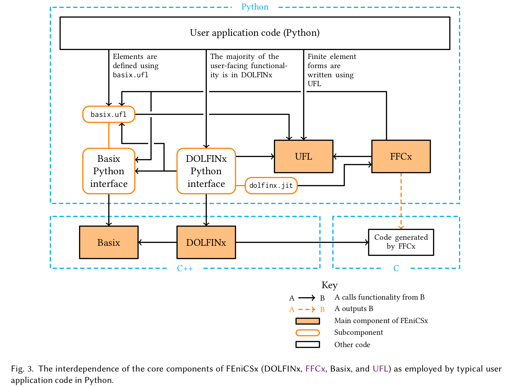
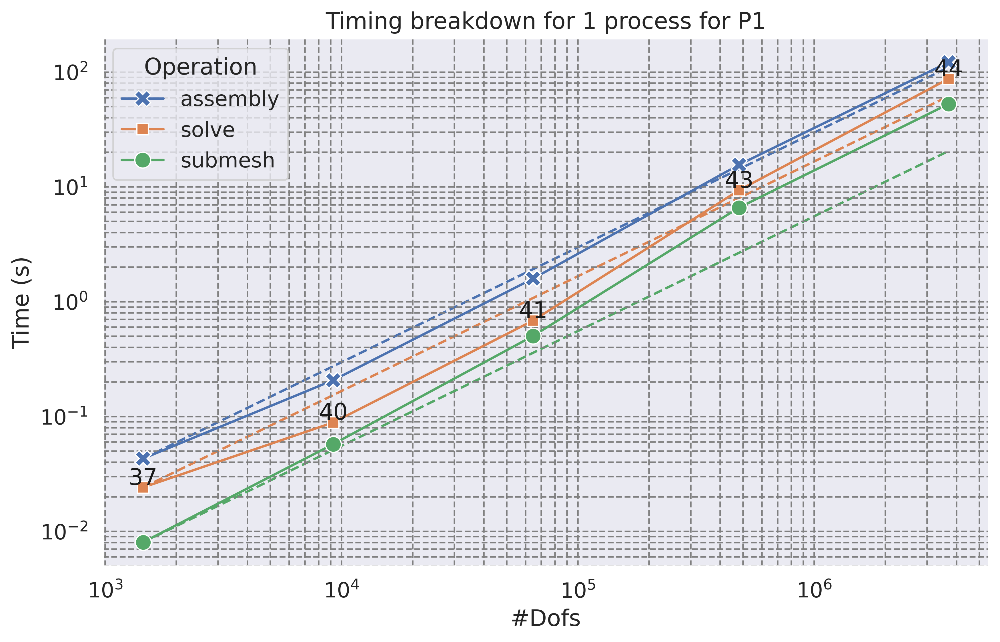
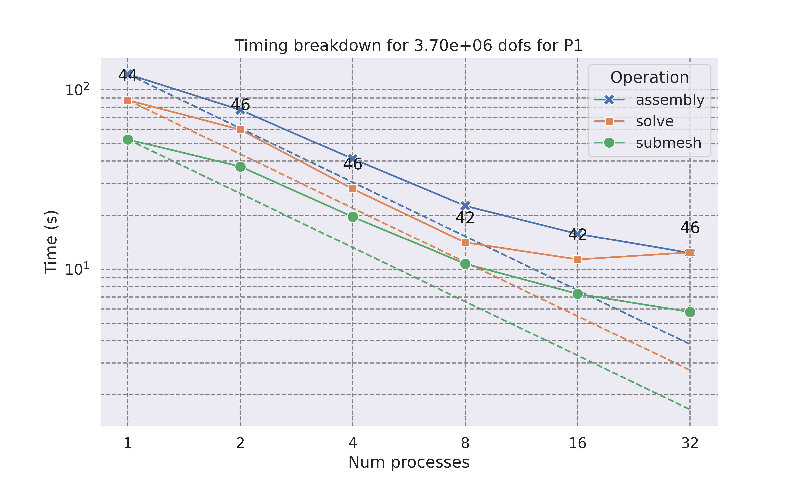
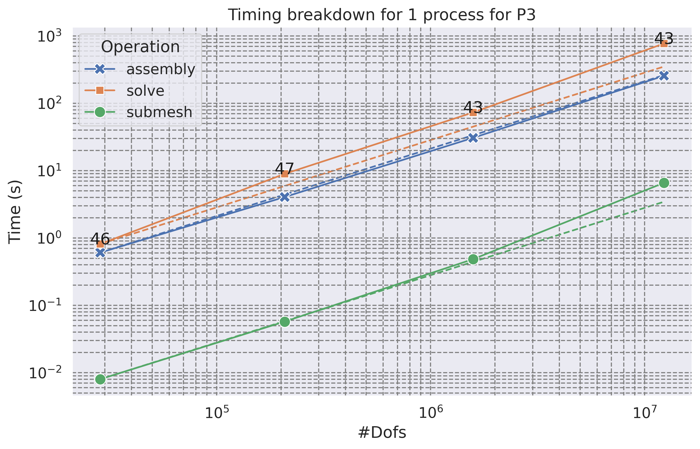
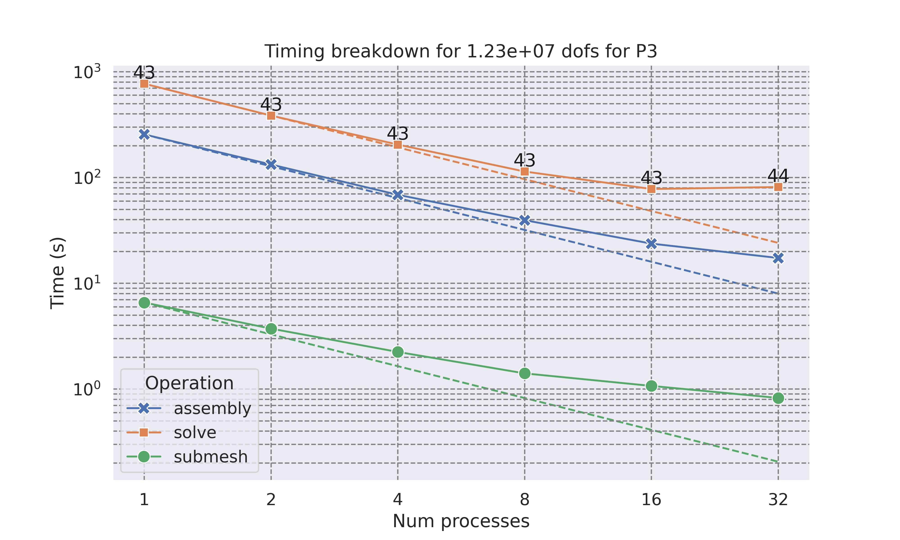
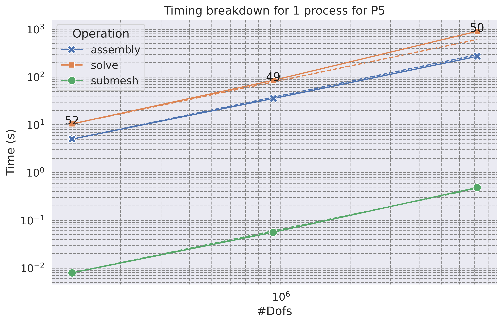
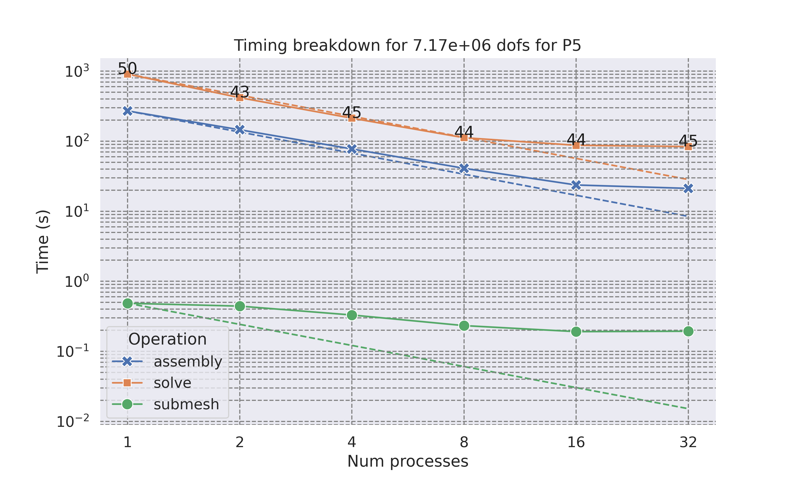

# Mixed-domain and multi-physics modelling in the FEniCS framework

<center>
<b>Jørgen S. Dokken</b>, Joseph Dean, Cécile Daversin Catty
<center/>

<center>
<b> dokken@simula.no </b>
<center/>

<center>
<a href="https://jsdokken.com">https://jsdokken.com</a>
<br> ICOSAHOM 2025 - MS 114
<center/>

<center>
<div>

</div>
<div>
&nbsp;&nbsp;&nbsp;&nbsp;&nbsp;&nbsp;&nbsp;&nbsp;&nbsp;&nbsp;

<!--  -->

</div>
<center/>

---

# What is FEniCS(x)?


- A collection of libraries for solving PDEs with FEM in C++/Python
- Supports arbitrary triangles, tetrahedra, quadrilateral, hexahedral meshes
  - Support for wedges/pyramids and mixed-cell grids is in development

---

# What is FEniCS(x)?

<!-- footer: Baratta, I. A. et al. (2023). DOLFINx: The next generation FEniCS problem solving environment. DOI: 10.5281/zenodo.10447666 <br><br>
 -->

<center>

</center>

---

<!-- footer: <br>
 -->

# The Poisson equation


```python
from mpi4py import MPI
import dolfinx.fem.petsc, ufl, numpy as np

mesh = dolfinx.mesh.create_unit_square(MPI.COMM_WORLD, 3, 3)
V = dolfinx.fem.functionspace(mesh, ("Lagrange", 5))


```

---

# The Poisson equation


```python
from mpi4py import MPI
import dolfinx.fem.petsc, ufl, numpy as np

mesh = dolfinx.mesh.create_unit_square(MPI.COMM_WORLD, 3, 3)
V = dolfinx.fem.functionspace(mesh, ("Lagrange", 5))

u, v = ufl.TrialFunction(V), ufl.TestFunction(V)
a = ufl.inner(ufl.grad(u), ufl.grad(v)) * ufl.dx
x, y = ufl.SpatialCoordinate(mesh)
f = x * ufl.sin(y * ufl.pi)
L = ufl.inner(f, v) * ufl.dx


```

---

# The Poisson equation

```python
from mpi4py import MPI
import dolfinx.fem.petsc, ufl, numpy as np

mesh = dolfinx.mesh.create_unit_square(MPI.COMM_WORLD, 3, 3)
V = dolfinx.fem.functionspace(mesh, ("Lagrange", 5))

u, v = ufl.TrialFunction(V), ufl.TestFunction(V)
a = ufl.inner(ufl.grad(u), ufl.grad(v)) * ufl.dx
x, y = ufl.SpatialCoordinate(mesh)
f = x * ufl.sin(y * ufl.pi)
L = ufl.inner(f, v) * ufl.dx

boundary_dofs = dolfinx.fem.locate_dofs_geometrical(
    V, lambda x: np.isclose(x[0], 0) | np.isclose(x[0], 1))
bcs = [dolfinx.fem.dirichletbc(0.0, boundary_dofs, V)]


```


---

# The Poisson equation

```python
from mpi4py import MPI
import dolfinx.fem.petsc, ufl, numpy as np

mesh = dolfinx.mesh.create_unit_square(MPI.COMM_WORLD, 3, 3)
V = dolfinx.fem.functionspace(mesh, ("Lagrange", 5))

u, v = ufl.TrialFunction(V), ufl.TestFunction(V)
a = ufl.inner(ufl.grad(u), ufl.grad(v)) * ufl.dx
x, y = ufl.SpatialCoordinate(mesh)
f = x * ufl.sin(y * ufl.pi)
L = ufl.inner(f, v) * ufl.dx

boundary_dofs = dolfinx.fem.locate_dofs_geometrical(
    V, lambda x: np.isclose(x[0], 0) | np.isclose(x[0], 1))
bcs = [dolfinx.fem.dirichletbc(0.0, boundary_dofs, V)]
options = {
    "ksp_type": "preonly",
    "pc_type": "lu",
    "pc_factor_mat_solver_type": "mumps",
    "ksp_error_if_not_converged": True,
}
uh = dolfinx.fem.Function(V, name="uh")
problem = dolfinx.fem.petsc.LinearProblem(
    a, L, u=uh, bcs=bcs, petsc_options=options,
    petsc_options_prefix="poisson_"
)
problem.solve()


```


---

# The Poisson equation

```python
from mpi4py import MPI
import dolfinx.fem.petsc, ufl, numpy as np

mesh = dolfinx.mesh.create_unit_square(MPI.COMM_WORLD, 3, 3)
V = dolfinx.fem.functionspace(mesh, ("Lagrange", 5))

u, v = ufl.TrialFunction(V), ufl.TestFunction(V)
a = ufl.inner(ufl.grad(u), ufl.grad(v)) * ufl.dx
x, y = ufl.SpatialCoordinate(mesh)
f = x * ufl.sin(y * ufl.pi)
L = ufl.inner(f, v) * ufl.dx

boundary_dofs = dolfinx.fem.locate_dofs_geometrical(
    V, lambda x: np.isclose(x[0], 0) | np.isclose(x[0], 1))
bcs = [dolfinx.fem.dirichletbc(0.0, boundary_dofs, V)]
options = {
    "ksp_type": "preonly",
    "pc_type": "lu",
    "pc_factor_mat_solver_type": "mumps",
    "ksp_error_if_not_converged": True,
}
uh = dolfinx.fem.Function(V, name="uh")
problem = dolfinx.fem.petsc.LinearProblem(
    a, L, u=uh, bcs=bcs, petsc_options=options,
    petsc_options_prefix="poisson_"
)
problem.solve()
with dolfinx.io.VTXWriter(mesh.comm, "uh.bp", [uh]) as bp:
    bp.write(0.0)
```


---

<!-- footer: Baratta, I. A. et al. (2023). DOLFINx: The next generation FEniCS problem solving environment. DOI: 10.5281/zenodo.10447666
 -->

<center>

<br>
<center/>

---

<!-- footer: <br>
 -->

# Multi-physics in DOLFINx

---

# Step 1: Create a sub-mesh to represent some of the physics on

```python
gamma, gamma_to_omega = dolfinx.mesh.create_submesh(omega, fdim, ft.find(tag))[
        0:2]


```

---

# Step 2: Create a symbolic representation in UFL of the mixed problem

```python
gamma, gamma_to_omega = dolfinx.mesh.create_submesh(omega, fdim, ft.find(tag))[
        0:2]
V = dolfinx.fem.functionspace(omega, ("Lagrange", 1, (omega.geometry.dim, )))
Q = dolfinx.fem.functionspace(gamma, ("Lagrange", 1))
W = ufl.MixedFunctionSpace(V, Q)
u, psi = ufl.TrialFunctions(W)
v, q = ufl.TestFunctions(W)
```

---

<!-- footer: <br> -->

# Supported UFL operations

- `ufl.derivative(F, [sigma, u], [ds, du])`
- `ufl.lhs`, `ufl.rhs`, `ufl.system`: [UFL #350](https://github.com/FEniCS/ufl/pull/350)
- `ufl.action`: [UFL 351](https://github.com/FEniCS/ufl/pull/351)
- `ufl.adjoint`: [UFL #352](https://github.com/FEniCS/ufl/pull/352)

---

# Example: Contact mechanics

---

# The Signorini problem

<center>

$\mathbf{u}\in V=\{\mathbf{u}\in H^1(\Omega, \mathbb{R}^3)~\vert~\mathbf{u}=\mathbf{u}_D~\text{on}~ \partial \Omega_D \}$

</center>

<br>
<div class=columns>
<div>

$$
\begin{align*}
\nabla \cdot (\sigma(\mathbf{u})) &= \mathbf{f} \text{ in } \Omega\\
\mathbf{u} &= \mathbf{u}_D \text{ on } \delta\Omega_D \\
\sigma(\mathbf{u})\mathbf{n} &= 0 \text{ on } \delta\Omega_N\\
\mathbf{u}\cdot \hat{\mathbf{n}} &\leq g \text{ on } \Gamma\\
\sigma_n(\mathbf{u})\mathbf{n} &\leq 0 \text{ on } \Gamma\\
\sigma_n(\mathbf{u})(\mathbf{u}\cdot \hat{\mathbf{n}}-g) &= 0 \text{ on } \Gamma
\end{align*}
$$

</div>

<div data-marpit-fragment>

$$
\begin{align*}
\min_{u \in K}&= \frac{1}{2} \int_\Omega (C\epsilon(\mathbf{u})):\epsilon (\mathbf{u})~\mathrm{d}x - \int_\Omega \mathbf{f}\cdot \mathbf{u}~\mathrm{d}x\\
K&=\{\mathbf{u}\in V ~\vert~ \mathbf{u}\cdot \hat{\mathbf{n}}\leq g ~\text{on}~\Gamma\}
\end{align*}
$$

<div data-marpit-fragment>

<b> How to enforce $\mathbf{u}\in K$? </b>

</div>

</div>

---

# Latent variable proximal point algorithm$^1$

<!--  footer: $^1$ Dokken, Farrell, Keith, Papadopoulos, Surowiec, _The latent variable proximal point algorithm for variational problems with inequality constraints_, CMAME, 2025, DOI: [10.1016/j.cma.2025.118181](https://doi.org/10.1016/j.cma.2025.118181) <br><br> -->

$$
\begin{align*}
&\min_{u\in K} J(u) \qquad K=\{v\in V~\vert~ Bv\in C(x)~ \text{for almost every}~ x\in \Omega\}
\end{align*}
$$

<div data-marpit-fragment>

Given $u^{k-1}\in V$, find $u^k\in V$, $\psi^k\in Q$ such that

$$
\begin{align*}
 \alpha_k J'(u^k) + B^*\psi^k &= B^*\psi^{k-1}\\
 Bu^k-\nabla R^*(\psi^k)&=0
\end{align*}
$$

where $\text{dom}R=C$, $(\nabla R)^*$ is the convex conjugate, $B^*$ the dual conjugate.

</div>

---

# Properties of the formulation

<br>
<div class=skewed-columns>
<div>

- $\alpha_k$ is bounded
- Can be discretized with
  FD, FV, FEM, SEM
- Can use higher order function spaces
-

</div>
<div>

<center>

</center>

</div>

---

# Latent variable proximal point algorithm$^1$

<div>

Let $\mathbf{u}^k\in V(\Omega)$, $\psi^k\in Q(\Gamma)$,

$$
\begin{align*}
\alpha_k(\sigma(\mathbf{u^k}), \epsilon(\mathbf{v}))_\Omega - (\psi^k, \mathbf{v}\cdot \hat{\mathbf{n}})_\Gamma &= \alpha_k(\mathbf{f}, v)_\Omega - (\psi^{k-1}, \mathbf{v}\cdot \hat{\mathbf{n}})_\Gamma\\
(\mathbf{u}^k\cdot \hat{\mathbf{n}}, w)_\Gamma - (e^{\psi}, w)_\Gamma &= (g, w)_\Gamma
\end{align*}
$$

Given $\alpha_k$, $\psi_{k-1}$

- Solve saddle point problem
- Check for convergence
- Update latent variable $\psi^{k-1}$, $\alpha_k$

</div>
<br>
<br>
<br>
</div>

---

# Implementation of the Signorini problem $^{1}$

```python
fdim = omega.topology.dim -1
gamma, gamma_to_omega = dolfinx.mesh.create_submesh(omega, fdim, potential_contact_facets)[
      0:2]

gdim = omega.geometry.dim
V = dolfinx.fem.functionspace(omega, ("Lagrange", degree, (gdim,)))
Q = dolfinx.fem.functionspace(gamma, ("Lagrange", degree))
W = ufl.MixedFunctionSpace(V, Q)

v, w = ufl.TestFunctions(Q)
u = dolfinx.fem.Function(V, name="Displacement")
psi = dolfinx.fem.Function(W, name="LatentVariable")
psi_k = dolfinx.fem.Function(W, name="PreviousLV")
alpha = dolfinx.fem.Constant(omega, 1.)
```

---

# Implementation of the Signorini problem $^{1}$

```python
def epsilon(w):
  return ufl.sym(ufl.grad(w))

def sigma(w, mu, lmbda):
  ew = epsilon(w)
  gdim = ew.ufl_shape[0]
  return 2.0 * mu * epsilon(w) + lmbda * ufl.tr(ufl.grad(w)) * ufl.Identity(gdim)

dx = ufl.Measure("dx", domain=omega)
ds = ufl.Measure("ds", domain=omega, subdomain_data=facet_tag subdomain_id=contact_tag)
F = alpha * ufl.inner(sigma(u, mu, lmbda), epsilon(v)) * dx
F -= alpha * ufl.inner(f, v) * dx
F -= ufl.inner(psi - psi_k, ufl.dot(v, n_g)) * ds
F += ufl.inner(ufl.dot(u, n_g), w) * ds
F += ufl.inner(ufl.exp(psi), w) * ds - ufl.inner(g, w) * ds
```

---

# Implementation of the Signorini problem $^{1}$

```python
bc = dolfinx.fem.dirichletbc(u_bc, dolfinx.fem.locate_dofs_topological(V, fdim, bc_facets))
petsc_options = {
    "snes_type": "newtonls",
    "snes_linesearch_type": "none",
    "ksp_type": "preonly",
    "pc_type": "lu",
    "pc_factor_mat_solver_type": "mumps",
    "ksp_error_if_not_converged": True,
    "snes_error_if_not_converged": True,
  }
F_blocked = ufl.extract_blocks(residual)
solver = dolfinx.fem.petsc.NonlinearProblem(F_blocked, [u, psi], bcs=bcs,
    kind="mpi",
    entity_maps=entity_maps,
    petsc_options=petsc_options, petsc_options_prefix="signorini_")
solver.solve()
```

---

# Implementation of the Signorini problem $^{1}$

<center>

</center>

<!-- --- -->

<!-- footer: <br> -->

<!-- --- -->

<!-- # Extraction of blocks from UFL

```python
a_blocked = ufl.extract_blocks(a_mono)
a = dolfinx.fem.form(a_blocked, entity_maps=entity_maps)
```

<div data-marpit-fragment>

Blocked matrices

```python
A = dolfinx.fem.petsc.create_matrix(a, kind="mpi")
```

</div>

<div data-marpit-fragment>

Nest matrices

```python
A = dolfinx.fem.petsc.create_matrix(a, kind="nest")
```

</div>

<div data-marpit-fragment>

Unified assembly

```python
dolfinx.fem.petsc.assemble_matrix(A, a)
A.assemble()
```

</div> -->

---

# The Extra, Intral Membrane (EMI) model

<div class=columns>

<div>
<br>
<br>
<br>

$$
\begin{align*}
-\nabla \cdot (\sigma_e\nabla u_e) &= 0&& \text{in } \Omega_e\\
-\nabla \cdot (\sigma_i\nabla u_i) &= 0&& \text{in } \Omega_i\\
\sigma_e\nabla u_e\cdot \mathbf{n}_e = - \sigma_i\nabla u_i\cdot \mathbf{n}_i &\equiv I_m&&\text{at } \Gamma\\
v &=u_e-u_i&& \text{at } \Gamma\\
\frac{\partial v}{\partial t} &= \frac{1}{C_m}(I_m-I_{ion})&& \text{at } \Gamma
\end{align*}
$$

</div>
<div style="font-size:25px">
<br>
<br>
<center>

<sup>2</sup>Benedusi et al. 2024 <br>&nbsp; DOI: <a href="https://doi.org/10.1007/s10915-023-02449-2">10.1007/s10915-023-02449-2</a>
</center>
</div>

<br>

---

<!-- footer: $^3$Kutcha et al. (2021), Solving the EMI Equations using Finite Element Methods, In: Modeling Excitable Tissue. Simula SpringerBriefs on Computing, DOI: [10.1007/978-3-030-61157-6_5](https://doi.org/10.1007/978-3-030-61157-6_5)<br><br>
-->

# Various ways of modelling this equation$^3$

- Single-dimensional primal form
- Multi-dimensional primal form
- Single-dimensional mixed form
- Multi-dimensional mixed form

<div data-marpit-fragment >
<center>
<br>
<b style="font-size:35px">All models can be implemented in DOLFINx</b>
</center>
</div>

---

<!-- footer: <br>
 -->

# Single-dimensional primal form

Find $u^n_i\in V(\Omega_i)\equiv V_i$, $u^n_e\in V(\Omega_e)\equiv V_e$ such that

$$
\begin{align*}
\int_{\Omega_e} \sigma_e \nabla u^n_e \cdot \nabla v_e ~\mathrm{d}x
+ \int_{\Gamma}C_m (\Delta t)^{-1} (u^n_e - u^n_i) v_e~\mathrm{d}s
&=
-\int_{\Gamma} \left(\frac{C_m}{\Delta t}(u^{n-1}_e - u^{n-1}_i) + I_{ion} \right)v_e~\mathrm{d} s\\
\int_{\Omega_i} \sigma_i \nabla u^n_i \cdot \nabla v_i ~\mathrm{d}x
+ \int_{\Gamma}C_m (\Delta t)^{-1} (u^n_i - u^n_e) v_i~\mathrm{d}s
&= \int_{\Gamma} \left(\frac{C_m}{\Delta t}(u^{n-1}_e - u^{n-1}_i) + I_{ion} \right)v_i~\mathrm{d} s
\end{align*}
$$

for all $v_e \in V_e$ and $v_i \in V_i$.

---

# Use known preconditioner$^4$ of this problem

$$
\begin{pmatrix}
\int_{\Omega_e} \sigma_e \nabla u_e \cdot \nabla v_e~\mathrm{d} x & 0\\
0 & \int_{\Omega_i} \sigma_i \nabla u_i \cdot \nabla v_i + u_i v_i ~\mathrm{d}x
\end{pmatrix}
$$

```python
P = sigma_e * inner(grad(ue), grad(ve)) * dxE
P += sigma_i * inner(grad(ui), grad(vi)) * dxI
P += inner(ui, vi) * dxI
P_compiled = dolfinx.fem.form(extract_blocks(P), entity_maps=entity_maps)
bc_P = dolfinx.fem.dirichletbc(0.0, bc_dofs, Ve)
B = dolfinx.fem.petsc.assemble_matrix(P_compiled, kind="mpi", bcs=[bc_P])
B.assemble()
```

<!-- footer: $^4$Kutcha and Mardal. (2021), Iterative Solvers for EMI Models, In: Modeling Excitable Tissue. Simula SpringerBriefs on Computing, DOI: [10.1007/978-3-030-61157-6_6](https://doi.org/10.1007/978-3-030-61157-6_6)<br><br>
-->

---

<!-- footer: <br>
 -->

# Alternatively one can use PETSc fieldsplit

```python
F = ....
a, L = ufl.system(F)
a_blocked = ufl.extract_blocks(a)
L_blocked = ufl.extract_blocks(L)
problem = fem.petsc.LinearProblem(
    a_blocked,
    L_blocked,
    u=[sigma, u],
    P=a_p,
    kind="nest",
    bcs=bcs,
    petsc_options_prefix="my_solver",
    petsc_options={
        "ksp_type": "gmres",
        "pc_type": "fieldsplit",
        "pc_fieldsplit_type": "additive",
        "ksp_rtol": 1e-8,
      },
)
```

---

# Performance

<!-- footer: $^*$Thanks to Chris Richardson, Department of Earth Sciences, University of Cambridge for providing the computational resources <br><br>
 -->

- Intel(R) Xeon(R) CPU E5-2690 v4 @ 2.60GHz$^*$
- Conjugate gradient with boomeramg (Hypre)

<div class=columns>
<div data-marpit-fragment>
<center>

</center>
</div>
<div data-marpit-fragment>
<center>

</center>
</div>

---

# Performance (P3)

<!-- footer: $^*$Thanks to Chris Richardson, Department of Earth Sciences, University of Cambridge for providing the computational resources <br><br>
 -->

- Intel(R) Xeon(R) CPU E5-2690 v4 @ 2.60GHz$^*$
- Conjugate gradient with boomeramg (Hypre)

<div class=columns>
<div>
<center>

</center>
</div>
<div data-marpit-fragment>
<center>

</center>
</div>

---

# Performance (P5)

<!-- footer: $^*$Thanks to Chris Richardson, Department of Earth Sciences, University of Cambridge for providing the computational resources <br><br>
 -->

- Intel(R) Xeon(R) CPU E5-2690 v4 @ 2.60GHz$^*$
- Lagrange-variant: Gauss–Lobatto–Legendre (warped)

<div class=columns>
<div>
<center>

</center>
</div>
<div data-marpit-fragment>
<center>

</center>
</div>

---

# Summary

<!-- footer:  <br><br>
 -->

- DOLFINx can support multiphysics problems by creating submeshes of codimension 0 (3D-3D, 2D-2D) and 1 (3D-2D, 2D-1D)
  - Show-cased using the **Latent Variable Proximal Point algorithm** for the Signorini problem
- It can easily be interfaced with PETSc (KSP, SNES, NEST)
- Shows descent performance

### Future work

- Codimension 2 coupling (3D-1D, 2D-0D)
  - Coupling non-conforming meshes
- Support of fractional Laplacian's for preconditioning the mixed dimensional EMI equations
