# Simula, FEniCS and fluid flow simulations

<center>
Guest lecture, Oslo Metropolitan University
<br>
<b>Jørgen S. Dokken</b>
<br>
<b> dokken@simula.no </b>
<br>
<a href="https://jsdokken.com">https://jsdokken.com</a>
<br>

<br/>
<div style="display: flex; justify-content: center; align-items: center; gap: 40px;">
  
  
  
</div>
</center>

---

# About me

<div data-marpit-fragment>

- **2011**: First introduction to programming (Python)
- **2014**: First introduction to FEniCS

</div>
<div data-marpit-fragment>

- **2016-2019:** PhD in informatics from University of Oslo/Simula Research Laboratory (SRL)

</div>

<div data-marpit-fragment>

- **2019-**: Forum Administrator for the FEniCS Project
- **2019-2022**: Post-doc at Department of Engineering, University of Cambridge

</div>

<div data-marpit-fragment>

- **2022-**: Member of the FEniCS Steering Council
- **2022-2023**: Research Engineer at SRL
- **2024--**: Senior Research Engineer at SRL

</div>

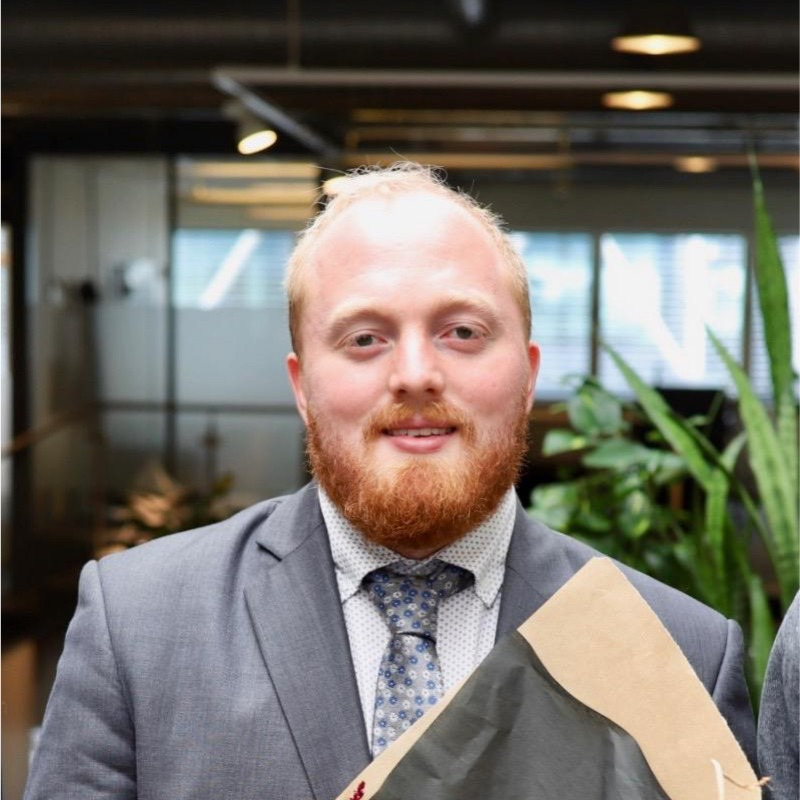

---


# About Simula

Founded in 2001 by the Norwegian Government

**6 research units**

- Simula Research Laboratory: Scientific Computing and Software engineering
- SimulaMet: Communication systems and machine intelligence
- Simula UiB: Cryptography
- Simula Innovation: Help for start-ups
- Simula Consulting: High-quality R&D consulting services
- Simula Academy: Researcher training and professional development

---

<!-- footer: $^1$ Vinje, V., Zapf, B., Ringstad, G. et al. Human brain solute transport quantified by glymphatic MRI-informed biophysics during sleep and sleep deprivation. Fluids Barriers CNS 20, 62 (2023). https://doi.org/10.1186/s12987-023-00459-8 <br><br> -->

### Department of Scientific Computing and Numerical Analysis

<div class="columns">

<div>

<center>
Analysis and generic tools and algorithms for PDEs

<br>
<center/>
</div>
<div>
<center>
  Modelling the brain$^1$
  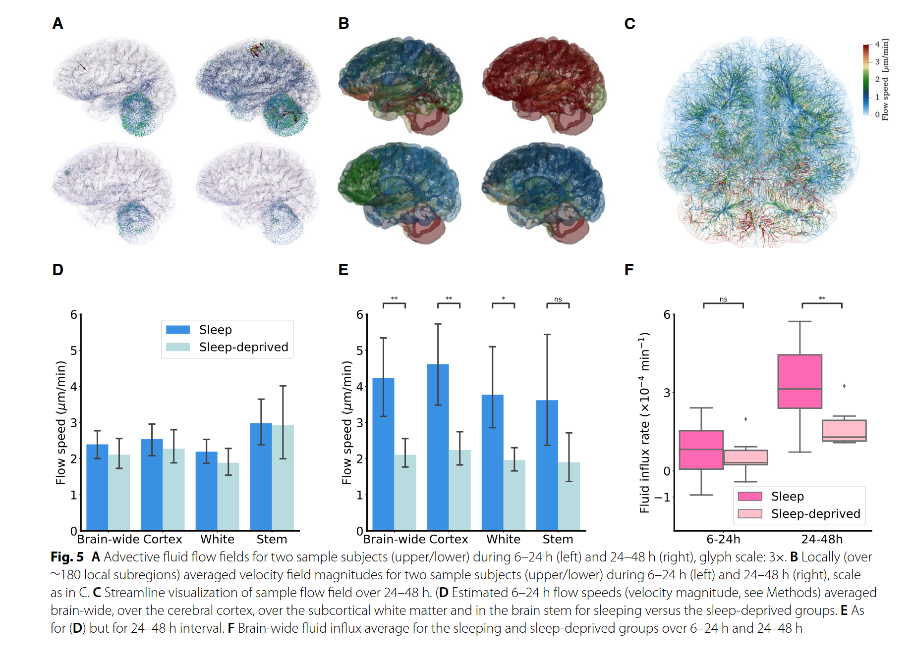
<center/>
</div>
</div>
<br>

---

<!-- 

<!-- # How I ended up at Simula


* Finished a master's in fluid mechanics and started looking for a job
* A professor at UiO encouraged me to apply for a PhD
* I applied, and got the position
* Near the end of the PhD, I accepted a job as a consultant
* Before I started, a colleague pointed me to a post-doc position: *"apply for this, it suits you"*
* I applied, and got the post-doc
* ...and got hooked on developing finite element software
* Became known for my FEniCS expertise, which led to a permanent position at Simula -->


<!-- footer: <br><br> -->


# A typical workday

<style scoped>
ol li { color: black; margin: 5px; font-size: 30px; }
</style>

I develop general-purpose finite element software that helps researchers in my lab and at other institutes.
As a core developer of the FEniCS project, my work reaches thousands of users.

<div data-marpit-fragment>

1. Start the day by checking what users are struggling with (bug reports, forum questions)
2. If an issue is intriguing, dig in and fix it
3. With the time left, think about and develop new features

</div>

---

<!-- footer: <br> -->

# Brief history of the finite element method (FEM)

<div>

* **1910s**: Rayleigh-Ritz/Ritz-Galerkin method
* **1940s**: Birth of the FEM
* **1958**: First open source FE software
* **1970s**: General purpose FE software and mathematical rigorousness
* **1990s**: Object oriented programming
* **2000s**: User-friendliness (Python)
* **2010s**: High performance computing

<center>
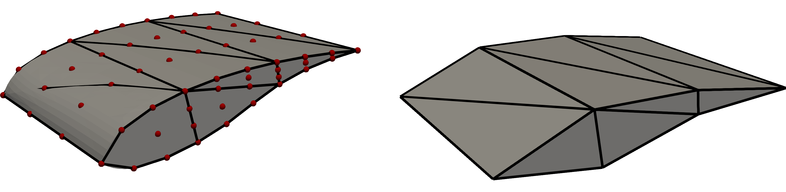
<center/>

---

# FEM in a nutshell

<div class="skewed-columns">
<div>

Find $u\in V_0$ such that

$$
R(x) = - \nabla \cdot (\nabla u) - f = 0  \text{ in } \Omega \\
$$

Define

$$
u_h = \sum_{i=1}^{N} u_i \phi_i(x)
$$

and an inner product

$$
\langle \cdot , \cdot \rangle: V_0 \times V_0 \rightarrow \mathbb{R}
$$

such that

$$
\langle R(x), \phi_i \rangle = 0 \qquad\forall i=1,\cdots,N
$$
</div>
<div>

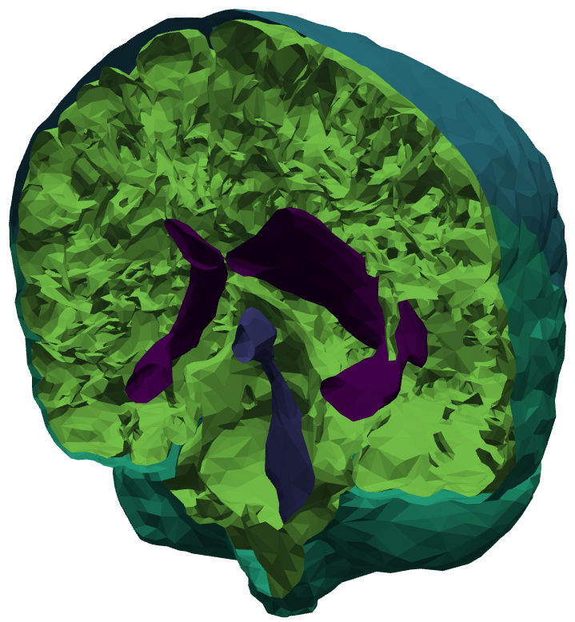

</div>

---

# Brief history of FEniCS


<div data-marpit-fragment>

- **2002**: First public version of a C++ library (DOLFIN)
- **2003**: FEniCS project was created
- **2004**: Code generation (C++) using FFC
- **2005**: First Python interface (PyDOLFIN)

</div>
<div data-marpit-fragment>

- **2006-2016**: Center for Biomedical Computing
- **2009**: Unified form language (UFL) introduced
- **2009**: Initial MPI support

</div>

<div data-marpit-fragment>

- **2016--**: Sponsored by NumFOCUS
- **2017--**: DOLFINx ([10.5281/zenodo.10447665](https://doi.org/10.5281/zenodo.10447665))

</div>
<div data-marpit-fragment>

- ~3800 users on the FEniCS Discourse forum
- ~12 000 monthly downloads

</div>
<center>

<center/>

---

<!-- footer: <a href="https://euromathsoc.org/news/developers-of-the-fenics-project-awarded-the-2026-emsecmi-lanczos-prize-217">euromathsoc.org/news/developers-of-the-fenics-project-awarded-the-2026-emsecmi-lanczos-prize-217</a><br><br> -->

<style scoped>
ul li { font-size: 24px; }
.katex-display { font-size: 0.8em; }
</style>


# The 2026 EMS/ECMI Lanczos Prize

<div class="skewed-columns">
<div>

Awarded to the developers of the FEniCS project for

<center>
<i>"revolutionary contributions to the implementation of the finite element method"</i>
</center>

<div style="font-size: 26px;">

Martin S. Alnæs, Igor A. Baratta, Joseph P. Dean, <b>Jørgen S. Dokken</b>, Michal Habera, Jack S. Hale, Anders Logg, Chris N. Richardson, Marie E. Rognes, Matthew W. Scroggs, Nathan Sime, Garth N. Wells

</div>


- Recognises outstanding mathematical software with important applications in mathematics, science, engineering, society or industry
<!-- - Presented at the 23rd ECMI Conference on Industrial and Applied Mathematics in Kaunas, Lithuania -->

</div>
<div>
<center>
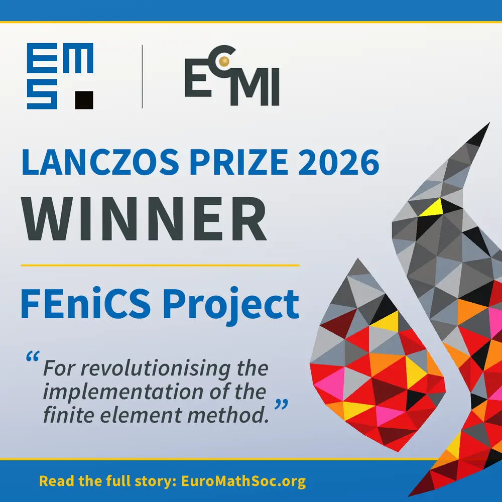
</center>
</div>
</div>
<br>

---

<!-- footer: <br> -->

# Some examples

<div class="columns">

<div>
<iframe width="600" height="420" src="https://jsdokken.com/dolfinx-tutorial/", title="FEniCS tutorial"></iframe>
</div>

<div data-marpit-fragment>

<div>

<center>
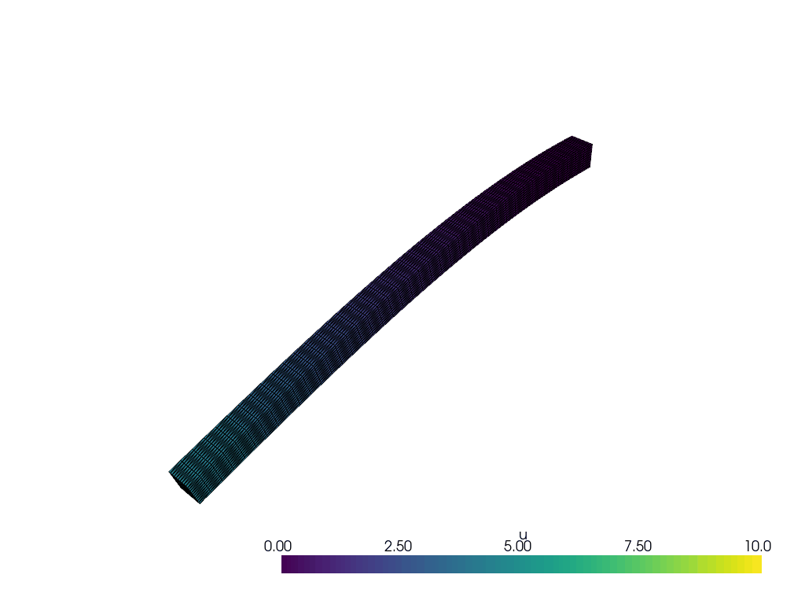
<center/>
<center>

<center/>
</div>

</div>

---

# The Poisson equation

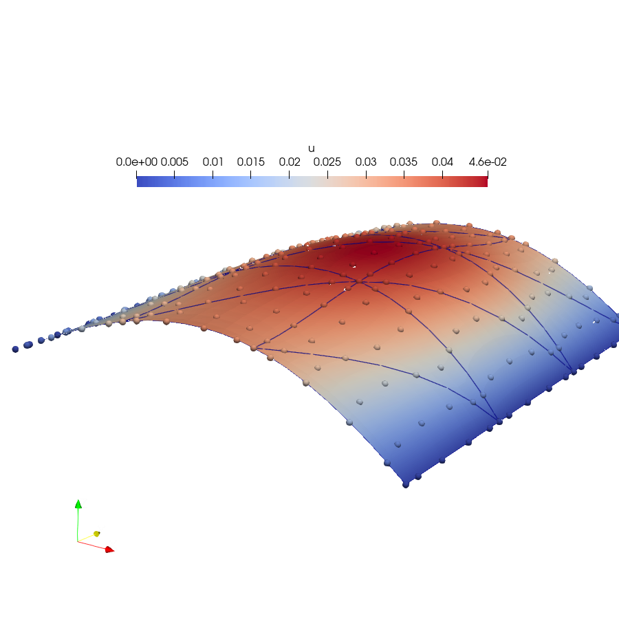

```python
from mpi4py import MPI
import dolfinx.fem.petsc, ufl, numpy as np

mesh = dolfinx.mesh.create_unit_square(MPI.COMM_WORLD, 3, 3)
V = dolfinx.fem.functionspace(mesh, ("Lagrange", 5))
```

---

# The Poisson equation


```python
from mpi4py import MPI
import dolfinx.fem.petsc, ufl, numpy as np

mesh = dolfinx.mesh.create_unit_square(MPI.COMM_WORLD, 3, 3)
V = dolfinx.fem.functionspace(mesh, ("Lagrange", 5))

u, v = ufl.TrialFunction(V), ufl.TestFunction(V)
a = ufl.inner(ufl.grad(u), ufl.grad(v)) * ufl.dx
x, y = ufl.SpatialCoordinate(mesh)
f = x * ufl.sin(y * ufl.pi)
L = ufl.inner(f, v) * ufl.dx
```

---

# The Poisson equation

```python
from mpi4py import MPI
import dolfinx.fem.petsc, ufl, numpy as np

mesh = dolfinx.mesh.create_unit_square(MPI.COMM_WORLD, 3, 3)
V = dolfinx.fem.functionspace(mesh, ("Lagrange", 5))

u, v = ufl.TrialFunction(V), ufl.TestFunction(V)
a = ufl.inner(ufl.grad(u), ufl.grad(v)) * ufl.dx
x, y = ufl.SpatialCoordinate(mesh)
f = x * ufl.sin(y * ufl.pi)
L = ufl.inner(f, v) * ufl.dx

boundary_dofs = dolfinx.fem.locate_dofs_geometrical(
    V, lambda x: np.isclose(x[0], 0) | np.isclose(x[0], 1)
)
bcs = [dolfinx.fem.dirichletbc(0.0, boundary_dofs, V)]
options = {
    "ksp_type": "preonly",
    "pc_type": "lu",
    "pc_factor_mat_solver_type": "mumps",
    "ksp_error_if_not_converged": True,
}
uh = dolfinx.fem.Function(V, name="uh")
problem = dolfinx.fem.petsc.LinearProblem(
    a, L, u=uh, bcs=bcs, petsc_options=options, petsc_options_prefix="poisson_"
)
problem.solve()
with dolfinx.io.VTXWriter(mesh.comm, "uh.bp", [uh]) as bp:
    bp.write(0.0)
```


---


# Fluid flows in my work

In my work, I regularly encounter fluid flows in physical systems:

- Biological systems
  - Cerebrospinal fluid (CSF) spaces surrounding our brains
  - Blood vasculature and aneurysms
- ARC (Affordable Robust Compact) fusion reactors
- Redox-flow batteries

<br>

<div data-marpit-fragment>
<div>

To model these systems we use a variety of numerical methods, including the **Finite Element Method** (using FEniCS) coupled with the **Finite Volume Method** (OpenFOAM).

</div>
</div>

---

<!-- footer: $^2$Hornkjøl, Valnes, <b>Dokken</b>. <i>Segmenting, meshing, and modeling CSF spaces</i>. In: <b>Dokken</b> et al. (eds.) <i>Mathematical Modelling of the Human Brain II</i>, Simula SpringerBriefs on Computing 18, 2026. DOI: <a href="https://doi.org/10.1007/978-3-032-00679-0_3">10.1007/978-3-032-00679-0_3</a><br><br> -->

# Cerebrospinal fluid (CSF) flow$^2$

<style scoped>
ul li { font-size: 24px; }
.katex-display { font-size: 0.8em; }
</style>

<div class="left-skewed-columns">
<div>

$$
\begin{align*}
\mu\nabla^2 u-\nabla p&= 0 &&\text{in } \Omega_F\\
\nabla\cdot u&= g &&\text{in } \Omega_F\\
u&= 0 &&\text{in } \Omega_P\\
u&= 0 &&\text{on } \Gamma_{FP}\\
\mu\nabla u\cdot n-pn&= 0 &&\text{on } \partial\Omega_{ps}\\
u&= 0 &&\text{on } \partial\Omega \setminus \partial\Omega_{ps}
\end{align*}
$$

- Stokes: the Reynolds number is very low $\rightarrow$ flow is laminar
- $g$: CSF production in the choroid plexus (0.5 L/day)
- Zero velocity in the brain tissue ($\sim 0.2~\mu\text{m/min}$)

</div>
<div>
<center>
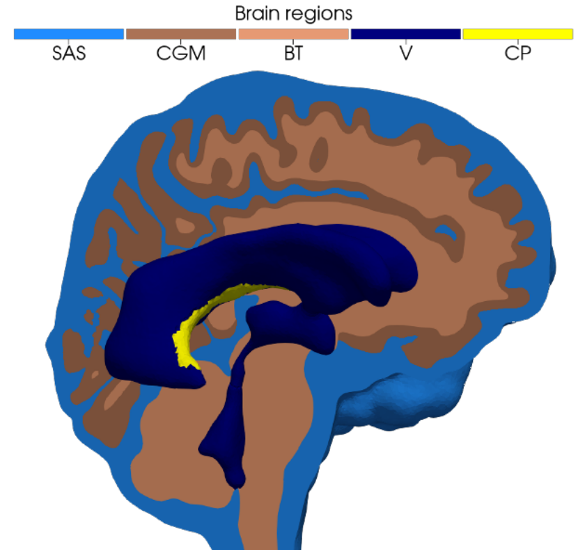
<p style="font-size: 20px; text-align: center;">
SAS, cortical gray matter (CGM), brain tissue (BT), ventricles (V), and choroid plexus (CP)
</p>
</center>
</div>
</div>
<br>

---

# Fluid spaces and interfaces$^2$

<center>
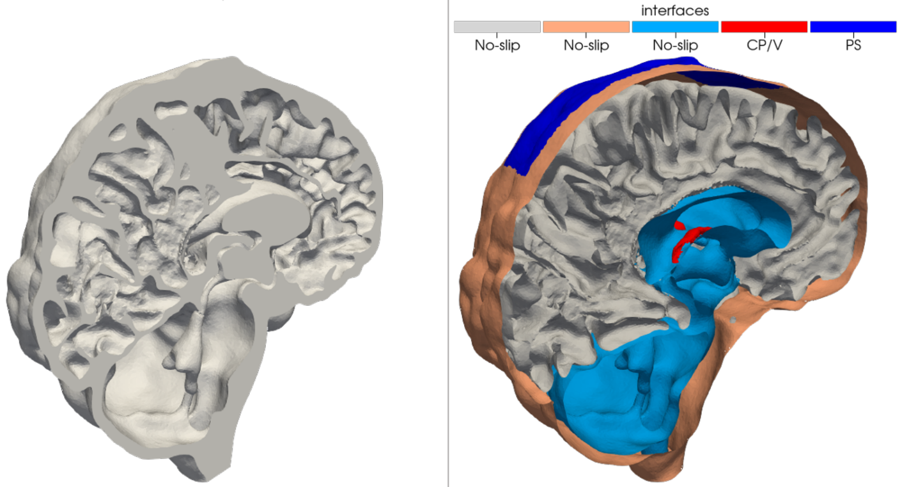
</center>
<p style="font-size: 20px;">
Left: the fluid spaces surrounding the brain. Right: the interfaces considered in the simulations. The outlet is the parasagittal sinus, and CP/V is the internal interface in the ventricles to the choroid plexus, which produces the CSF.
</p>
<br>
<br>

---

<style scoped>
ul li { font-size: 24px; }
.katex-display { font-size: 0.8em; }
</style>


<!-- _footer: $^2$Hornkjøl, Valnes, <b>Dokken</b>. <i>Segmenting, meshing, and modeling CSF spaces</i>. In: <b>Dokken</b> et al. (eds.) <i>Mathematical Modelling of the Human Brain II</i>, Simula SpringerBriefs on Computing 18, 2026. DOI: <a href="https://doi.org/10.1007/978-3-032-00679-0_3">10.1007/978-3-032-00679-0_3</a><br>$^3$Hu, Schneider, Wang, Zorin, Panozzo. <i>Fast tetrahedral meshing in the wild</i>. ACM Transactions on Graphics 39(4), 2020. DOI: <a href="https://doi.org/10.1145/3386569.3392385">10.1145/3386569.3392385</a><br>My work on this is funded by the Wellcome Trust grant <a href="https://wellcome.org/research-funding/funding-portfolio/funded-grants/next-generation-simulation-and-learning-imaging"><i>Next-generation simulation and learning in imaging-based biomedicine</i></a> (FEniCS in the wild)<br><br> -->

# From MRI surfaces to a fluid mesh$^2$

<div class="left-skewed-columns">
<div>

- The choroid plexus is thin and often not well resolved in MR images
  - Can lead to degenerate meshes and unphysical results
- The SAS can be so thin that it is hard to resolve
  - Expand it by 2 mm in SVM-Tk
- Thin regions (aqueduct, SAS) need refinement
  - Otherwise the flow is effectively stopped
- Working with researchers in mesh generation to improve meshing of complex medical images$^3$

</div>
<div>
<center>
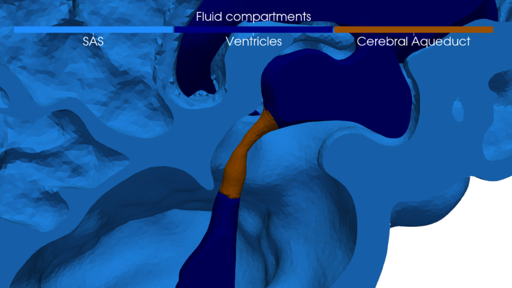
<p style="font-size: 20px; text-align: center;">
The cerebral aqueduct marked as a separate subdomain
</p>
</center>
</div>
</div>
<br>
<br>
<br>
<br>

---


<style scoped>
ul li { font-size: 26px; }
.katex-display { font-size: 0.8em; }
</style>


# Results$^2$

<div class="right-skewed-columns">
<div>

- 2 453 870 tetrahedra
- 11 518 224 velocity DOFs
- 546 542 pressure DOFs
- Peak velocity $\sim 3.3~\text{mm/s}$ in the aqueduct
- $\sim 2\text{-}4~\mu\text{m/s}$ in the SAS
- Similar to experimental studies in mice and previous simulations
- 20 CPUs, 120 GB RAM

</div>
<div>
<center>
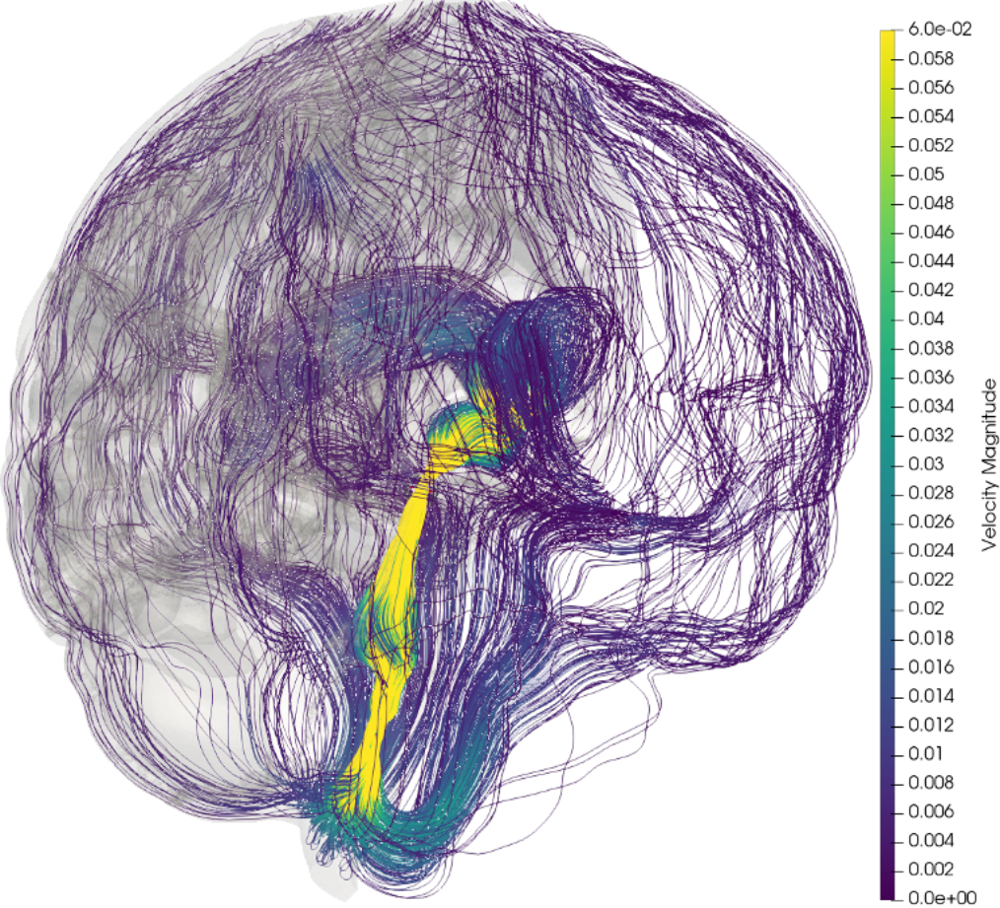
<p style="font-size: 20px; text-align: center;">
Magnitude of the CSF velocity (cut-off at 0.06 mm/s).
</p>
</center>
</div>
</div>
<br>

---


<style scoped>
ul li { font-size: 22px; }
.katex-display { font-size: 0.8em; }
</style>


### Standard preconditioning does not work on the brain$^2$

<center>
<div class="columns">
<div>
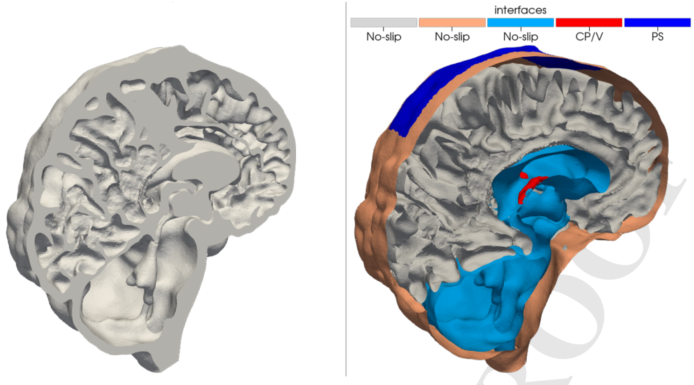
</div>
<div>
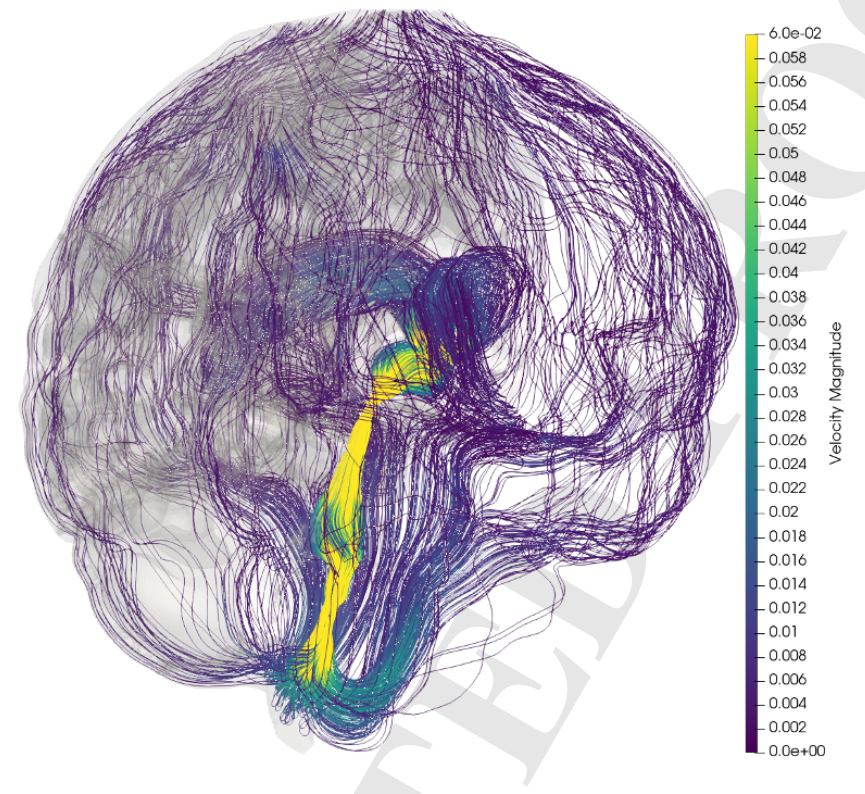
</div>
</div>
</center>

- <b>1155 MINRES iterations</b> with a standard Stokes preconditioner (BoomerAMG)
- Condition number of the preconditioned matrix $\approx$ 927 000
- The inf-sup condition breaks down in anisotropic geometries$^4$

<br>
<br>

<!-- footer: $^2$Hornkjøl, Valnes, <b>Dokken</b>. <i>Segmenting, meshing, and modeling CSF spaces</i>. In: <b>Dokken</b> et al. (eds.) <i>Mathematical Modelling of the Human Brain II</i>, Simula SpringerBriefs on Computing 18, 2026. DOI: <a href="https://doi.org/10.1007/978-3-032-00679-0_3">10.1007/978-3-032-00679-0_3</a><br><sup>4</sup>Sande, E., Koch, T., Kuchta, M., & Mardal, K. (2025). On a robust inf-sup condition for the Stokes problem in slender domains - with application to preconditioning. ArXiv, abs/2510.24590. <br><br> -->

---


<!-- footer: $^5$I.G. Gjerde. <i>Graphnics: Combining FEniCS and NetworkX to simulate flow in complex networks</i>. 2022. <br>DOI: <a href="https://doi.org/10.48550/arXiv.2212.02916">10.48550/arXiv.2212.02916</a>.<br>$^6$ Daversin-Catty, Dean, and Rognes. <i>Finite Element Software and Performance for Network Models with Multipliers</i>. 2024.<br>DOI: <a href="https://doi.org/10.1007/978-3-031-58519-7_4">10.1007/978-3-031-58519-7_4</a> <br><br> -->

# Blood flow in networks: Networks_FEniCSx

<div class="skewed-columns">

<div>

MPI compatible FEniCSx+Networkx based on $^{5,6}$

```python
from networks_fenicsx import HydraulicNetworkAssembler, NetworkMesh, Solver
from networks_fenicsx.network_generation import make_arterial_tree
from networks_fenicsx.post_processing import export_functions, extract_global_flux

n = 5
G = make_arterial_tree(N=n, direction=np.array([0.1, 1, 0]))
network_mesh = NetworkMesh(G, N=40, color_strategy=nx.coloring.strategy_largest_first)
assembler = HydraulicNetworkAssembler(network_mesh, flux_degree=1, pressure_degree=0)
assembler.compute_forms(p_bc_ex=p_bc_expr)
solver = Solver(assembler, kind="nest")
solver.assemble()
sol = solver.solve()
global_flux = extract_global_flux(network_mesh, sol)
```

</div>

<div>
<figure>
<center>
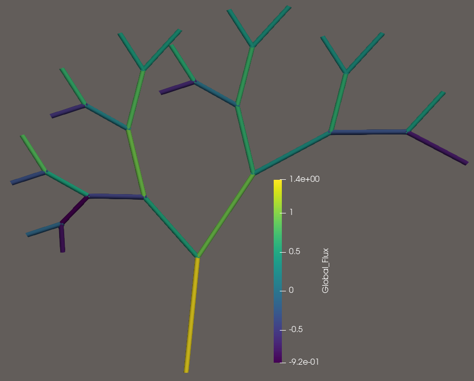
</center>
</figure>
<br>
</div>
</div>

---

<!--  footer: $^7$ Kuchta, M. (2021). Assembly of Multiscale Linear PDE Operators. In: Vermolen, F.J., Vuik, C. (eds) Numerical Mathematics and Advanced Applications ENUMATH 2019. Lecture Notes in Computational Science and Engineering, vol 139. Springer, Cham. https://doi.org/10.1007/978-3-030-55874-1_63 <br><br> -->

### Vessels in tissue: Non-conforming 3D-1D coupling using FEniCSx_ii

- Algorithm based on $^7$, but with MPI support and FEniCSx support
- Example below from [FEniCSx_ii Demos](https://scientificcomputing.github.io/fenicsx_ii/demos/coupled_poisson_solver.html)

<div class=columns>
<div>

<center>
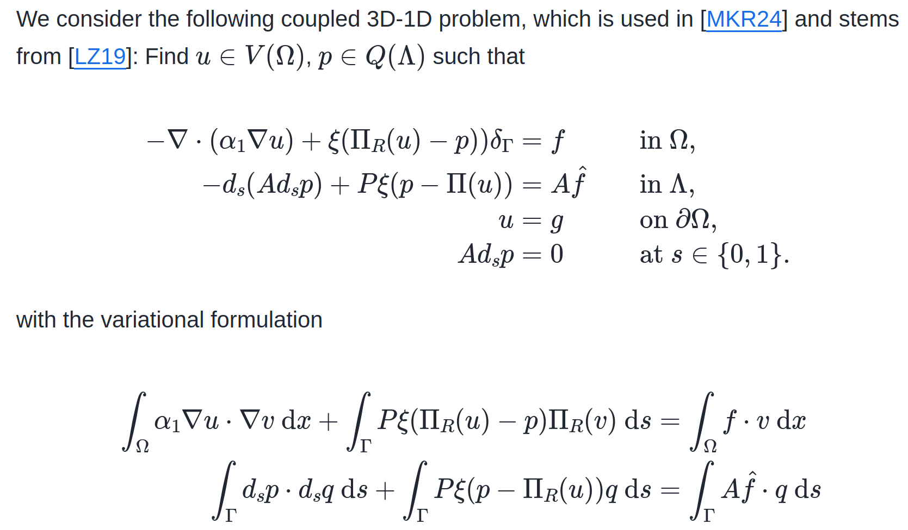
</center>
</div>
<center>
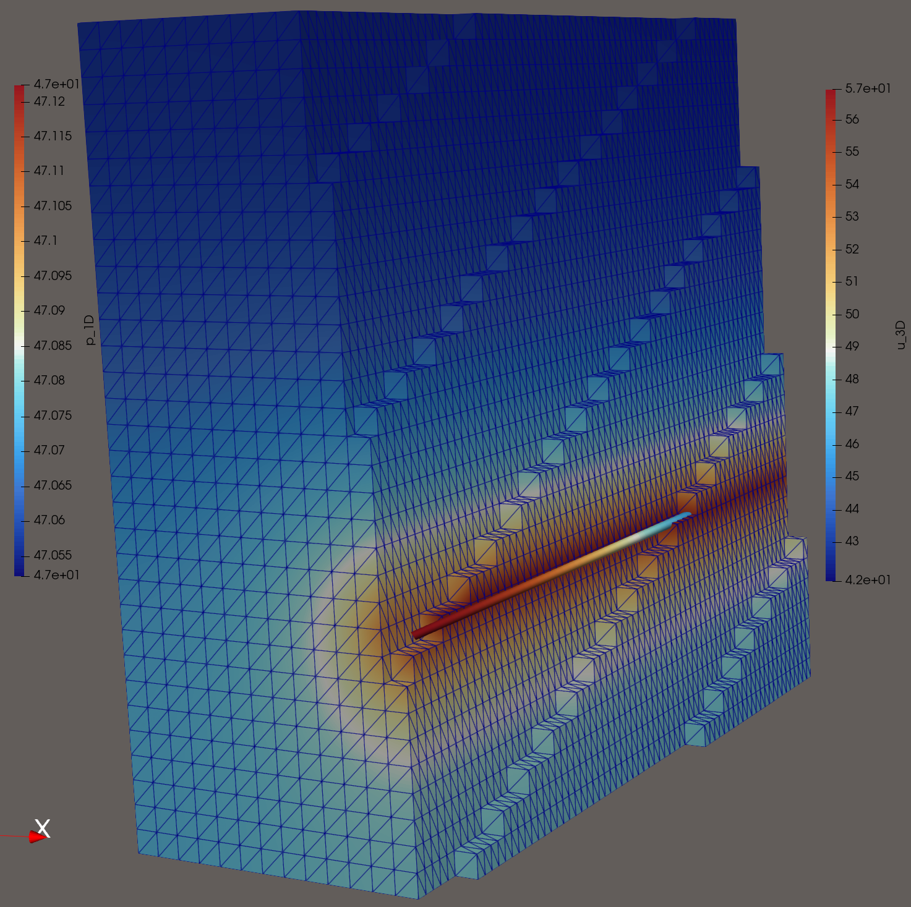
</center>
</div>
<br>
<br>
<br>

---

<!-- footer: $^8$Yamamoto, Bruneau, Ring, <b>Dokken</b>, Valen-Sendstad. <i>VaSP: Vascular Fluid–Structure Interaction Pipeline</i>. SoftwareX 32, 102392, 2025. DOI: <a href="https://doi.org/10.1016/j.softx.2025.102392">10.1016/j.softx.2025.102392</a><br><br> -->

# Blood flow in cerebral aneurysms$^8$

<div class="columns">
<div>

- VaSP: Vascular Fluid–Structure Interaction Pipeline
  - Medical image-derived surface → fluid and solid mesh
  - Monolithic FSI (fluid, solid, and mesh motion) with turtleFSI
  - Hemodynamic and wall-mechanical post-processing
- Built on FEniCS and VMTK

</div>
<div>
<center>
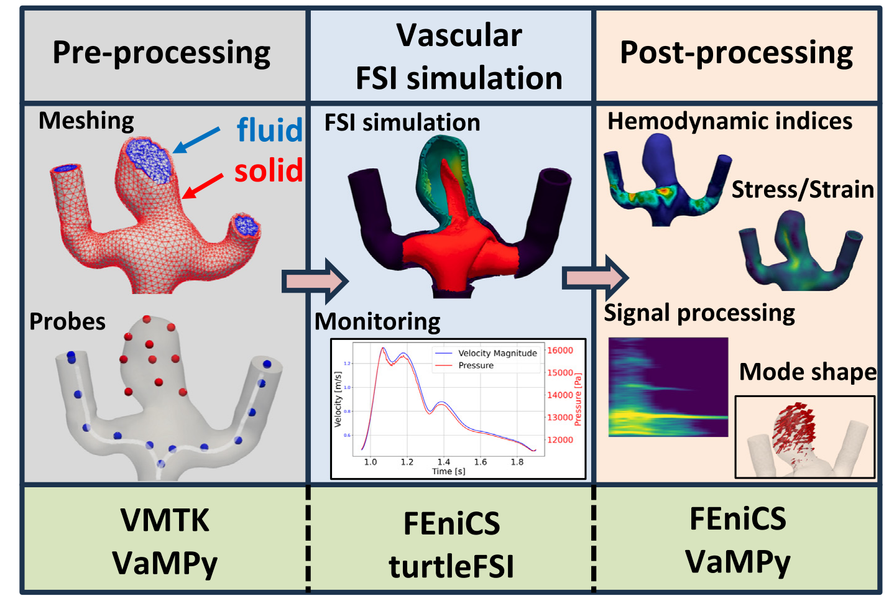
</center>
</div>
</div>

---

<!-- 
# Automated meshing$^8$

<div class="right-skewed-columns">
<div>
<center>
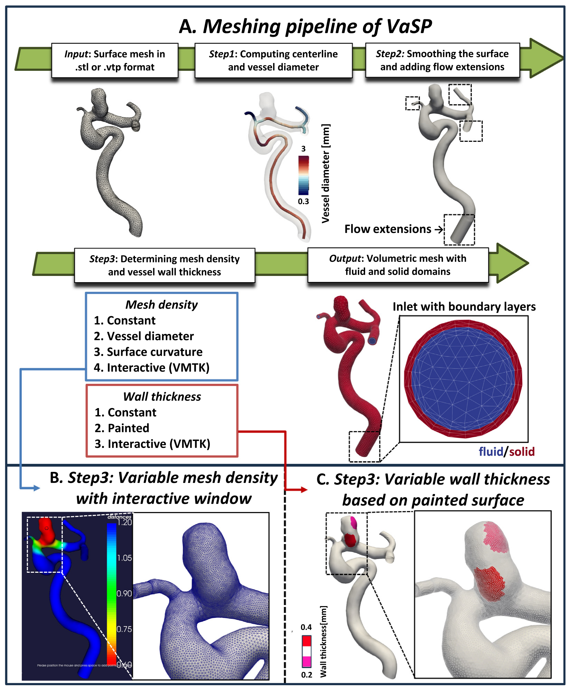
</center>
</div>
<div>

- Centerlines and smoothing
- Cylindrical flow extensions at inlets and outlets
- Local mesh size and wall thickness
- Scriptable command-line interface for reproducibility

</div>
</div>

--- -->

# Transitional flow and wall vibrations$^8$

<center>
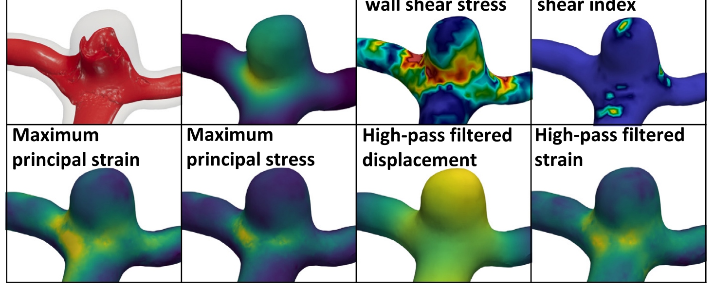
<p style="font-size: 20px; text-align: center; max-width: 950px; margin: 0 auto;">
Hemodynamic and solid-mechanical indices, and high-pass filtered displacement and strain
</p>
</center>

- Tailored for transitional flow and high-frequency wall vibrations
- Has offered a plausible explanation for clinically reported aneurysm sounds

---

<!-- footer: <br>$^9$Brunátová, <b>Dokken</b>, Valen-Sendstad, Hron. <i>On the Numerical Evaluation of Wall Shear Stress Using the Finite Element Method</i>. Int. J. Numer. Methods Biomed. Eng. 41(9), e70086, 2025. DOI: <a href="https://doi.org/10.1002/cnm.70086">10.1002/cnm.70086</a><br><br> -->

# Computing wall shear stress with FEM$^9$

<style scoped>
ul li { font-size: 25px; }
</style>

<div class="skewed-columns">
<div>
<br>

- P1/P1 stabilized vs. Taylor–Hood P2/P1 elements
- WSS from a new boundary-flux method, or by projecting the tangential traction onto P1, DG-1 or DG-0
- P2/P1 with boundary-layer meshes on curved walls *degraded* WSS accuracy (geometric approximation error)

</div>
<div>
<center>
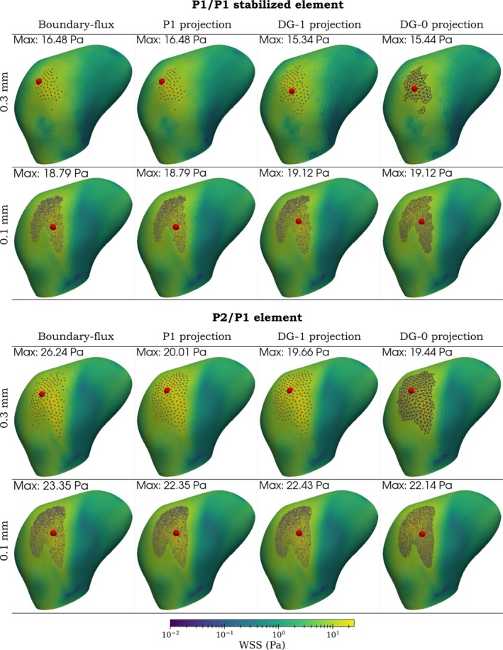
<p style="font-size: 20px; text-align: center;">
Boundary-flux vs. projection (P2/P1) in an aneurysm
</p>
</center>
</div>
</div>

---

<style scoped>
ul li { font-size: 22px; }
.katex-display { font-size: 0.8em; }
</style>


<!-- footer: $^{10}$Dark, Sircar, Bae, <b>Dokken</b>, Delaporte-Mathurin. <i>Multiphysics tritium transport modelling of the ARC breeding blanket with FESTIM</i>. 2026. arXiv: <a href="https://arxiv.org/abs/2608.05398">2608.05398</a><br><br> -->

# Fusion: The ARC breeding blanket$^{10}$

<div class="columns">
<div>

- ARC: Affordable, Robust, Compact fusion reactor
- Liquid immersion blanket of FLiBe salt
  - Breeder, coolant, and neutron moderator
- Flowing molten salt couples
  - Neutronics
  - Thermal hydraulics
  - Hydrogen isotope (tritium) transport
- Model a 5° sector (72 identical sectors)

</div>
<div>
<center>
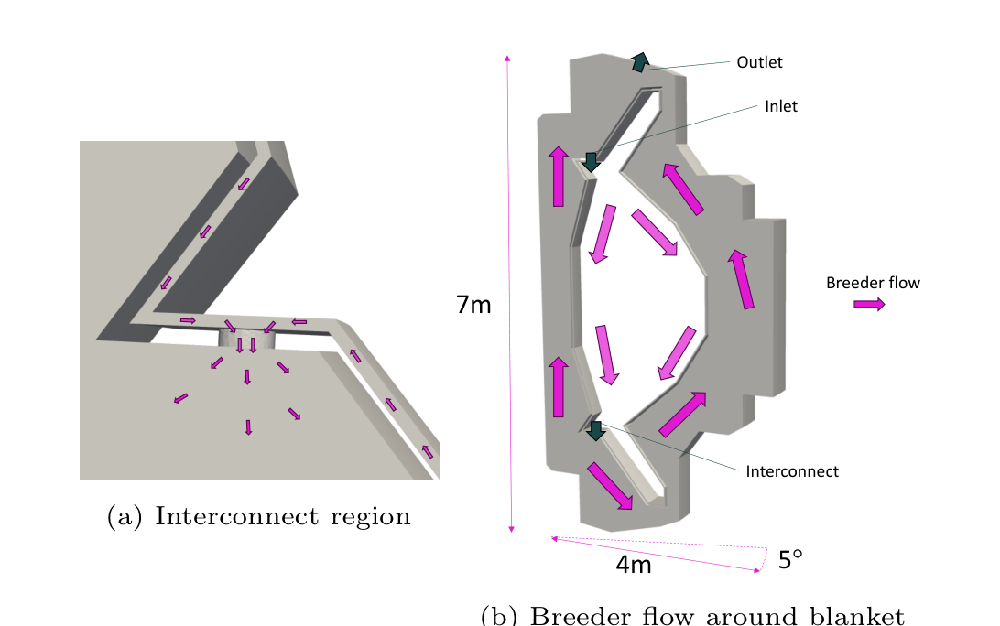
<p style="font-size: 20px; text-align: center;">
Breeder flow path, inlet, outlet, and interconnect
</p>
</center>
</div>
</div>

---

<style scoped>
ul li { font-size: 22px; }
.katex-display { font-size: 0.8em; }
</style>


### Coupling finite volumes and finite elements$^{10}$

<center>
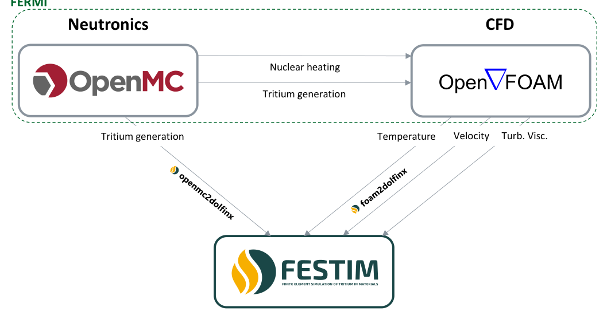
</center>

- **OpenMC** (neutronics): tritium generation, nuclear heating
- **OpenFOAM** (finite volume CFD, RANS $k$-$\omega$ SST): velocity, temperature, turbulent viscosity
- **FESTIM** (finite elements, DOLFINx): tritium transport

<br>
<br>

---

# Tritium transport model$^{10}$

$$
\frac{\partial c_m}{\partial t} = \nabla \cdot (D_{\text{eff}}\nabla c_m) + S - \nabla \cdot (\mathbf{u}c_m)
$$

<div class="columns">
<div>

$$
\begin{align*}
D_{\text{eff}} &= D + D_{\text{turb}} + D_{\text{art}}\\
D &= D_0 e^{-E_D/(k_B T)}\\
D_{\text{turb}} &= \frac{\nu_t}{Sc_t}\\
D_{\text{art}} &= \delta h \Vert \mathbf{u}\Vert
\end{align*}
$$

</div>
<div>

- $S$: tritium source from OpenMC
- $\mathbf{u}$, $\nu_t$, $T$: from OpenFOAM
- $D_{\text{turb}}$: turbulence-enhanced mixing
- $D_{\text{art}}$: stabilisation (as in SUPG/artificial diffusion) for high Péclet numbers

</div>
</div>

---

### Tritium accumulates where the flow stagnates$^{10}$

<center>
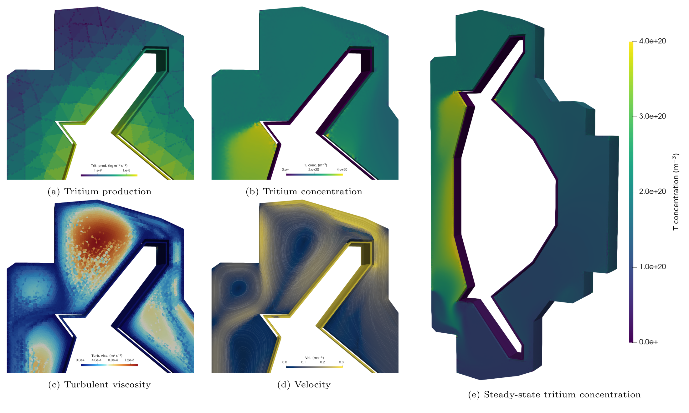
<p style="font-size: 20px; text-align: center; max-width: 700px; margin: 0 auto;">
Multiphysics fields in the upper region of the blanket sector. High concentrations in flow stagnation zones, lower concentrations in highly turbulent zones.
</p>
</center>


<br>
<br>
<br>


<!-- footer: $^{10}$Dark, Sircar, Bae, <b>Dokken</b>, Delaporte-Mathurin. <i>Multiphysics tritium transport modelling of the ARC breeding blanket with FESTIM</i>. 2026. arXiv: <a href="https://arxiv.org/abs/2608.05398">2608.05398</a><br> -->


---

# FESTIM (FEM) vs. OpenFOAM (FV)$^{10}$

<div class="columns">
<div>

- Steady-state tritium inventory
  - FESTIM: 243 mg
  - OpenFOAM: 240 mg
- Outlet flux
  - FESTIM: 1.0 mg/s
  - OpenFOAM: 1.01 mg/s
- Outlet flux at 99.5% of steady state
  - FESTIM: 25.0 min
  - OpenFOAM: 23.1 min

</div>
<div>
<center>
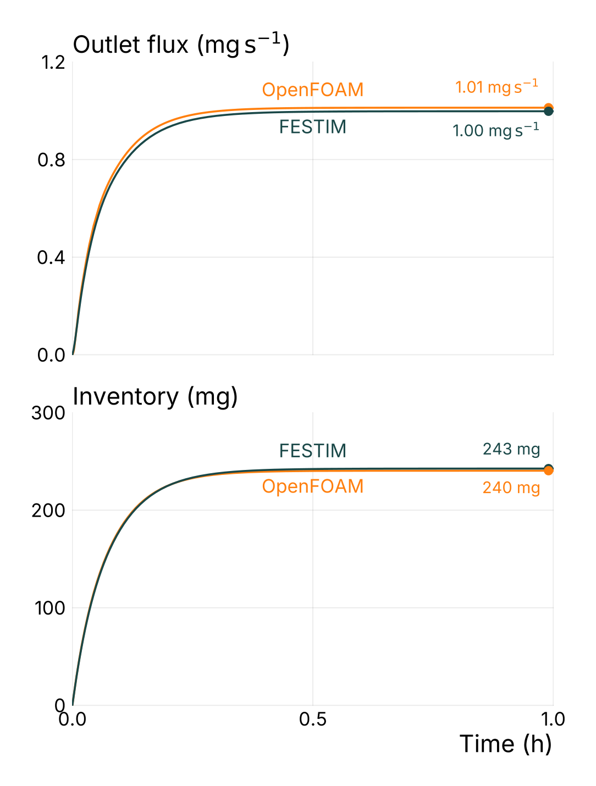
</center>
</div>
</div>

---

<!-- footer: $^{11}$Aghabarari, <b>Dokken</b>, Horsch, Valseth, Janssen. <i>RFBniCS: An open-source simulation framework for redox flow batteries</i>. 2026. <a href="https://github.com/Ah-Aghabarari/RFBniCS">github.com/Ah-Aghabarari/RFBniCS</a><br>Funded by Horizon Europe, grant agreement no. 101137725 (BatCAT)<br><br> -->


<style scoped>
ul li { font-size: 26px; }
.katex-display { font-size: 0.8em; }
</style>


# Redox flow batteries$^{11}$

<div class="columns">
<div>

- Large-scale energy storage for intermittent sources (solar, wind)
- Energy stored in redox-active species dissolved in liquid electrolytes
- Electrolytes circulated from two storage tanks through two half-cells
- Capacity scales with the tank volume

<center>

</center>
<br>

</div>
<div>
<center>
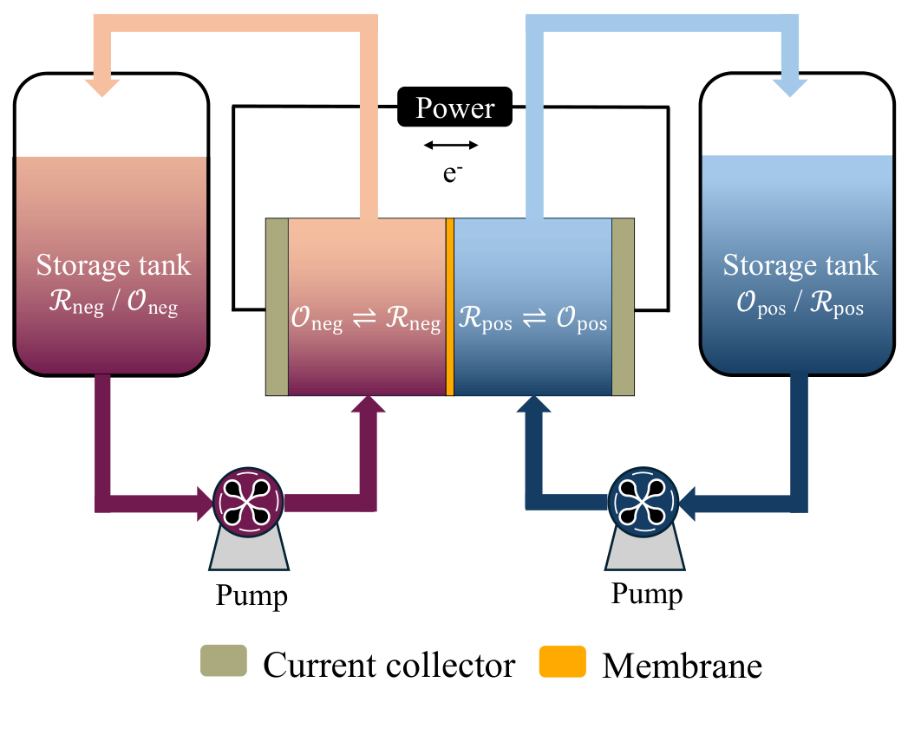
</center>
</div>
</div>
<br>

---


<!-- footer: $^{11}$Aghabarari, <b>Dokken</b>, Horsch, Valseth, Janssen. <i>RFBniCS: An open-source simulation<br> framework for redox flow batteries</i>. 2026. <a href="https://github.com/Ah-Aghabarari/RFBniCS">github.com/Ah-Aghabarari/RFBniCS</a><br>Funded by Horizon Europe, grant agreement no. 101137725 (BatCAT)<br><br> -->


<style scoped>
ul li { font-size: 26px; }
.katex-display { font-size: 0.8em; }
</style>


# RFBniCS: Redox flow batteries in FEniCSx$^{11}$

<div class="left-skewed-columns">
<div>

- Macro-homogeneous porous-electrode model
  - Electrolyte flow
  - Multicomponent species transport
  - Ionic and electronic charge conservation
  - Interfacial Faradaic charge transfer
- 1D, 2D and 3D half-cells
  - 2D: Darcy flow
  - 3D: Navier–Stokes with Darcy–Forchheimer resistance in the porous electrode
- Flow solved first (Taylor–Hood), then the coupled electrochemical system

</div>
<div>
<center>
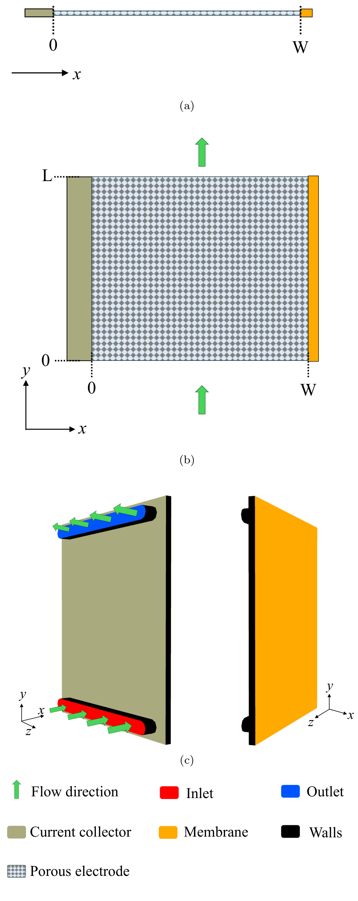
</center>
</div>

</div>
<br>
<br>

---

<!-- footer: $^{11}$Aghabarari, <b>Dokken</b>, Horsch, Valseth, Janssen. <i>RFBniCS: An open-source simulation framework for redox flow batteries</i>. 2026. <br><br> -->

# Governing equations$^{11}$

<div class="columns">
<div>

Species transport (Nernst–Planck)

$$
\begin{align*}
\frac{\partial (\varepsilon c_j)}{\partial t} + \nabla \cdot \mathbf{N}_j &= S_j\\
\mathbf{N}_j = -D_j^{\text{eff}}\nabla c_j - \frac{z_jc_jD_j^{\text{eff}}}{RT}F\nabla \phi_\ell &+ \mathbf{v}c_j
\end{align*}
$$

Local electroneutrality

$$
\sum_{j} z_jc_j = 0
$$

</div>
<div>

Charge conservation

$$
\begin{align*}
\nabla \cdot \mathbf{i}_\ell &= a i_F\\
\nabla \cdot \mathbf{i}_s &= -a i_F
\end{align*}
$$

Butler–Volmer kinetics

$$
i_F = i_0\left[\frac{c_\mathcal{R}^{\text{surf}}}{c_\mathcal{R}}e^{\frac{\alpha_aF}{RT}\eta} - \frac{c_\mathcal{O}^{\text{surf}}}{c_\mathcal{O}}e^{-\frac{\alpha_cF}{RT}\eta}\right]
$$

</div>
</div>

---

### Verification against other open-source tools$^{11}$

<div class="columns">
<div>
<center>
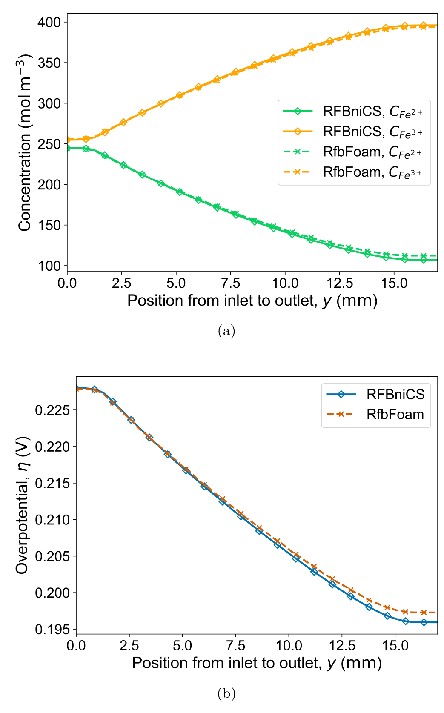
<p style="font-size: 20px; text-align: center;">
3D vs. RfbFoam (OpenFOAM, finite volume): relative <i>L</i><sup>2</sup> errors 1.7% (<i>c</i><sub>Fe<sup>2+</sup></sub>), 0.54% (<i>c</i><sub>Fe<sup>3+</sup></sub>), 0.39% (<i>η</i>)
</p>
</center>
</div>
<div>
<center>
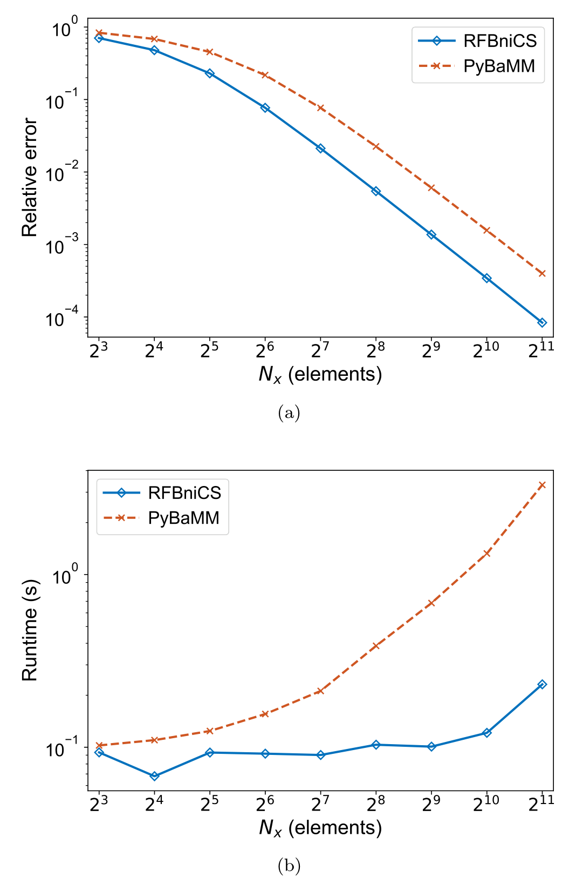
<p style="font-size: 20px; text-align: center;">
1D vs. PyBaMM: RFBniCS is more accurate and faster
</p>
</center>
</div>
</div>
<br>

<!-- --- -->

<!-- # Transient charge–rest–discharge cycle$^{11}$

<div class="columns">
<div>
<center>
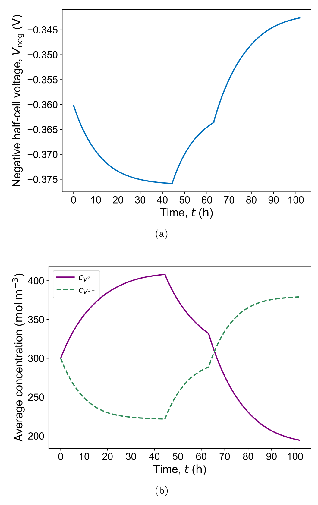
</center>
</div>
<div>

- Negative half-cell of a vanadium redox flow battery
- Resolves both redox-active and supporting-electrolyte species
- Near the end of charging, the Faradaic current localises near the inlet
  - Non-uniform utilisation of the porous electrode

</div>
</div> -->

<!-- ---

# Faradaic current during charging$^{11}$

<center>
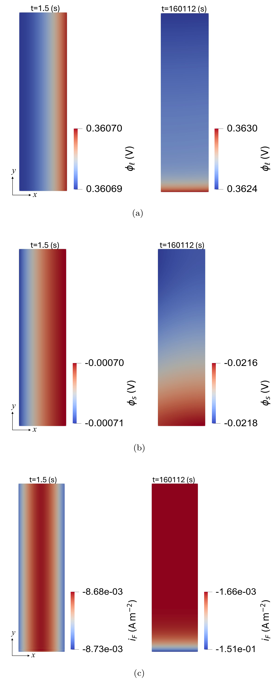
</center>
-->

<!-- --- -->


---

<!-- footer: $^{12}$Hornkjøl, M. (2024). <i>mri2fem-ii-chapter-3-code</i> v1.0.0, code accompanying Hornkjøl, Valnes, <b>Dokken</b>, <i>Segmenting, meshing, and modeling CSF spaces</i>, 2026. DOI: <a href="https://doi.org/10.5281/zenodo.10808334">10.5281/zenodo.10808334</a><br><br> -->

### Back to the brain: Extracting the CSF spaces$^{12}$

```python
domain, ct, ft = read_mesh(
    infile, facet_infile, grid_name, cell_tags_name, facet_tags_name
)
new_tag = extend_facet_marker_with_outlet(domain, ft, x_bounds, y_bounds, z_bound)
```

<div data-marpit-fragment>

```python
fluid_cells = ct.indices[np.isin(ct.values, fluid_markers)]
fluid_mesh, cell_to_full, vertex_to_full, node_to_full = dolfinx.mesh.create_submesh(
    domain, domain.topology.dim, fluid_cells
)
sub_cell_tags = transfer_meshtags_to_submesh(
    ct, fluid_mesh, vertex_to_parent=vertex_to_full, cell_to_parent=cell_to_full
)
sub_facet_tags = transfer_meshtags_to_submesh(
    new_tag, fluid_mesh, vertex_to_parent=vertex_to_full, cell_to_parent=cell_to_full
)
```

</div>
<br>

---

### Stokes flow in the CSF spaces$^{12}$

```python
cell = fluid_mesh.basix_cell()
P2 = element("Lagrange", cell, 2, shape=(fluid_mesh.geometry.dim,))
V = dolfinx.fem.functionspace(mesh, P2)
P1 = element("Lagrange", cell, 1)
Q = dolfinx.fem.functionspace(mesh, P1)
W = ufl.MixedFunctionSpace(V, Q)

dx = ufl.Measure("dx", domain=fluid_mesh, subdomain_data=sub_cell_tags)

# Compute volume of mesh here
# ...
g_source = dolfinx.fem.Constant(mesh, production_value / vol)
mu = dolfinx.fem.Constant(mesh, water_viscosity)
```

---

### Define variational form and preconditioner$^{12}$

```python
(u, p) = ufl.TrialFunctions(W)
(v, q) = ufl.TestFunctions(W)
a = mu * ufl.inner(ufl.grad(u), ufl.grad(v)) * dx
a -= ufl.div(v) * p * dx
a -= q * ufl.div(u) * dx
L = [ufl.ZeroBaseForm((v,)), -g_source * q * dx(cp_marker)]
a = ufl.extract_blocks(a)

P = mu * ufl.inner(ufl.grad(u), ufl.grad(v)) * dx
P += (1.0 / mu) * p * q * dx
P = ufl.extract_blocks(P)
```

---

### Create boundary conditions$^{12}$

```python
no_slip = dolfinx.fem.Function(V)
no_slip.x.array[:] = 0
bcs = []
mesh.topology.create_connectivity(sub_facet_tags.dim, mesh.topology.dim)
for marker in noslip_markers:
    facets = sub_facet_tags.find(marker)
    fixed_dofs = dolfinx.fem.locate_dofs_topological(V, sub_facet_tags.dim, facets)
    bcs.append(dolfinx.fem.dirichletbc(no_slip, fixed_dofs))
```

---

### Preconditioned (iterative) linear solver$^{12}$

```python
opts = {
    "ksp_type": "minres",
    "pc_type": "hypre",
    "pc_hypre_type": "boomeramg",
    "ksp_monitor": None,
    "ksp_error_if_not_converged": True,
    "ksp_atol": 1e-6,
    "ksp_rtol": 1e-6,
}
problem = dolfinx.fem.petsc.LinearProblem(
    a, L, bcs=bcs, petsc_options=opts, P=P, petsc_options_prefix="stokes_"
)
(uh, ph) = problem.solve()
```
<br>

---

<!--  footer: Baratta, Dean, <b>Dokken</b>, Habera, Hale, Richardson, Rognes, Scroggs, Sime, Wells. 2023. DOLFINx: _The next generation FEniCS problem solving environment_. Zenodo. DOI: 10.5281/zenodo.10447666 <br><br> -->

<!-- # How does it work?

### Package overview

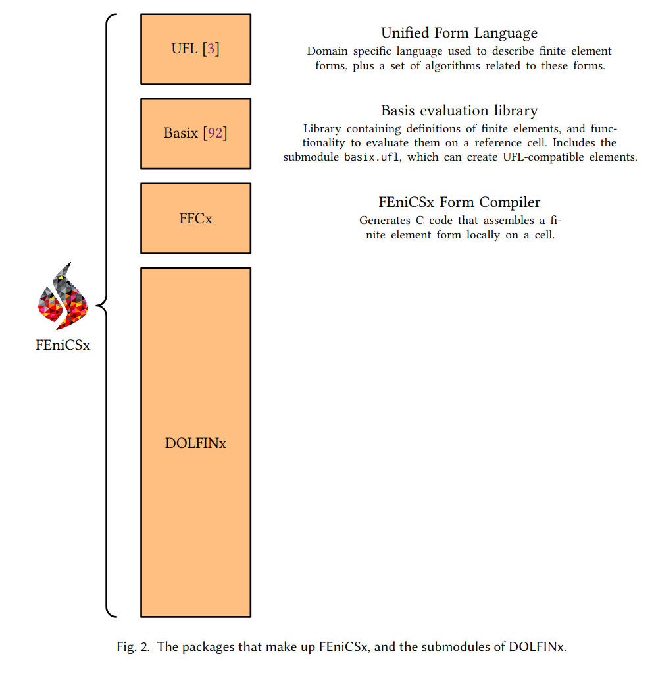

---

# How does it work?

### Package overview

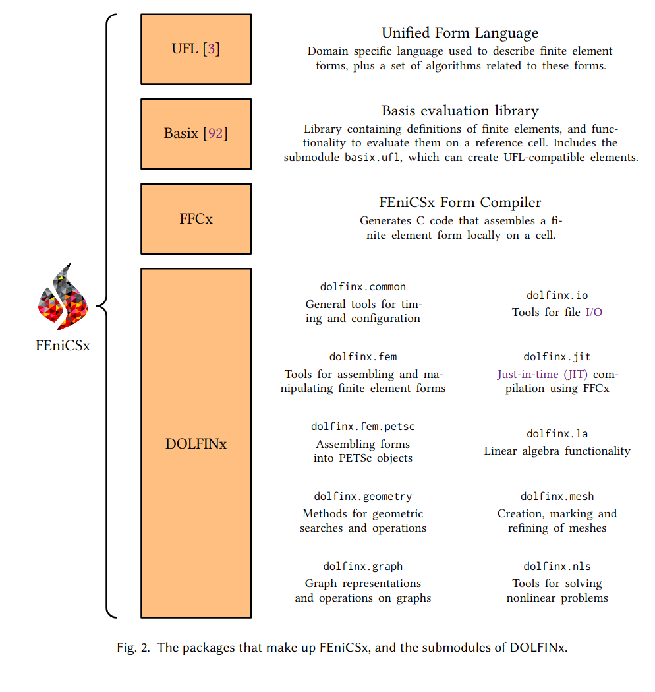

--- -->

<!-- footer: <br><br> -->

# Adaptive mesh refinement with higher order grids using NetGen

<div style="font-size:20px">
<center>
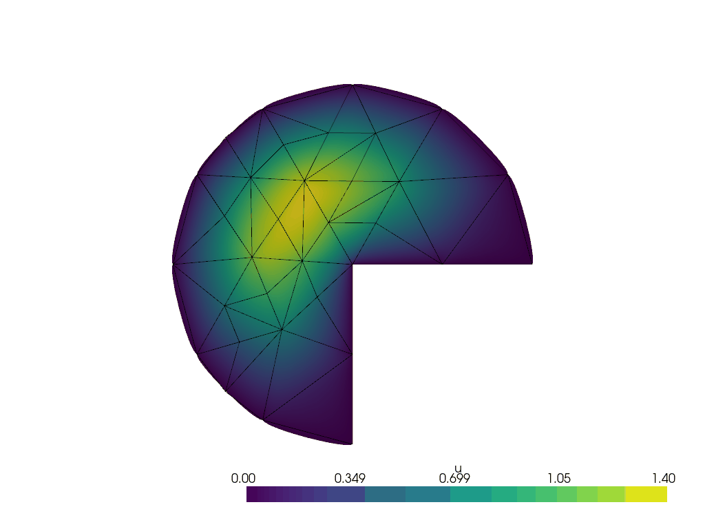
<br>
Implemented together with Umberto Zerbinati.<br>
<a href="https://jsdokken.com/dolfinx-tutorial/chapter2/amr.html">https://jsdokken.com/dolfinx-tutorial/chapter2/amr.html</a>

</center>
</div>

---

# Hungry for more?

<div class="columns">
<div>
<iframe width="550" height="420" src="https://jsdokken.com/dolfinx-tutorial/", title="FEniCS tutorial"></iframe>
</div>
<div style="font-size: 22px;">

1. [DOLFINx tutorial](https://jsdokken.com/dolfinx-tutorial/)
2. [Mechanical tours in DOLFINx](https://bleyerj.github.io/comet-fenicsx/)
3. [Shell models in DOLFINx](https://fenics-shells.github.io/fenicsx-shells/)
4. [MultiPointConstraints in DOLFINx](https://jsdokken.com/dolfinx_mpc/)
5. [Workshop notes on how DOLFINx works](https://jsdokken.com/FEniCS-workshop/README.html)
6. [Non-conforming 3D-1D coupling](https://scientificcomputing.github.io/fenicsx_ii)
7. [scifem: Convenience tools on top of FEniCS](https://scientificcomputing.github.io/scifem)
8. [dolfiny: Further toolbox on top of FEniCS](https://dolfiny.uni.lu/)

<br>

- [FEniCS webpage](https://fenicsproject.org/)
- [User forum](https://fenicsproject.discourse.group/)

</div>
</div>


---

# Questions?

<center>
<b> dokken@simula.no </b>
<br>
<a href="https://jsdokken.com">https://jsdokken.com</a>
<br>


</center>
