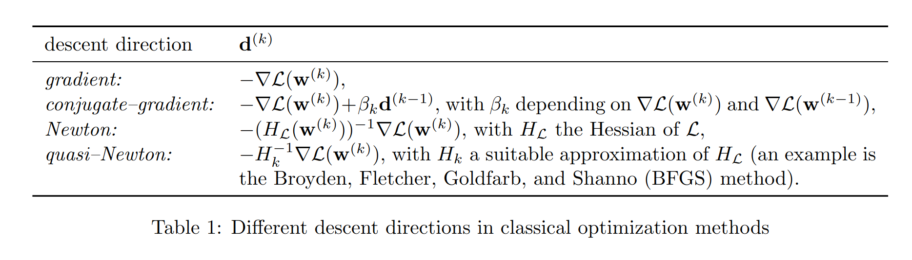
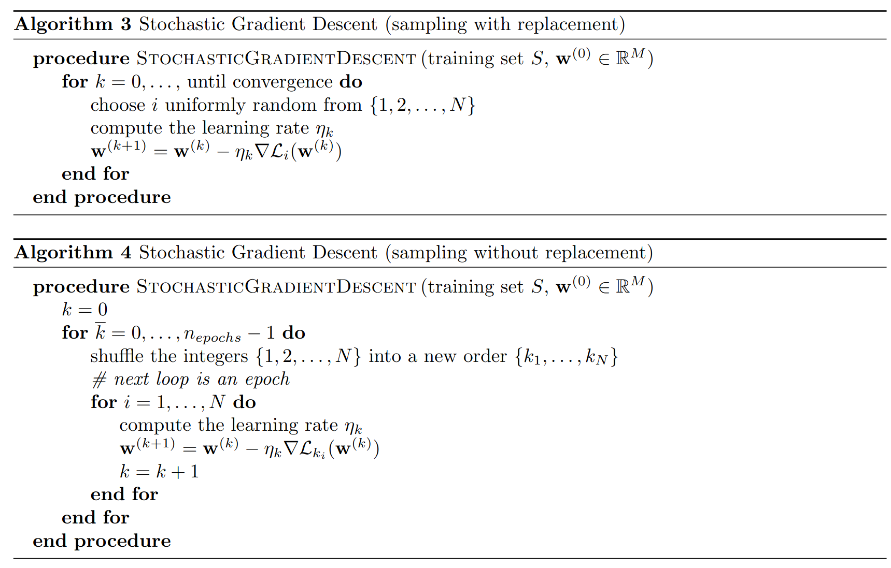

# Combining physics–based and data–driven models: advancing the frontiers of research with Scientific Machine Learning

<b>Section 3.2.6-3.2.9</b>

Jørgen S. Dokken

---

# Recap 1

We have:

- An _input space_ $\mathcal{X}\subseteq \mathbb{R}^n$
- A _target space_ $\mathcal{Y}\subseteq\mathbb{R}^m$
- The space $\mathcal{Y}^{\mathcal{X}}$ consisting of all functions $\mathbf{f}:\mathcal{X}\rightarrow\mathcal{Y}$
- _Hypothesis space_: $\mathcal{H}\subset\mathcal{Y}^{\mathcal{X}}$ where we choose to search for our optimal model

---

# Recap 2

- _Loss metric_ $d_M:\mathcal{Y}\times\mathcal{Y}\rightarrow[0,\infty]$ that measures the distance/mismatch between two elements in the target space
- _Expected risk_: $R=\mathbb{E}[d_M(y, f(x))]$ that measures how well our model performs on average (across the whole space $\mathcal{X}\times\mathcal{Y}$)
- A training set $S=\{(\hat x_i,\hat y_i)\in \mathcal{X}\times\mathcal{Y}, i=1,\dots,N\}$
- _Empirical risk_: $R_{S,N} = \frac{1}{N} \sum_{i=1}^{N} d_M(\hat y_i, f(\hat x_i))$, an approximation of $R$ on the training set.

---

# Recap 3

Ideally, we want to solve:

$$
\hat{\mathbf{f}} =\underset{f\in \mathcal{X}^\mathcal{Y}}{\mathrm{\arg\min}}\ R(x)
$$

Instead we solve

$$
\hat{\mathbf{f}}_{\mathcal{H, S}} =\underset{f\in \mathcal{H}}{\mathrm{\arg\min}}\ R_{S,N}(x)
$$

---

# 3.2.6 Optimization methods for training

Consider

$$
\mathcal{L}(\mathbf{w})=\frac{1}{N}\sum_{i=1}^N \frac{1}{2}[d(\hat{\mathbf{y}}_i, f(\hat{\mathbf{x}}_i, \mathbf{w}))]^2
$$

with $d:\mathbb{R}\times\mathbb{R}\rightarrow \mathbb{R}^{+}$ is a suitable distance metric, $\mathbf{w}$ are the weights of our neural network $\mathbf{f}$.

We want to find

$$
\mathbf{w}^*=\underset{\mathbf{w}\in \mathbb{R}^M}{\mathrm{\arg\min}}\ \mathcal{L}(\mathbf{w})
$$

---

# Optimization 101

Traditionally done with a descent method:

- Given a suitable initial guess $\mathbf{w}^{(0)}$:
- Construct a sequence $\{\mathbf{w}^{(k)}\}_{k\geq 0}$ such that
  $\mathbf{w}^{(k+1)}= \mathbf{w}^{(k)} + \eta_k \mathbf{d}^{(k)}$
  where $\mathbf{d}^{(k)}$ is the descent direction and $\eta_k$ the step-size (_learning rate_).
- Usually stopped when $\vert\vert \mathbf{d}^{(k)}\vert\vert<\epsilon$ or when $k$ hits a threshold.

---

# Optimization properties

- Strictly convex problems yields a unique global minimizer of $\mathcal{L}$
- If only locally convex around $\mathbf{w}^*$, one can only achieve convergence if $\mathcal{w}^{(0)}$ is sufficiently close.
- Usually neural nets are not convex, and thus yields local minimizers.

---

# Choice of $\mathbf{d}^k$

Classical optimization methods

- Gradient has lowest computational cost, but not fastest convergence.
- CG is slightly more expensive, but often outperforms gradient wrt number of iterations
- Newton/quasi-Newton is more expensive per step, but higher convergence rates.
- The step-size $\eta_k$ is chosen with a line-search method/trust-region method or kept constant.

---

# The search for the optimal $\mathbf{w}^*$

- We usually can't find the globally optimal solution.
- Settle with good enough (reduce amount of computing hours)
- Usually one makes $\mathcal{L}$ more convex by adding additional terms (regularization).

---

# Machine learning methods (SGD/SGA)

The loss function $\mathcal{L}$ takes in all samples $(\hat{\mathbf{x}}_i, \hat{\mathbf{y}}_i), i=1,\dots,N$.
We write it

$$
\begin{align*}
\mathcal{L} &= \frac{1}{N}\sum_{i=1}^{N}\mathcal{L}_i\\
\mathcal{L}_i &= \frac{1}{2}[d(\hat{\mathbf{y}}_i, f(\hat{\mathbf{x}}_i), \mathbf{w})]^2
\end{align*}
$$

Gradient descent would choose $\mathbf{d}_k=-\nabla\mathcal{L}(\mathbf{w}^{(k)})$.

SDG chooses $\mathbf{d}_k=-\nabla\mathcal{L}_j$ where $j$ is randomly picked from $\{1,\dots.N\}$.
**As Thomas would say:** THIS IS NOT A DESCENT DIRECTION

---

# Stocastic gradient approximation/descent

Various ways of sampling $j$:

- With replacement ($j$ can be resampled as the same integer in two successive iterations)
- Without replacement up to $N$ iterations (Cycle of $N$ iterations is called an _epoch_).
- Various ways of updating learning rate (see paper, eq 43,44).
  It has been proven that $\mathbb{E}(\mathcal{L}(\mathbf{w}^{(k)})- \mathcal{L}(\mathbf{w}^*))\overset{k\rightarrow \infty}\rightarrow \eta C$

---

# Convergence and cost

Linear/geometric convergence:

$\exist \rho\in(0, 1)$ s.t. $\forall k \in \mathbb{N}$

$$
\vert \mathcal{L}(\mathbf{w}^{(k)})-\mathcal{L}(\mathbf{w}^{*})\vert \lesssim \rho^{k}
$$

**Cost**

$$
\begin{align*}
\text{Cost of GD}& \propto N\cdot C \cdot \log \frac{1}{\epsilon}\\
\text{Cost of SGD} &\propto \frac{C}{\epsilon}
\end{align*}
$$

---

# Alternatives to SGD

- Instead of picking a single $j$, choose a subset $N_b$ of ${1,\dots,N}$ to approximate the gradient, called a _minibatch_
- Similar cost to SDG, but better on GPUs when adjusting batch size to num GPU registers.
- _Dynamic Sample size_: Let $N_b$ increase as a function of the iteration counter $k$.
- _Gradient Aggregation_: Weighted average of current and previous descent directions.
- The latter generalizes to a class in ML called _SGD with momentum_ (similar to a CG-method).

---

---

# Adapting the step size

- SGD has a hyper-parameter tuning this
- Modern methods calibrate the learning rate on a component by component level
  - AdaGrad: step size scaled by the sum of squares of previous gradients, component wise
  - RMSProp: Discards the oldest part of the gradient history, slower decrease of step size
  - ADAM: First and second order moments, with an exponential weighting, four parameters

---

# ADAM vs. YOGI

Yogi is not mentioned in paper.

Jørgen S. Dokken, Jan 11 2023 in SCAN Slack

---

## 3.2.7 Backpropagation - How to compute $\nabla \mathcal{L}_i(\mathbf{w}^{(k)})$?

- Use chain rule to compute $\nabla \mathcal{L}_i$.
- Backdates ML by decades, and used in Scientific Computing for a long time

$$
\begin{align*}
\mathcal{L}_i(\mathbf{w})&=\mathcal{L}_i(\sigma(\mathbf{z}(\mathbf{w})))\\
\mathbf{a}&=\sigma(\mathbf{z})\\
\mathbf{z}&=A\hat{\mathbf{x}} + \mathbf{b}\\
\mathbf{w} &= \{A_{k,l}, \mathbf{b}\}
\end{align*}
$$

Then we have that

$$
\begin{align*}
\nabla \mathcal{L}_i=\left(\frac{\mathrm{d}\mathcal{L}_i}{\mathrm{d}A_{k,l}}, \dots, \frac{\mathrm{d}\mathcal{L}_i}{\mathrm{d}b_{m}}\right)^T\\
\end{align*}
$$

---

# Backpropagation continued

If we want to find the variation for a given weight $\delta\mathbf{w}_i$, we compute

$$
\begin{align*}
\frac{\mathrm{d}\mathcal{L}_i}{\mathrm{d}A_{k,l}}&=\frac{\partial\mathcal{L}_i}{\partial \mathbf{a}}\left(\frac{\partial \mathbf{a}}{\partial \mathbf{z}}\left(\frac{\partial \mathbf{z}}{\partial A_{k,l}}\right)\right)\\
\frac{\mathrm{d}\mathcal{L}_i}{\mathrm{d}b_{m}}&=\frac{\partial\mathcal{L}_i}{\partial \mathbf{a}}\left(\frac{\partial \mathbf{a}}{\partial \mathbf{z}}\left(\frac{\partial \mathbf{z}}{\partial b_m}\right)\right)
\end{align*}
$$

---

# Backpropagation continued

$$
\begin{align*}
\left(\frac{\mathrm{d}\mathcal{L}_i}{\mathrm{d}A_{k,l}}\right)^T&=
\left(\frac{\partial\mathcal{L}_i}{\partial \mathbf{a}}\left(\frac{\partial \mathbf{a}}{\partial \mathbf{z}}\left(\frac{\partial \mathbf{z}}{\partial A_{k,l}}\right)\right)\right)^T\\
&=
\left(\frac{\partial \mathbf{z}}{\partial A_{k,l}}\right)^T\left(\frac{\partial \mathbf{a}}{\partial \mathbf{z}}\right)^T\left(\frac{\partial\mathcal{L}_i}{\partial \mathbf{a}}\right)^T\\
\left(\frac{\mathrm{d}\mathcal{L}_i}{\mathrm{d}b_{m}}\right)^T&=
\left(\frac{\partial\mathcal{L}_i}{\partial \mathbf{a}}\left(\frac{\partial \mathbf{a}}{\partial \mathbf{z}}\left(\frac{\partial \mathbf{z}}{\partial b_m}\right)\right)\right)^T\\
&=\left(\frac{\partial \mathbf{z}}{\partial b_m}\right)^T\left(\frac{\partial \mathbf{a}}{\partial \mathbf{z}}\right)^T\left(\frac{\partial\mathcal{L}_i}{\partial \mathbf{a}}\right)^T
\end{align*}
$$

---

# 3.2.8 Penalty-based regularization

Modify $\mathcal{L}$ such that it is
$\mathcal{L}=\frac{1}{N}\sum_{i=1}^{N}\mathcal{L}_i + \lambda H(\mathbf{w})$
where $\lambda > 0$.

### Tichonov regularization

$$
H(\mathbf{w}) = \vert\vert \mathbf{w}\vert\vert_2^2
$$

### Least Absolute Shrinkage and Selection Operator (LASSO)

$$
H(\mathbf{w}) = \vert\vert \mathbf{w}\vert\vert_1
$$

Avoids large weights (usually not applied to biases) making the neurons to sensitive.

**Doesn't alter backpropagation much!**

---

# 3.2.9 Tuning of hyperparameters

###### Hypothesis space hyperparameters

- Number of layers
- Numbers of neurons

###### Optimization hyperparameters

- Number of iterations
- Number of epochs
- Size of minibatches
- Learning rate if constant
- Momentum constant $\rho$
- Type of regularization
  - Coefficient $\lambda$

---

# Tuning

Extract a validation set from $S$ of $N_{valid}$ samples, $S_{train}=S\setminus S_{valid}$.

Consider the empirical risks $R_{S_{train},N_{train}}$, $R_{S_{valid}, N_{valid}}$.
Tune hyper-parameters to minimize the empirical risk of the validation set (that has not been trained on).

Once "optimal" hyperparameters have been found, evaluate them on $S_{test}$.

**Validation** might use a different metric than the **training**

---

# Search methods

###### _k-fold cross-validation_:

###### Grid-search

Naively try random combinations from a grid

###### Bayesian optimization

Search is influenced by previous results

